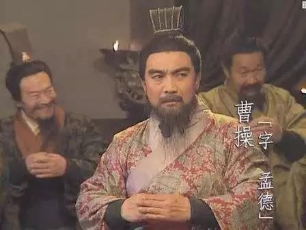

##正文

《三国演义》一书，著作于元朝末年的群雄混战时期。后来，满清于白山黑水之间起兵反明时，被努尔哈赤皇太极父子极为推崇，给了高级将领人手一本满文配图版作为内部文件。

甚至易中天还讲过一个段子，说满清取得天下之后，一位满洲将军结识了一个极为要好的汉人朋友。满洲将军说，你这汉人不错，来来来，你到我房间来，我给你看一个内部绝密文件，不公开的。

打开一看，是本《三国演义》.......

而作为“必读科目”，满清朝廷上上下下都对此视若神明，甚至后来康熙安排个心腹奴才去湖北任职，那奴才吓得跪地说，当年关二爷都没守住的地方，就怕会辜负主子的厚望.....如颠蒜一样的磕头......

 

说起来，三国演义以及随后的红楼梦，能够成为中国小说界的巅峰之作，除了文笔等原因之外，还有一个重要的因素，就是作者的身份决定了格局。

就像昨儿据说刷屏的那个爆款文，刚毕业的学生，只能靠拼凑故事卖焦虑，一点儿职场的常识都没有。

而红楼梦的作者曹雪芹，人家老爹曹寅和康熙皇帝，那是异父异母的亲兄弟，搁现在，能把伦敦大学学院毕业的王思聪秒成渣，他能写个《青楼梦》就不错了。真要比起来，如今恐怕也只牛津毕业的那位，才能跟曹雪芹相提并论。

 

同样，三国演义的作者罗贯中，是当时与陈友谅、朱元璋“三分天下”的张士诚的谋士，搁现在最低也是领导人的机要秘书，人家整天琢磨的的确就是天下争霸和高层内部的博弈。

所以呢，跟当年满清没入关前选择了最靠谱的《三国演义》作为军事指南，如果没机会接触到牛逼的朋友，但又要借鉴点东西的话，其实翻翻三国演义和红楼梦，比看捧着手机看公众号更好使。

因此呢，今天就跟大家简单聊一聊，三国演义里面，曹操为什么不杀刘备。

 

三国演义中呢，曹操一直视刘备为心腹大患，刘备对这一点也心知肚明，所以刘备兵败投靠曹操的时候，不仅团队内部激烈反对，曹操团队中的二号人物，王佐之才的荀彧，也是积极主张曹操干掉刘备。

那么，刘备为什么敢赌命去投靠曹操，曹操又为什么会决定不杀刘备呢？

这要从曹操和曹操团队的构成说起。

曹操团队，实质也就是大汉朝廷，共有三股势力构成，第一组是曹家的亲戚，譬如长女清河公主就嫁给了夏侯家的夏侯楙，第二组是控制大汉朝廷的建制派大家族，在外有袁绍袁术这样的大门阀，在内有荀彧荀攸这样的豪门，第三组是寒门士人，以郭嘉许褚为代表。

这里面呢，最主张杀刘备的，是第二组的建制派，也是整个曹操集团中势力最大的一股。就像荀彧跟袁绍说的，刘备不是久居人下之人。荀彧早就认定他有不臣之心，是乱臣贼子，是大汉朝最危险的敌人。

 

所以，如果刘备在曹操那里按照民主投票，早就被颍川的们阀门投死了一万次了。

但是，曹操却没有听从荀彧干掉刘备的建议，反而听从了寒门代表郭嘉的建议，饶了刘备一命。

这是为啥呢？

因为干掉刘备这个威胁者，的确符合大汉朝廷的利益，但是并不符合曹操个人的利益。

虽然曹操早年的梦想，是作为汉征西将军，平定异民族，让大汉朝的荣光复兴。但是，随着曹操不断的取得胜利，他和大汉朝廷以及那些建制派门阀们，矛盾越来越激化，颠覆曹操的地下运动从来都没有停止过。

因此，做到丞相位置上的曹操，已经没有后路可以退了，一旦下台并失去军权，必然会遭遇门阀们高平陵式的清算，曹家子孙一起完蛋。

所以，曹操只能咬着牙一直干下去。不断从自家亲戚和从寒门中提拔人才，去替换建制派的人，来与门阀建制派对抗，形成制衡。

而在这个大背景之下，寒门出身的郭嘉，就给了曹操一个建议，那就是不杀刘备。

道理很通俗易懂，就是两个字，“民心”。

大富豪家庭出身的曹操，原本不是汉末政治圈的玩家，而他能够在大汉朝廷里面立足，根本原因在于汉末，在全国流民乱串的冲击之下，老百姓和小地主们都受到了极大的威胁。曹操通过修墙屯田，推动经济发展，争取到了老百姓的民心。

而曹操修墙屯田是有成本的，无论是亲曹的荀彧荀攸，还是反曹的袁绍袁术，都不会替他出这些钱，因此，曹操如果想要拿到钱，又不能让老百姓拿钱丢了民心，那么就必须要让各路来投奔他的豪强们来出钱。

而此刻，第一个投奔曹操的刘备，正好是“千金马骨”。

所以，曹操为了自己着想，还真杀不得刘备。

毕竟，有不臣之心的刘备，的确是整个大汉朝廷和大门阀袁绍袁术们的心腹大患，但是，他并不是曹操本人的心腹大患，所以，曹操即使认识到，作为一个政治家，也会有意的忽略。

 
天下英雄谁敌手！

 

而历史也证明了这一点，正是有了刘备这个千金马骨的标杆，后来与刘备关系密切的北海孔融，以及与曹操有宿仇的张绣等势力，后来都纷纷投靠曹操，让曹操实力和人望迅速增强，以至于后来拥有了足够的实力，在官渡跟门阀建制派的终极BOSS袁绍，展开了一场大决战。

好了，如果明白了曹操的心理，那么刘备在面对曹操、袁绍袁术、荀彧荀攸以及郭嘉许褚们，分别应该怎么做，其实并不难下决心。

##留言区
 

