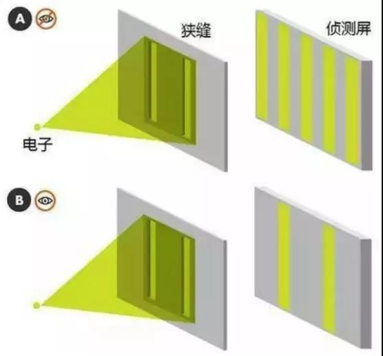

##正文

春节的七天长假过去了，我的Happy Week 也过去了。
 
打了七天游戏的我，突然被喊了起来，就像桃花源中那样，“不知有汉 无论魏晋”，这一周国际国内发生了什么新闻也都不知道，连最近大火的电影《流浪地球》都没看，说起来，还真不知道该写点什么了。
 
不过呢，介于需要证明一下我还“存在”，所以还是决定今天还是写一篇“思考”的文章，嗯，就像笛卡尔说的“我思故我在”嘛。

高中物理时学过，光既是粒子，也是波，这叫做光的“波粒二象性”。
 
其中光的“波”属性，是通过下图中，双缝的隔板后，明暗相见的条纹试验得出来的。（如果光只是粒子的话，那么我们看到的应该是两条亮纹）

 

嗯，爱因斯坦就是凭借着“光的波粒二象性”拿到的诺奖，而不是”《相对论》。
 
但是，双缝实验有一个极其恐怖的重复实验，就是我们在隔板后面放上开启的摄像头，然后让光源一个电子一个电子的打过去，就会发现，原本明暗相间的条纹，变成了两条平行对应的亮纹，而一旦将摄像头关闭，那么两条亮纹又会变成明暗相间的条纹。

 

这个实验令人毛骨悚然之处，在于任何一个人类的观察，都能够决定微观粒子的运动状态，通俗点说，就是唯心主义的“意识决定物质”。
 
这个实验，把无数的物理学家搞得非常崩溃，以至于目前的主流观点，是：“微观粒子被观测前是没有固定的位置的，它是一缕波，当它被观测的那一刹那，它就变成了粒子。”
 
嗯，但即使这样，也无法解释，为什么人类的观测，而不是阿猫阿狗的观测，会导致微观粒子的无数种运动状态突然“坍缩”，从波态“变态”成粒子态！
 
对此呢，我很久之前通过游戏的逻辑假设过下面的一个假设。
 
以ARPG游戏始祖暗黑破坏神为代表，很多游戏都有随机地图，在地图被打开之前，都和组成世界的微观粒子一样，拥有无数种符合游戏规则的可能。但是一旦玩家进入地区去观察，那么就会使得地图无数种可能性一瞬间集体坍缩，形成唯一确定性的状态。

 

毕竟，开局就一次性的“创造世界”，实在是太消耗计算机的系统资源了，而且还不符合游戏的可玩性，所以呢，还是按照事先设定的规则，这样是最符合“程序”的逻辑。

虽然这个解释非常通俗易懂，但这个假设如果成立的话，也就代表着我们现在存在的这个宇宙，是被某个更高维度的生物，按照某种规则创造出来的。
 
这样，我们的四维空间相对于高纬度生物来说，仅仅是一串数字代码的“一维空间”，他们可以随意暂停“游戏”。而低维度的我们却根本不可能感受得到，造物主们甚至可以随意的对世界进行修正，他们就是我们世界的主宰。
 
虽然这个模型这样很悲观，但很多困扰着物理学家的难题就会迎刃而解，譬如超越光速的“量子纠缠”，两个纠缠例子无论距离多远都会瞬时反应，就像我玩《三国志13》里面，你杀了刘备之后，无论有没有通讯阻隔，关羽张飞都会立即自动把你视为仇敌那样，这就是系统的设定，不需要来符合物理学原理。
 
甚至就像漫威电影里面常用的平行宇宙概念，其实就像玩游戏时候的同步保存的存档一样，虽然最初的系统属性都一样，但是各种不确定事件会导致出现无数种的可能。
 
所以呢，我们现在的宇宙，可能也是在一个超级计算机之中，无数个同步运行的程序之一。
 
不过呢，有可能，我们是其中唯一一个孵化出“人工智能”的世界。
 
举一个例子，就像谷歌通过计算机程序之间相互搏杀，正在搞的那个最厉害的人工智能阿拉法狗一样，我们人类至少也是地球上，无数的生物之间不断的搏杀与进化之中，唯一一个拥有智能的生物。

而且目前看来，地球上也不会再进化出什么只能生物了。
 
而如果按照这个概念，人类进化过程中很多无法解释的BUG和空白，就能讲得通，因为就像我们要对阿拉法狗不断的人工智能不断进行修正一样，我们在进化过程中，有可能也有一只上帝之手在操控着我们的进化。
 
甚至就在我们观测微观粒子的时候，造物主可能也正在观测我们.......
 
当然，即使这个推测方向是对的，也不代表我们要变得唯心主义去拜神拜佛，反而更应该去研究我们这个世界运行的逻辑，尤其是物理学。
 
因为游戏规则一旦明确，我们我们就能够在规则允许的范围内，不被造物主毁灭，就能创造出我们的奇迹。
 
譬如说，我们只要研究明白了这个世界的规则，就可以主动的升维或者降维。
 
降维非常容易理解，像电影《黑客帝国》那样，脑后插管，把自己代码化，进入一个数字化的世界，在里面可以爽的不亦乐乎，只要我们的世界不毁灭（断电），降维之后的人，就可以作为降维的世界的造物主，成仙成佛甚至不朽。
 
而升维也不难理解，本质就是要舍弃现在这则世界的肉身，把自己回归于一则足够强悍的通用代码（病毒），通过高维度与低维度信息通道，进入到高维度间之中，寻找一个高维度的肉体宿主即可。

当然，估计这对于绝大部分人，包括我自己，也没啥兴趣......而且，估计高维度的空间，生存环境大概率还不如我们。
 
当然，所谓的高维度空间，大概率也是一个他们空间的四维空间，用不着像电影星际穿越里面搞的那么抽象。

只不过，低维度的我们看高纬度的造物主，那么就像游戏中的RPG看我们是一个道理，的确有着维度上不可逾越的鸿沟，顶多能够与高维度在低维度的“化身”进行一些沟通。
 
这个假设如果继续推演，会有很多很好玩的事儿，只不过，那已经不是我应该去研究的东西了。
 
最后，我想说的是，我们与造物主之间的科技差距，有可能并没有我们想象的差距那么大，如果我们的世界只是一则代码的话。
 
因为，按照科技的发展，大概一千年以内，我们应该就可以用超级计算机，去创造一个远比我们世界还要完美的低维度宇宙了。

明天开始，正常更新............

##留言区
 

