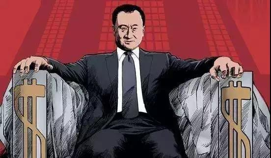
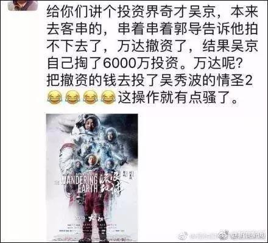

##正文

今天中午，资本市场爆出了猪年第一瓜，苏宁董事长张近东在新春团拜会上宣布，将在今年收购万达百货，受此影响，苏宁股价大涨3%......

说起来在七年前，关于百货零售，王健林和马云这两位轮流坐庄的“中国首富”，曾经有过一个“小目标”的赌注：

哥俩约定在2020年，电商如果占了国内市场份额50%以上，王健林输马云一个亿。反之，代表着线下百货的王健林如果占了50%以上，则马云输王健林一个亿。

 

结果，就在这则百货零售的“首富赌约”即将兑现之际，王健林把自家线下的百货公司.......卖给了马云的哥们张近东.......

这下，不知道打赢了赌注的马云，明年应该问谁去要这个“小目标”了......

 

当然，玩笑归玩笑，这笔交易对于万达和苏宁双方来说，都是双赢的。

首先，对于王健林来说，目前万达的第一要务，是满足“监管要求”。

要知道，目前万达最重要的两块资产，分别是万达商业和万达电影（含传奇影业），这两个千亿级市值的集团军，目前都在分别等待国内IPO和重组的审批。

万达商业就是王健林在全国持有数百个万达广场，此次苏宁收购的，则是万达商业中的39家万达百货。

 

这些万达百货的本质，是早年为了打造万达广场不得不搞起来的“配套基建”，依靠着万达集团的输血才能够迅速扩张。而在网购成为主流的今天，不赚钱的万达百货已经成为了王健林的负担，而且影响IPO时的财报，因此甩卖也属正常。

而更重要的是，王健林通过出让万达商业的股份和万达百货，如今已经跟苏宁等一批大佬们绑在了一起。

红楼梦里面对于江南四大家族有句评价“一荣俱荣，一损俱损”，毕竟首富王健林那么早就开始转向金融，可如今万达金融在国内也就是三线水平，而实力远如不万达的苏宁，如今已经是金融牌照第二齐全的民营公司了。

股份合作之后，大家可就是一条船上的了。

而且，刚刚金融街19号已经换了主人。所以，王健林抓紧机会，将非主营资产继续抛售，降低负债率，就成为了必然的选择。

因为只要撑过去，从资本市场拿到钱，凭借着全国数百家万达广场强劲的现金流，王健林很快就能“王者归来”。

 

而对于苏宁的张近东来说，这也是一笔合适的买卖，王健林在过去几年已经把近百家不盈利的万达百货陆陆续续都关闭了，如今剩下来的这三十多家，全部集中于一二线城市的中心地段，而且基本都是处于盈利状态。

可以说，目前万达百货的这些资产，比苏宁开的那些需要补贴的苏宁小店和店铺质量高多了，因此，此次收购之后，能够大幅提升苏宁的资产质量。

而值得关注的是，苏宁2018年入股万达商业花了近百亿，与其5月份甩卖阿里股票的15亿美金几乎相当，而对比此次收购万达百货的背景，是苏宁18年底又把手里最后的18亿美金阿里的股票清仓。

嗯，介于原本阿里与苏宁是相互持股，因此从某个角度上来说，苏宁入股万达的钱，也算是“阿里的钱”。

有趣的是，2018年之前，王健林的战略合作，是拉着腾讯百度组建“腾百万”，跟京东一起支援格力造车，文旅板块卖给融创，酒店板块卖给富力，主要合作的企业们，妥妥是一条“京粤轴心”。

而2018年之后的万达呢，“江沪浙包邮区”的新玩家们出现了，杭州的阿里入股万达电影，南京的苏宁入股万达商业，连万达持有的百年人寿的股权，也被杭州的绿城拿下了，仿佛万达在17年一连串的被迫瘦身之后，18年开始，王健林便以分享股份的方式，拥入“江沪浙同盟”的怀抱。

因此，可以预见的是，不同于万达与融创、富力们的合作，都是一锤子买卖，未来被入股的王健林，很可能会跟“江沪浙”的老板们有非常紧密的合作，以苏宁为例，未来将和万达广场之间将形成一种共生的关系。

那么问题来了，整个零售行业在下滑的大背景之下，王健林都挣不到的钱，其他人能挣到吗？

当然是挣不到了.....

但是，这就像前两个月聊了那么久的“基建”问题一样，只有基建投资突破一个阈值，高附加值的动能才会出现。

这里，以今年大热《流浪地球》的例子。

本来呢，中国科幻片没有成功的案例，这部片子的预售也非常低，甚至一开始的投资方万达都打了退堂鼓。

 

但是，这部片子却能够一路逆袭，大概率将成为继战狼2之后国内第二卖座的大片，除了除了大刘郭导还有吴战狼的努力外，背后更有着“马师傅”的努力。

 

酒香也怕巷子深，很多好片子其实我们根本看不到。

而我们再看看阿里系的春节期间，手机淘宝为这部电影设计了主题图标和入口，天猫制定了专题页面，支付宝更是在首页推荐........

一群十亿级用户的APP狂推，再加上优酷、大麦、口碑、饿了么、分众、阿里云、高德.....可以说，这部片子得到了阿里全家桶的广泛参与......

而这刷屏式的曝光度，让我不由得想到了马云的铁哥们史玉柱......

 

得到阿里如此硬点，当然导演在微博发战绩的时候，左下角的入口也都直接摆上了阿里的“淘票票”。

 

就像当年建立淘宝的平台一样，阿里系未来并不会去自己全套的拍戏（京东模式），而是像搭建淘宝平台一样，只抓住整个行业附加值最高的几个领域，从“让世上没有难做的生意”升级到“让国内没有难卖的电影”。

而万达拥有着传奇影业等强大的制作能力，以及遍布于全国各地的万达院线，但是在没有互联网的宣发渠道试下，这些重资产并不能去左右票房。

联想到就在一个月前阿里影业大火的“啥是佩奇”以及近年来阿里宣发的好几部爆款，未来阿里很可能以千金买马骨的形式，通过巨额的补贴搞宣发，在影视行业再复制一个成功的淘宝。

嗯，从前年马云拍功守道就能看出来，未来阿里系在影视方面是下了决心的。

而此次被苏宁入股的万达，凭借着过去几年大规模在影视基建领域的投资（国内最大的院线和制作公司），将承揽未来的基建工作，将形成影视领域“共生体”的四通一达。

进一步来说，可以预想到的是，随着合作的加强，万达庞大的商业人流数据导入到阿里的大数据分析系统之中，再加上“阿里全家桶”式的推广，电影宣发仅仅是开始，未来很多高附加值的领域，阿里和苏宁都会利用万达广场庞大的基建来进行实景呈现。

甚至随着苏宁店铺的入住，未来包邮区搞出来的教育、医疗等一大批产业的实景落放在万达广场，大家也不必吃惊。

只是遥想当年，王健林各种张罗，拉着马化腾和李彦宏，组建腾百万，成立反马云联盟的时候，如今看来不禁哑然。

这就像关东十八路诸侯讨董卓，结果打了半天，盟主袁绍投降了...........

 

##留言区
 

