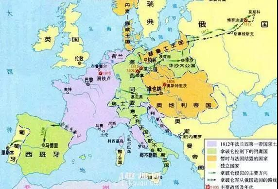
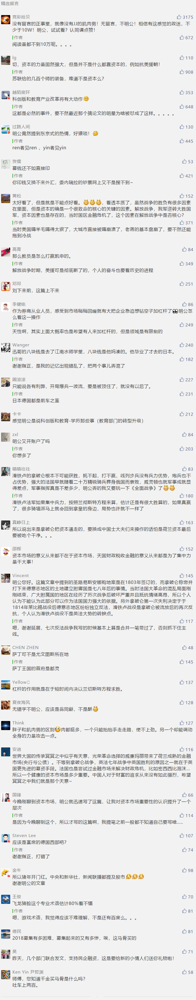

##正文

1815年，也是一个猪年，当清朝的嘉庆爷还在治理泛滥的鸦片之际，英国的威灵顿正率领第七次反法联军与拿破仑决战于滑铁卢。

这是一场关系着欧洲大陆命运和前途的战争。

如果拿破仑取得最终胜利，那么欧洲将在法国的领导下走向统一，继而称霸全球；而英国组建的联军如果获胜，那么拿破仑的法国将被肢解，离岸的英国将成为世界的霸主。

结果呢，大家都知道，滑铁卢成为了一个比喻惨痛失败的代名词，而英国开启了日不落帝国的时代。

说起来，提到滑铁卢就会想到惨败，是因为拿破仑时代的法国实在是太强大了，不仅拥有富庶的德国东部，还有低地（含荷兰比利时卢森堡）、加泰罗尼亚（巴萨所在地）、萨丁（尤文图斯所在地）、教皇国（罗马）、克罗地亚等几乎欧洲大陆所有的沿海富庶之地。

更不要说，法军的战力媲美于如今美军，而且还有大量的附庸国和盟友，其强大的综合国力绝不是英国这个弹丸岛国所能比拟的。

 

但是，英国能够在这场拼消耗的战争中，一直坚持下来并取得最终的胜利，原因之一在于英国发达的资本市场，能够募集到大量的资本，以招募武装军队并大规模的补贴反法同盟。

 

就像大家津津乐道的罗斯柴尔德家族通过滑铁卢战役的信息，狂赚20倍财富的段子，其实言过其实。

罗斯柴尔德家族做的是“投行”，不过是替英国打工“发债”，从民间募集资本，赚的是手续费。

不过，正是凭借着这些罗斯柴尔德家族们，源源不断帮助英国从市场上募集资金，最终，英国愣是靠着“屡战屡败”和“屡败屡战”，将法皇拿破仑拉下了马。

 

反之，底层出身的拿破仑由于对银行家们天生的厌恶，再加上他迫使荷兰王国进行选举，使得阿姆斯特丹的银行家们带着资本逃向到了英国。

这使得，荷兰的资本家们在东南亚百年来赚取的巨额财富，最终都通过资本化，以国债和股票的方式，变成了攻击法军的枪炮子弹，射向解放了荷兰的法国.......

这可以说是完美的诠释了“资本没有祖国”。

而当时主要通过税收来募集资本的法国（现在已经沦为高利贷帝国了），虽然比英国富庶的多，但是在加杠杆力度不够的情况下，能够调动的资源却非常有限，甚至不得不把幅员辽阔的圣路易斯安纳卖给美国以筹集军费。

 

嗯，这么大的一块地，因为着急甩卖，也就只卖了1500万法郎。

而法国战败后的赔款呢？

不仅赔付七亿法郎和大量难以估价的艺术品。除此之外，拿破仑东征西讨那么多年打下来的疆域，也完全吐了出来。

而英国拿着法国的巨额赔款，不仅支付了巨额的战争公债，还维护了商业的信用，使得其在建立日不落帝国的过程中，继续募集到巨额的资本来扩张。

所以，也就有了滑铁卢战役结束的十多年时候，解决了欧洲争霸之后的英国军队，终于不用再忍着清政府的禁烟政策，再一次从资本市场上募集资本，一群外国人，不远万里来到中国，打了一场持续多年的鸦片战争。

 

当然，仗不能白打，募集来的钱怎么可能打水漂呢？

于是南京条约里面，英国人用3000万的赔款和开放港口，支付了为战争募集的公债和股息......

说起来，在鸦片战争时期，我大清并不弱，依然占据了全球三分之一的GDP，国内的富庶程度远超欧洲，但是，大清有一个致命伤，在于资本的募集能力，除了要支付各项开支的税收之外，并不能超额募集资本。

以至于英军拿下了京杭大运河，丧失南方税源的大清立刻瘫痪，马上选择投降议和，也验证了资本方面的风险应对能力几乎为零。

反过来看英国，后来埃及总督爆发财政危机，准备出售手中一半的苏伊士运河股份之际，英国为了抢在法国之前，直接让罗斯柴尔德家族紧急募集400万英镑，不仅以白菜价买下了这个全球最牛逼的印钞机，还籍此在随后的几十年中，牢牢的控制住了国际航运的大动脉。

反过来看，这种紧急动员资本的能力，清廷一直都没有长进，以至于滑铁卢战役80年后的甲午战争，继英国之后，另一个岛国日本，又一次以小博大，击败了看似不可能战胜的大清帝国。

当时，对于日本的挑衅，不仅清廷内部以为必胜，以翁同酥为代表的大佬们都在琢磨如何掣肘不让李鸿章大胜，甚至连欧洲的列强们也一致看好中国，有的还准备趁机瓜分日本。

结果一仗打下来，清朝几十年经营下来的北洋水师全军覆没，丢了台湾澎湖朝鲜，东北差点也没了，巨额的战争赔款更导致了原本一副中兴模样的大清朝，十几年后就轰然倒塌。

 

说起来，现代化的军队，尤其是海军，一直都是一个极度烧钱的领域，而清政府虽然国力雄厚，但也只能在厘金、盐税、关税等常规领域中想办法，根本无法有效的集中全国财力推行国家战略。

嗯，清政府的第一次发行国债已经是1894年，嗯，那年已经是甲午年了......

日本方面呢？

为了准备这场日本人口中的“日清战争”，人家从十几年前就开始发行公债，为了这场战争募集上万亿元的资本。

而北洋水师呢？

每年到手才一百万两左右的财政拨款，这还不算中间的各种贪墨和火耗，更不要说动不动就被挪用了。

一个靠瞬间爆发的资本市场，一个只能靠平滑的税收，正是双方资本市场上募集能力的差距，使得原本薄弱的日本海军能够迅速“加杠杆弯道超车”，以至于在黄海海战的时候，日军的总吨位和武器装备已反超了当时“全球第九，亚洲第一”的北洋水师。

而一直以税收作为判断的满清大臣们，自然也是很难理解日本从哪里搞到的那么多钱，所以出现了巨大的误判。

当然，日本勒紧裤腰带，鬻儿卖女负债打的这场仗，自然也得到了充足的回报，不仅拿到了朝鲜、台湾和澎湖列岛，还拿到了三亿多两的战争赔款。（连本带息带损耗）

嗯，这些赔款加起来，足够给老佛爷修一百多个园子了，一次住三天，一年都不带重样的。

换成军费呢？

凭借着“飞龙骑脸”般的五百多艘铁甲舰，恐怕大清水兵每过段时间就要去日本体验东京式的热情，甚至英国的老佛爷维多利亚也得琢磨学习打麻将套近乎了。

哎，该醒了，别做梦了.......大清的体制决定了，根本搞不了那样的资本运作.....
 
 

而打赢了甲午战争的日本，正是凭借着拿到的巨额赔款，不仅还清了之前为战争募集的公债，还有余力购买先进设备进行大规模的工业建设，甚至还搞起了大规模的教育补贴。当年鲁迅就是揣着八块大洋去日本留学的，嗯，毕竟便宜嘛。

甚至孙中山、黄兴、蒋介石、汪精卫、蔡锷、蒋百里.......这些民国时期叱咤风云的精英们，也几乎一色都是廉价日本留学的产物。

大家都知道，科技和教育领域的下功夫，才能为经济发展提供不竭的动力，但是，这俩可都不是一般的费钱。

而正是凭借着资本市场上的的魔幻能力，日本这个学生以小博大，实现了对中国老师的弯道超车，利用募集的资本撬动杠杆，实现了工业化并迈入了发达国家的行列。

好了，历史说了这么多，有什么借鉴的地方呢？

在工业化之后，想要实现像英国对法国，日本对中国那样的弯道超车，想要像英国收购苏伊士运河那样的廉价收购资产，就必须有强大的市场来募集资本和加杠杆。

回忆一下十年前吉利以白菜价收购沃尔沃时有多艰辛，就会明白一个完善的资本市场的价值。

同样，英国能够在反法同盟中，募集到足够的资本反超法国，靠的是阿姆斯特丹的资本家们穿越海峡搬了过去；而美国能在反法西斯同盟中，募集到足够的资本反超英国，靠的是欧洲的资本家们穿越大洋搬了过去。

所以呢，放在这个维度之下就会明白，国内的资本市场虽然存在大量的问题，但是却必须不惜代价稳住，一切以此为基准，不能单纯以数据来衡量。

同样，国内有些人再怎么看起来不顺眼，某些海外资本再怎么贪婪，也得千金买马骨式的奉为上宾。

因为，资本市场的意义，从来就不仅在于资本市场。

##留言区
 

