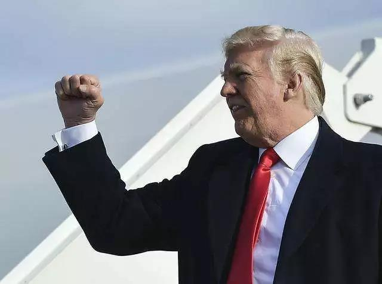
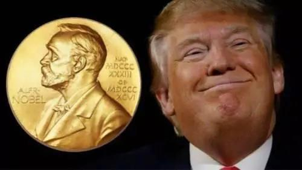
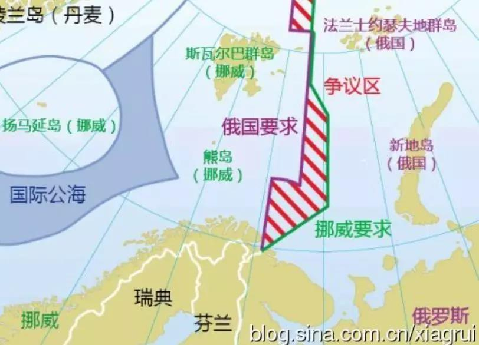
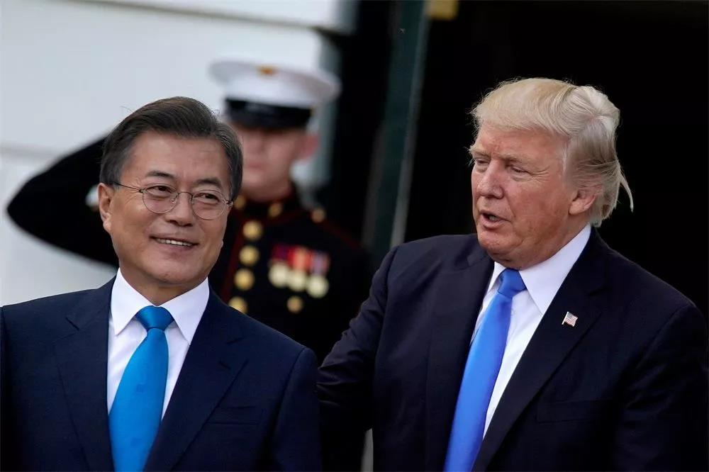

##正文

今年的情人节，美国总统特朗普收到了不少的情人节礼物，其中，日本首相安倍晋三的礼物，颇得特朗普欢心。

因此，在收到情人节礼物的次日，特朗普就在白宫玫瑰园，将这束“日本玫瑰”向媒体公开。 

 
[Link_MBT_20190217_1](https://v.qq.com/x/page/o0838tvrb1p.html)

在这封“漂亮无比”的五页纸信件中，安倍提名特朗普获得诺贝尔和平奖，理由是他开启了与朝鲜的对话并缓和了与朝鲜的紧张关系。

安倍在信里面是这么说的：

>“我代表日本满怀敬意地提名您。**我要求他们**授予您诺贝尔和平奖给您。”

嗯，从“要求”一词中可以明显看出，日本已经在向诺奖委员会施压了。

而诺奖对于特朗普来说，一直都是一个梦寐以求的“奖励”。

甚至，去年朝韩首脑在板门店实现了历史性会晤之后，特朗普就开始为诺奖造势了。

在朝韩牵手跨过三八线的次日，一场美国密歇根州举行的政治集会上，有特朗普的支持者在台下大喊“诺贝尔”。特朗普停止讲话，微笑着站着，然后说道“太好了，谢谢。诺贝尔，那太好了。”

 

随后，美国国会18位共和党议员联名致信诺贝尔和平奖委员会，要求提名特朗普，以表彰其在改善美朝关系上所做的工作。

因此，特朗普已经成为了今年夏季诺贝尔和平奖最强劲的竞争者。

 

但是，特朗普却是诺贝儿和平奖最难获得的人。

因为遵照诺贝尔遗嘱，物理奖和化学奖归瑞典科学院，生理医学奖归瑞典医学院，文学奖归瑞典文学院，但是，**和平奖却是由挪威议会选出**的。

而挪威这个国家，天生就是站在特朗普的对立面上。

首先，挪威作为全球作大的主权基金和出口比重最大的国家，最怕的就是国际经济动荡，结果特朗普上台后引发了全球贸易烽火连天。

其次，作为北极圈国家，挪威对于遏制气候变暖和控制碳排放是最坚定的国家，新能源车持有率世界第一，结果特朗普上台后就退出了巴黎气候变化协定。

再次，作为全球最“白左”的国家，挪威政客都能向因强奸自己被遣返的难民道歉，结果一贯反移民的特朗普还刚刚通过紧急法案来建隔离难民的墙。

而且，诺奖有五名评委，其中有一位在去年特朗普政府强制将非法移民子女与父母分离时，公开给予了严厉的批评。

最后，也是最重要的，挪威一直以来都是北约最坚定的支持者，各种费用缴纳只多不少，因为挪威不仅与俄罗斯接壤，还有近20万平方公里的海域纠纷以及北极圈的资源争夺。（冷战历史上著名的“巴伦支手术刀”，就是挪威空军和苏联空军在争议领域巴伦支海上空的一场遭遇战）

 

而特朗普呢，不仅整天嚷嚷着要推出欧盟，甚至跟俄罗斯总统普京暧昧的关系已经尽人皆知了。

可以说，特朗普简直就是挪威的“天煞孤星”。

更不要说回顾历史，从一百多年前的罗斯福和威尔逊，到本世纪的卡特和奥巴马，挪威议会都一直都坚持把和平奖颁只给美国民主党的总统，金灿灿的奖章，一个共和党总统都没摸过........

 

那么，特朗普就得不到诺贝尔奖了嘛？

其实不然，安倍的那则亲笔信还是非常重要的。

因为日本的房产和债券，不仅是挪威主权基金最大的投向之一，更重要的是，日本也是挪威三文鱼最大的消费国。作为全球最大刺身市场，日本进口挪威三文鱼量，是东亚第二大进口国的十倍。

而这个第二大国的影响力有多大呢？

2014年9月，其以病毒威胁为由，禁止进口部分挪威三文鱼之后，次年，挪威诺委会就创造了114年历史上首次主席被革职的先例，搞的全球一片哗然。

而且，就在换了主席之后，这个第二大进口国随即爆冷，拿到了梦寐以求的历史上第一座诺贝尔理工科奖。

可想而知，日本这个挪威三文鱼的全球第一大进口国，对于选诺贝尔和平奖的挪威议会，会有着多大的影响力。

所以呢，就像特朗普展示的，安倍作为日本首相和执政党的党魁，的确有资格去要求挪威诺委会把奖颁给特朗普。

而且，按照规定，个人的诺奖提名应该严格保密，特朗普此次直接把原本桌子底下交易摆了出来，因此也可见成竹在胸。（被卖安倍估计气得骂娘，但既不能承认又不能否认）

那么，能从此次特朗普宣扬诺贝尔奖的细节中，能判断出什么呢？

诺奖的提名在本月截止，也是全球各方势力表明态度和做交易的一个窗口期。

面对美国汽车关税制裁的日本，必须要想办法“逃过一劫”，因此，在情人节凭借着日本对挪威巨大的影响力，安倍跟特朗普个人做一个交换，自然是成本最低的一个选择。

 

同样，另一个被美国制裁和军费搞的焦头烂额的韩国总统文在寅，在去年就公开表示，特朗普应该获得诺奖而不是自己，朝韩和解的功劳都是特朗普的，必然也是全力向挪威和瑞典施加影响力，以作为交易的筹码。

 

更不要说，在第二次“特金会”之前过生日的背后，还有一只看不见的手在背后推动。

而且，就在特朗普在玫瑰园秀出安倍“玫瑰”的同一天，朝鲜《劳动新闻》15日刊发署名文章，强调朝鲜格外重视与社会主义国家的传统友好关系，也愿意本着平等自主、相互尊重等原则与所有友好对待朝鲜的国家发展关系，包括与“曾敌视朝鲜的国家”发展友好合作、“**共同谱写新的历史**”。

因此，可以预见的是，本次在越南的朝美会面，在东亚诸国同舟共济的协作之下，将取得一个非常棒的结果。而且，在东亚诸国的努力之下，如果特朗普因此获诺奖，会更加巩固这次的胜利果实。

最后呢，对于资本市场还有另一个推断，在今夏取得诺贝尔奖之前，特朗普会坚持战略收缩，以中东为代表，全球不会主动出现大规模的地缘震荡，很多国家都将迎来一段宝贵的内部机遇期和春天。

##留言区
 

