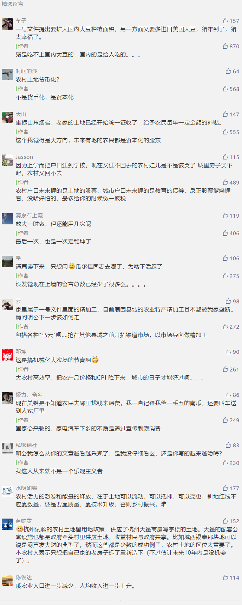

##正文

 
一

昨日，特朗普政府宣布，将取消对加州高铁项目的9亿美元拨款，并考虑采取法律行动，追回过往发放的25亿的联邦政府资金。

白宫追索投资的直接原因，是加州宣布08年启动的，从洛杉矶到旧金山的高铁项目，仅保留1200公里规划中的177公里。

当然，更深层的原因，则是加州是民主党的大本营，也是反特朗普的急先锋，特朗普因为修墙接下来将遭遇的一连串地方司法起诉，地点就会放在加州法庭。

看看刚刚结束的繁忙春运和中国这些年建成的万里高铁，再看看美国两党为一百多公里的高铁撕来撕去。

嗯，不得不慨叹，老美某些地方还是应该学学咱们中国。

 
二

说起来，修铁路撕逼搞的如此厉害，在中国历史上也不是没有，不过，要追溯到一百多年前的清末。

如今堪称印钞机的京沪线，在清末的时候，被叫做津浦线。

嗯，与美国拖拖拉拉的加州高铁类似，这条大清1880年就开始推动这条帝国的大动脉，愣是被一直拖到了1911年，大清亡了才通车。

 

且不说京沪线是中国利润最高的线路，而在在当年，用烧煤的铁路取代纤夫，从经济学上来看是很容易得到的答案。但是当时的决策者们，哪怕如维新派的重臣张之洞和盛宣怀，也都极力反对。

 

津浦线遭遇阻力的原因很简单，因为这条铁路的建设，是要取代京杭大运河的漕运。

而大运河作为自隋唐开通以来的大动脉，数千里河道上一连串的贸易重镇，数十万的漕运就业以及上下游百余万人口的产业链，这千余年来形成的利益集团，可谓是牵一发而动全身。

尤其在风雨飘摇的清末，麾下几十万的漕帮分分钟教老佛爷怎么做人。因此，虽然铁路科技会带来巨大的利益和生产率的提升，但是政策上没谁愿意去点这个火药桶。

搁在美国也是如此，随着科技的进步，美国锈带工人的收入大幅降低，他们的怒火，最终帮助特朗普击败希拉里，让全球都大跌眼镜并受伤不已。

而道理从古至今都是这样，在无法解决庞大的就业和产业链问题前，科技的进步也是一把双刃剑，稍有不慎就可能伤到自己。

 
三

科技的进步会伤到自己，这个道理，相信资本市场的朋友最能感同身受。

随着这几年美国页岩油技术的突飞猛进，导致国际油价从140多美元一桶一路跌了三分之二，而且技术的不断改进，使得这个趋势还看不到什么时候是个尽头。

同样，还有大豆，2018年初，美国著名的转基因公司，孟山都发布消息，美国几大农业公司联合开发的第三代转基因大豆将在2020年上市。

由于第三代大豆能够避免病虫害，这意味着几年之后全球大豆产量将有一轮恐怖的提升。

而无论是能源还是农业，消费能力都很难短期大幅提升，因此，根据市场经济规律，当供应突然增加的时候，价格必然会大幅下跌。

因此，如今的“技术提升”，就像古代的“风调雨顺”，如果不能寻找到足够大的产品倾销市场，结果就只会是“谷贱伤农”，引发剧烈的国内问题。

上个世纪资本主义危机的时候，往密西西比河里面倒产能过剩的牛奶，甚至打了两场世界大战，就是前车之鉴。而如今，石油储量第一的委内瑞拉，也给我们打了一个很好的样板。

所以，从这个角度，可以理解为什么在华有着巨大利益的共和党，为何在去年那么咄咄逼人。

而从这个角度也会理解，作为全球最大的大豆和石油的净进口国，这一年多来我们的底气在哪里。

 
四

昨天，中央一号文终于隆重登场，这份中央连续发出的第十六个“一号文件”开宗明义指出，今明两年，是全面建成小康社会的决胜期。

既然是决胜期，自然就要All in 。

就像新华社说的，这些问题解决起**来需要付出真金白银，需要真刀真枪地干**。

回想国家这几年开始控制各项开支的背后，一轮轮扫黑除恶的背后，都是在为兑现全面小康的承诺，来积蓄力量。

而All In 农村这个逻辑其实不难理解，因为中国农村有着庞大的土地和人口红利。

 

而且，只有中国的村镇富了，增产增收的农民兄弟，才能从城镇购买大量的工业产品，实现消费升级。而只有中国的城镇的产品卖了出去，维持住了工业的产能，方能从美国进口更多的大豆和石油等原材料。

因此可以说，从国际到国内，都是一环套一环的。

中国农村的脱贫攻坚，将解决中国城市的问题；而中国城市的转好，又将解决全球的供应过剩问题。

而这连环关系的背后，是我们正面对一个科技突飞猛进的时代，无论是中国还是美国，为了避免科技进步带来的双刃剑伤到自己，都需要给自己找到一个缓冲。

正是有了这个缓冲，才能够跑得更高跳得更远。因此也可以说，2021年，完成扶贫与确权之后的中国农村，将是西方大片中“拯救世界”的关键。

而想要拥有拯救世界的能力，那么封建时代延续下来松散的农村、农民和农业是毫无意义的。未来三农必将拧成一股绳，以资本化的方式汇聚力量，以科技化的方式发挥力量，迎接崭新的明天。

##留言区
 

