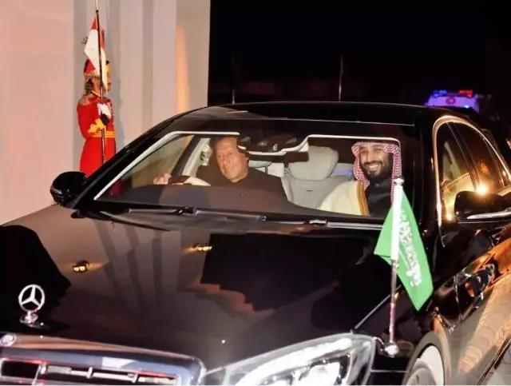
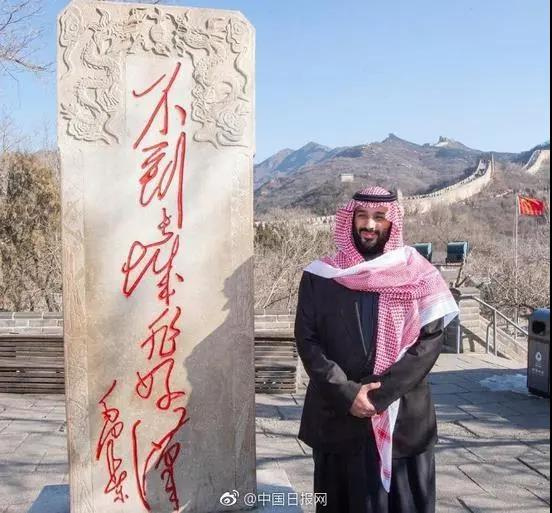

##正文

最近一周，波斯湾首富、沙特王储小萨勒曼，开启了他的亚洲之旅。作为全世界最土壕的男人，一路上都享受到了最顶级的接待。

 

为了迎接他，巴基斯坦不仅安排了上万名的安保成员，还派遣战机编队护航，并让其他航班停飞还切断沿线的网络通信，甚至，总理也亲自披挂上阵当司机，把他送回酒店。

 

 

而这位首富到了印度也一样，一贯趾高气扬的南亚霸主莫迪，打破惯例，亲自跑到机场，以个人名义接机，给足了这位波斯湾首富“元首”级的待遇，“熊抱”后献上了百合花。

 

 

能够让互为死敌的印巴两国，如此的一致毕恭毕敬的对待，原因只有一个，那就是“看在钱的份上”......

巴基斯坦现在正面临严重债务危机，新总理上台后向国际货币基金组织寻求120亿美元紧急援助，迄今没有获批。而此次，波斯湾首富一来，直接甩了200亿的大礼包，嗯，零头都不用找了。

另一位，印度总理莫迪在他的改革过程中，也遭受到了极大的反噬，大量的失业和发展退步，也让莫迪连续输掉多个地方选举。而此次波斯湾首富一来，直接承诺未来两年投资超千亿，帮助莫迪给选民吃了一颗定心丸。

正是凭借着挥舞石油美元，这位前脚还因“记者谋杀案”被西方媒体围剿的波斯湾首富，转过年就开始重塑自己的国际声誉和海外影响力，向世界展示了，“有钱真的是可以为所欲为”。

 

终于，小萨勒曼发现，参加那些多边活动没啥意义，还是拿着支票访问最靠谱。

就像西虹市首富里面的一句台词：本来打算以普通人的身份跟你们相处，可换来的却是疏远。不装了，我是亿万富翁，我摊牌了。

 

不过呢，就算是亿万富翁，波斯湾首富，来中国也得按照“基本法”。

今天这位王储抵达了中国，游览了八达岭长城，驻足观看毛泽东题词“不到长城非好汉”的石碑，并合影留念，一副乖宝宝的模样。

 

当然，对于本次送来了近三百亿合同的土壕，我泱泱礼仪之邦也不会亏待，今晚还特意让他上了新闻联播，并在公告里面说了，“反对任何干涉沙特内政的行为”。

 

虽说有钱办事儿就是方便，不过，我们也不要被土壕的炫富蒙蔽了眼睛。

就像首富们往往都是“首负”，虽然沙特王室凭借着石油印钞机，享受着无比奢华的生活，但实际上他们的麻烦远比我们想象的大。

与委内瑞拉类似，在过去高油价时代，沙特也搞出了高福利，国家财政支大规模增加。可是随着油价下跌，国家财政收入大幅缩水，而财政支出却随着人口和王室成员的激增，不得不屡破新高，今年的赤字占GDP已经高达4.2%了，吊打欧猪五国们。

尤其是老萨勒曼准备打破“兄终弟及”的沙特传统，为了将王位传给儿子小萨勒曼，那么就更不可能缩减开支，只能继续在政府开支和福利方面继续加大，搞赎买政策。

因此，也才有了连全球最赚钱的公司，沙特阿美近年来都要准备上市融资，来填补沙特财政巨大的窟窿。
 
 

说起来，此次波斯湾首富访问亚洲三国，从另一个角度也能看到一些好玩的。

除了能帮助王储在记者谋杀案后重振国际形象之外，这三个国家有两个共同点，一方面都是沙特石油的大卖家，另一方面，还是除美俄英法之外，全球为数不多的，真正能摆台台面上的核国家。

沙特作为阿拉伯国家的头头，一直都在谋求更高的国际地位，但是他却伊朗和以色列这俩拥有核技术的国家包围。

而且更重要的是，沙特是全球位数不多的，靠烧油发电的国家，为了满足灯红酒绿和纸醉金迷，沙特每天要烧掉100多万桶原油用来发电。

100万桶是什么概念呢？沙特每天烧掉的油，和委内瑞拉如今每天生产的油基本相当。

可是，随着近年来沙特人口激增，能源消耗也迅速激增，此消彼长，使得沙特能够拿出来出口的油越来越少。

而且更重要的是，沙特为了摆脱对于石油的依赖，搞出的2030的远景计划，这些高科技对于电力的消耗，只会比传统工业更多。

总不能以后沙特道路上跑的电动车和庞大的云计算中心，还都是靠烧油提供电能吧？

所谓，沙特的萨勒曼家族如果想要能够延续，就必须想办法找到新的能源供应，否则日益增加的能源需求不仅会把其庞大的石油储备都消耗掉，使得其无法获取赎买民众所需要的外汇与财政支出。

因此，在目前的科技之下，萨勒曼家族想要传承下去，只有一个可能，那就是吸引投资发展核能，然后把节约下来的石油继续换国内福利。

而按照沙特2030远景所需要的发电量，未来沙特需要几十坐核电站才有可能满足其能源消耗。如此大规模的核电建设，按照国际惯例，就必然涉及到技术和知识产权的转让。

不过，一方面，核技术又是一个敏感的问题，对于全球火药桶的中东来说，尤为敏感。另一方面，沙特又是美国地缘、美元以及能源方面的铁杆盟友和基石，美国不可能让别的国家染指。

更不要说，如今特朗普这个天生的生意人，绝不可能让肉掉到别的国家锅里，所以，其他国家大批拿到沙特庞大的核电单子几乎不太可能。

但生意毕竟还是生意，沙特也必须向美国国会展示，自己并非没有别的选择。来迫使美国国会同意向沙特转移核技术，并尽可能的压低价格。

介于萨勒曼家族和特朗普家族之间巨大的利益，因此，从某种程度上来讲，未来这些有核能力或者建设能力的国家，也都会积极配合演戏，一方面帮着沙特压价，另一方面帮着特总对国会进行施压。

而在这个过程中，配合演戏的大家不仅能够拿到沙特的大礼包，还能趁机和特朗普联络联络感情，如此只赚不赔的买卖，大家自然是笑脸相迎了。

至于核技术以及核技术转移带来的核威胁，对于特朗普来说，只要价格合适，其实没什么是不能卖的。

##留言区
 无留言