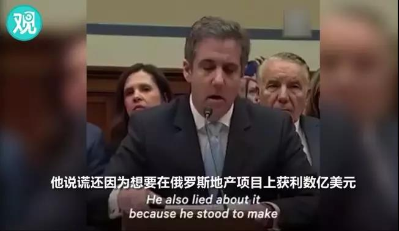
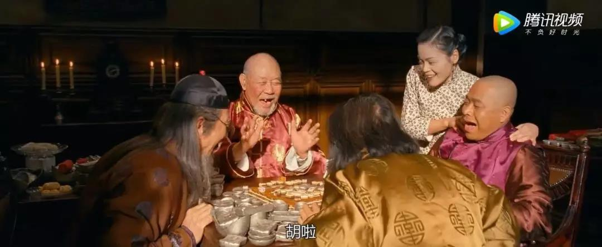
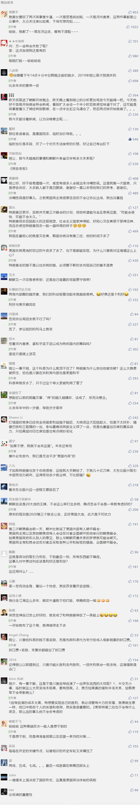

##正文

昨天夜里（27号），在河内，朝美两国元首晚宴之后，白宫方面发布了特朗普今日（28号）的行程，将于下午14时05分出席联合签约仪式，签署《河内宣言》。

不过，就在仪式即将举行的一小时前，记者们被告知，原定的“联合协议签字仪式”被取消，同时取消的还有两国代表团一起工作午餐的拍照机会。随后，得到通知的朝鲜车队也从原定举行签约仪式的大都会酒店匆匆离开。

继上次金特会之后，筹备了近一年的《河内宣言》，在“临门一脚”时，打了高射炮......

而这种对于亚洲局势乃至全球经济都有着重大影响的事件，自然得研究问题出在哪里，这样才能知道接下来各方的走势。

首先，按照惯例，这种重要会谈，在双方元首见面前，宣言早就已经起草完毕，给两国元首留的都是不落笔的，口头承诺的空间。

因此，临时变卦，只可能是某一方内部临时出现了重大变故。

而从朝方的体制，以及东亚诸国的投入来看，几乎没有出现变故的可能，因此，出现“问题”的一方，几乎可以确定，就是特朗普。

那么，引发特朗普在最后时刻放弃签字和“诺奖”，必然是突发的时间，因此想要寻找答案，就要把眼光望向大洋彼岸的美国。

 

就在特朗普前赴越南，准备实现他的理想之际，他的后院同时也着了两把火，一个是美国众议院推翻了他为修边境墙而签发的“国家紧急状态”令，另一个是他的私人律师科恩与通俄门调查团队达成和解，跳出来在国会做证词，放出来一大波特朗普的黑料。

本来呢，这两个事儿都在预料之中，众议院推翻后特朗普也可以通过总统的否决权再否决，而“通俄门”的事儿，也都是一些陈年烂谷子，早就被民主党媒体翻烂了。

不过，当很多事情纠缠到一起时，事情就发生了变化。

首先，特朗普的私人律师科恩“反水”，并没有把陈述重点放在通俄门的问题上，而是把重点放在了2020年的大选之上。

 

科恩披露了他与特朗普大量私下里的对话与交易，其中包括了大量极度歧视黑人的语言，以及当众展示了特朗普当上总统之后给他的支票，用于奖励他处理特朗普跟艳星搞婚外情。

而在美国，五千万的黑人和“半边天”的女人是决定性的两大票仓，而这俩票仓，一个最怕被“黑”，一个最怕被“绿”，此次国会公证之后，意味着特朗普将不得不面对接下来一连串的对质，而这些对质无论怎么样，都会极大的打击他在黑人和女人群体的选票。

而且，此次科恩还放出了大量特朗普不光彩事情，譬如用慈善基金会搞假竞拍，威胁学校不得公开其考试成绩，甚至一直都把参加竞选总统当做是一门生意来交换个人利益，更不要说，还披露了维基解密在公布希拉里邮件前，事先通知了特朗普。

 

可以说，是针对了各个方面的选票群体的针对性陈述，愣是把一场原本重点是通俄门的听证会，变成了一场道德抨击，可以说民主党打了一场漂亮的翻身仗。

而这场翻身仗也引发了多米诺骨牌的效应。

本来呢，今年特朗普敢于放肆的“解雇”国防部长，宣布进入国家紧急状态，甚至敢于推动朝美和解，靠的是共和党在去年年底的中期选举拿下了参议院，在安全和外交方面特朗普“手里有票心里不慌”。

而这种不慌的来源，恰恰是特朗普自己带来的，因为恰巧，明年有接近一半的共和党参议员，将在2020总统大选期间面临席位改选。

每当美国的大选年会出现一种情况，就是大量的选民积极投票议员，来“支持自己的总统”，反之，也会出现大量的选民通过投票议员，来“反对别人的总统”。

在美国，参议员席位极其珍贵，不仅大权在握影响该州乃至国家的政策，而且一旦选上任期长达六年比总统还长。因此，本轮共和党的参议员们为了保住自己宝贵的位置，默认都会选择跟特朗普“合作”，以争取特朗普支持者们的选票。

正是因为参议员们被“绑架”，所以，特朗普才能在修墙这个问题上有恃无恐，搞出为了几十亿，就把全国搞的紧急状态这种闹剧，甚至还不怕众议院否决。

而特朗普的这笔生意，计算的也特别好，逼着参议员支持他建墙，带动狂热的选民，以助其竞选总统，而他竞选总统时的优势，也会带动参议员们连任。

因此，参议员们虽然普遍对建墙持反对意见，但是介于为了依靠特朗普竞选总统来保住自己的参议员位置，捏着鼻子也就认了。

 

但是，特朗普这种看似优势的局面，也是在走钢丝。

一方面，特朗普的支持都是“口头支持”，所有的参议员们在建墙的问题上，都希望别的参议员们跳出来表态，而自己避免表态。这样他们就可以既不受特朗普反对者们的攻击，又能坐享特朗普支持者们的红利。

而另一方面，特朗普的“助选承诺”并非是“现金”，而是“股票”。特朗普在2020如果气势如虹那么一切好说，可一旦在最后特朗普垮了，那么所有现在跳出来支持特朗普的参议员，就像49年加入国军一样。。。。

因此，特朗普看似参议院支持者众多，但是就像张麻子在鹅城时面对的几大家族那样，一方面不积极，另一方面也是墙头草。

 

尤其是一旦参议员们感觉到了一种错觉，特朗普无法赢得大选，那么他们很快就会临阵退缩，为了获得选民的支持而改为放弃建墙。

 

而一旦建墙失败，特朗普无法兑现自己上台时的诺言，那么，他们他丢掉大选彻底失败就不是错觉。

所以，在特朗普律师突然反水，导致特朗普民众支持度迅速下滑，大选失败概率提升的大背景之下，**维系参议院微弱的平衡，以确保其在议会仅存的优势并继续推动建墙，对于特朗普来说，要高过一切。**

因此，任何能够打破共和党参议院平衡的力量，在这个时间点上，力量都会被无限大的放大。

而共和党参议院中，能源军工集团的话语权非常之大，就像上一代的代表人物麦凯恩那样，被誉为美国两党之外的第三股势力。

这股力量一方面介于自身的利益唯恐天下不乱，另一方面也对某些走非资本主义路线的国家有着难以磨灭的敌意，上一次金特会也是临近最后一脚时，差点被他们搞砸了。

所以，如果推测正确的话，那么此次越南的金特会，直接导火索是特朗普律师反水，引发后院起火，随后，在参议员们对于否决建墙一事迟迟不表态的大背景之下，某些参议院的小集团，在最后时刻发难，成为压垮骆驼的最后一根稻草。

为此，特朗普不得不撕毁已经达成的河内宣言，找个台阶回家救火，不惜一切代价先稳住参议院。

**因为保住了参议院，才能保住那栋墙，而只有保住了那栋墙，才能确保他2020年再拿下总统之位。**

因此，推导的结论就是，在美国边境墙问题及其背后的参议院问题解决之前，未来半岛问题只能在各方的努力之下，慢慢的在地下推进了。

考验各位政治家们定力的时候，到了。

而解决问题的关键，可能还是那一堵墙。

 

##留言区
 

