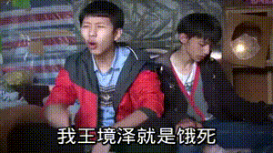

##正文

今临时有事儿出门，写一则短篇的历史散文，文章轻快，纯属娱乐。

山不在高，有仙则名。水不在深，有龙则灵。斯是陋室，惟吾德馨.....

这首《陋室铭》是中学语文的必考题目，作者唐朝大诗人刘禹锡，借此陋室表明心迹，就算自己再穷困潦倒，也不愿同流合污。

 

刘禹锡如此志行高洁也是有底子的，这哥们跟刘备一样，是中山靖王之后，孝景帝阁下玄孙。

而且，刘禹锡21岁就与柳宗元同榜进士，23岁授太子校书，随着太子唐顺宗登基，不到三十就成为了大唐权力中心的人物。

不过，后来随着唐顺宗被迫让位，刘禹锡和柳宗元们也被逐出大唐权力的中心，一直在偏远地区蹉跎，因此刘禹锡的《陋室铭》、“旧时王谢堂前燕”等对权贵们不满的诗词，在这蹉跎的几十年来也是层出不穷。

直到刘禹锡在生命的最后时刻，他终于时来运转得以重返洛阳，成为炽手可热、各方笼络的人物。

刘禹锡的热度，让当时的位极人臣的李司空（尚书右仆射）也不得不巴结他，摆下了极其奢华的宴席，让自己最珍爱的歌姬出来作陪。

嗯，类似王司徒请董卓赴宴，画面大概应该是这样的：

 

看到如此天仙美貌女子，刘禹锡不由得诗（淫）兴大发，当场赋诗一首：

>高髻云鬓新样妆，春风一曲杜韦娘，司空见惯浑闲事，断尽苏州刺史肠。

嗯，“司空见惯”这个成语就是来源于“司空见惯浑闲事”，意思就是李司空的美女看多了，习惯了，导致“脸盲”。

 

而“断尽苏州刺史肠”这句的意思，是我刘禹锡（苏州刺史）可不脸盲啊，看到这妹子，体内酝酿已久的洪荒之力即将喷涌而出。（断肠一词，取意李白的“一枝红艳露凝香，云雨巫山枉断肠。”）

这就像房地产老板请政府领导去夜总会，发现一身正气的领导眼睛直勾勾的盯着自己带来的妹子，哈喇子直流，就知道接下来的运作有戏。位高权重的李司空，随即就把这名顶级歌姬作为礼物，送给了一身正气刘禹锡。

而几十年来，诗词中一贯抨击“王谢”等豪门，“无丝竹之乱耳”的刘禹锡，麻溜的就笑纳了.....

嗯，真香.....

 

哦，这里还得补充一下背景，刘禹锡作诗的时候已经六十多岁了，如果他也有一个好朋友叫苏轼的话，估摸也会送他一首“鸳鸯被里成双夜，一树梨花压海棠”......

 

当然，我们也不能就这么光调侃“一身正气刘禹锡”的“真香”，还有那位摆豪宴送歌姬的李司空，名叫李绅，虽然这个名字可能不熟悉，但他写的两首《悯农》诗，相信全中国没有没不知道的：

>锄禾日当午，汗滴禾下土。谁知盘中餐，粒粒皆辛苦？
>春种一粒粟，秋收万颗子。四海无闲田，农夫犹饿死。

生活奢华糜烂到让混顶级圈子的刘禹锡都慨叹“司空见惯”的大佬，同时也是当年说教“谁知盘中餐，粒粒皆辛苦”的诗人。

也许，这就是历史最喜欢开的玩笑。有些东西，不是谁都能守得住的。

 

##留言区
 无留言