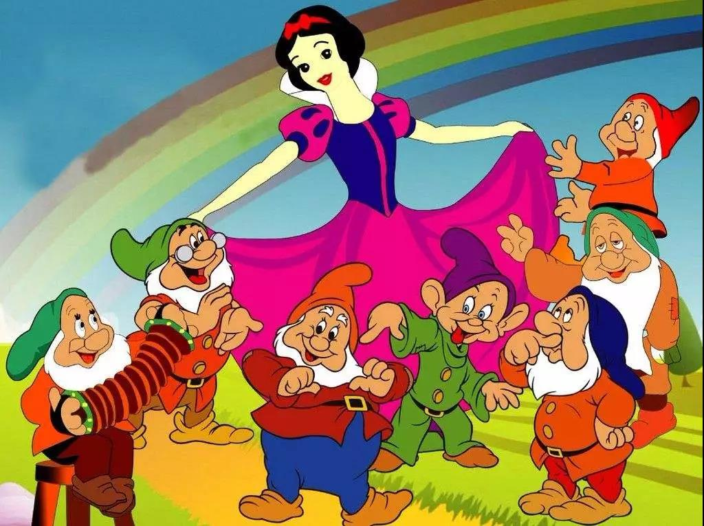

##正文

今天本来想写特高压，不过老同学来访，出去喝酒回来晚了些，这样就先只写前半部分的特斯拉。

最近几年，大家经常会在网上看到一名“网红”科学家，尼古拉.特斯拉，随便百度一下，就会发现网上把他吹得那叫神乎其神，几乎近代所有的重大都跟他有直接关系，甚至通古斯大爆炸都被炒成了他的神作。

 

而实际上呢，就算如网上所说，美国资本家的不待见他导致他被封杀，但往往越是这样，高教版的教材就越会对其加重笔墨，而好好读书的同学都应该知道，课本里面特斯拉就是一笔带过，绝大部分人甚至都没有印象。

特斯拉不被重视的原因，就是特斯拉同期的二十世纪初前后，物理界的大神如井喷一般，以他的贡献来衡量，教科书上能给一个豆腐块真就不错了。

 

那么，“平平无奇”的特斯拉为什么在这几年能够突然成为中国的网红呢？
 
答案很简单，就在特斯拉突然在国内爆红的同期，美国的一家电动汽车公司正准备进军中国市场，他的名字就叫做特斯拉。

 

虽然此特斯拉并非彼特斯拉，但只要让老百姓觉得特斯拉这位科学家牛逼哄哄的，大家买特斯拉汽车的时候，自然也会觉得自己牛逼哄哄。

也只有这样，才能接受一个美国的普通品牌汽车，在中国卖出来奢侈品的价格。

嗯，这也是近期特斯拉为了促销而降价，竟引发了国内买家的激烈反对的原因。毕竟很多特斯拉车主是按照奢侈品买的车，自然无法接受像快消品那样快搞降价促销。（就像香奈儿降价女孩们反而会不爽，是一个道理）

而除了马斯克之外，特斯拉能够逆袭的第二个重要因素，就是自媒体口中那个打击特斯拉的美国政府。
 
其实，美国政府并没有打击特斯拉，特斯拉的大部分发明都集中在一战之前，那个时候的美国正在韬光养晦，国际影响力远逊于英法等欧洲老牌列强，因此，在科技领域的争夺中也落在了身后，所以一战之前，美国专利局就把无线电的专利判给了英国公司马可尼。
 
但是，秉承着“穷则搁置争议，达则自古以来”的美国，在1943年二战进入转折阶段之后，马上就做出了令全球科学界瞠目结舌的，重新裁定特斯拉为无线电的发明者。一下子把特斯拉的历史地位提了一个大的台阶。
 
当然，美国如此支持特斯拉也是有自己小算盘的，这样美国的企业和军方，也不需要再为此向英国企业缴纳高额的专利费了，而此时正在被小胡子铁骑肆虐的欧洲，正指望着美国的援军，也就只能捏着鼻子认了。

最后，特斯拉能够在中国爆红，最根本的原因还是“自有国情在此”，因为中国人喜欢特斯拉这种屌丝逆袭的剧情。
 
特斯拉屌丝出身，这使得他在重视传承的西方的确不被重视。但是在中国，屌丝出身，尤其是一路被打压的成功者往往会引发极大的赞赏，甚至大家都会积极主动的去美化他。

这个东西方之间的巨大反差，连在童话中都有着深刻的体现。
 
譬如中国的的古代爱情故事，从天仙配、西厢记到白蛇传，清一色都是屌丝逆袭，不是秀才啪玉帝姑娘，书生啪相国小姐，就是士人啪千年蛇精，反正开启了意淫模式之后，读书人的事儿嘛，没什么不能啪的。

 

反过来呢，再看西方的神话，男主人公一色都是帅气的王子，上从白雪公主，下到灰姑娘，像首富儿子那样到处啪妹子，也不怎么挑食。

而其他配角们就像七个小矮人一样，根本不算人。
 
 

东西方之间巨大的差别，在于西方有资格从小就接受高等教育，只有各个领主家的孩子，人家本来就是王子和公主，自然听得就是王子和公主的故事。

而中国从孔子开始逐步打破了教育的垄断之后，大量的底层民众有了上升的通道和学习的权利。甚至闲暇之余，也写点剧本给自己和朋友们乐呵乐呵，西游记、水浒传乃至三国演义，都是一代代的知识分子们搞“接力赛”写出来的产物。

而正是有中国特色的编撰模式，使得特斯拉原本一个平平无奇的科学家，愣是在国内无数创作家们的接力改编之下，不断的扩充，牛逼一步步的吹上天，最终成为了一个神乎其神的全球顶级科学家。

而随着民众接力炒作斯特，以及大书特书特斯拉与爱迪生在交直流电上竞争的故事，不仅特斯拉，连他发明的交流电，在中国都被极大的高估了。

如果将视角，放在中国即将大规模启动特高压输电这个宏伟的大背景之下，考虑到国际上交流与直流标准的竞争。

也许，那么多人炒作特斯拉，可能有更深的原因.......

##留言区
 

