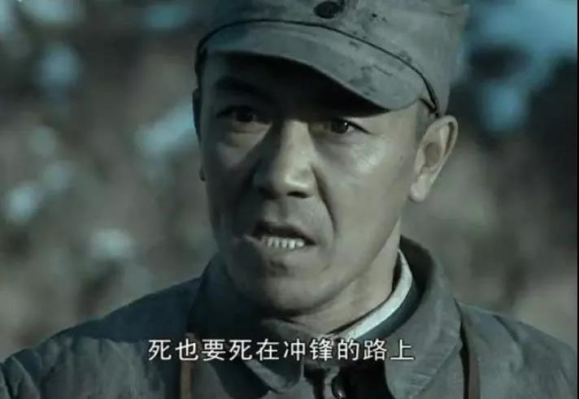

##正文

1979年，在改革的春风吹遍全国之际，位处大西南的云南玉溪卷烟厂也开始了一场历史性的改革。刚刚结束20年“右派下放”生涯，在农场担任糖厂厂长褚时健，这位“老革命”临危受命出任玉溪卷烟厂厂长。
 
之所以说是临危受命，是因为当时的玉溪卷烟厂就跟《亮剑》第一集的独立团类似，一盘散沙、士气低落，机器设备不仅老旧而且损坏严重，“拳头产品”红梅烟更是因为质量低差，被百姓嘲笑为“红梅红梅，先红后霉”。
 
而伴随着改革开放，万宝路、骆驼等进口品牌香烟就像鬼子的特工队一样，神不知鬼不觉的出现在了国内市场，对国产品牌打了一个突然袭击。这些进口品牌凭借着优异的质量和精美的包装，迅速击垮几十年来没变化的国产香烟，即使价格高出几十倍却仍然供不应求。
 
在此危机之下，从下放农场回来的褚时健，就像从被服厂刚放回来的李云龙一样，并没有气馁，而是打破了过去的大锅饭，对烟厂进行了大刀阔斧的改革，还在征得了上级领导同意之后，率队去了意大利倒腾技术......

 

在引入一系列的西方先进设备之后，在褚时健推动的"单箱工资奖金包干”分配制度下，下面的员工一个个“嗷嗷叫”求战式的开拓市场。玉溪卷烟厂也取得李云龙独立团式的迅猛发展。

尤其是88年云南地震，国家为了帮扶云南，解封的烟草管制，使得玉溪卷烟厂凭借着优异的品质迅速横扫全国，红塔山、阿诗玛、红梅销量包揽全国前三，玉溪卷烟厂也成为亚洲第一的烟草集团。

其麾下品牌红塔山更是在高档香烟中，做到了“天下烟有一石，红塔山独占八斗”般无法复制的成绩，并与进口香烟的亮剑中频频大获全胜。

怎么形容当时褚时健风头有多盛，且不说纷至沓来的各种荣誉，仅税收一项，在其离任前的1996年，红塔集团仅上缴利税就达200亿，现在大家可能对这个数字没啥感念了，嗯，这是一家公司支撑了当年1/3的军费.......

 

当然，有本事的人往往脾气也大，就跟李云龙频频跟友军闹矛盾类似，提供云南财政半壁江山的褚时健，意气风发之时，对很多外省的省部级干部也不给面子，只有中央和省里的几位领导才能降服得了这头倔驴。

而这，也给他埋下了深深的隐患。

1995年，在审查时任贵州省主要领导的过程中，发现该领导夫人从云南批了上万件的“硬通货”红塔山，顺带查出褚时健私分公款之事。

随即，这位红透了全国的风云人物，一夜之间变成了阶下囚，而对这位七十多岁老人更致命的是，不仅亲属纷纷入狱，唯一的女儿也在狱中自杀身亡。

风烛残年的老人在晚年遇到这样的不幸，一般都会从此消沉，但是“一息尚存就战斗不止”的褚时健却没有，在糖尿病保外就医后，上了哀劳山，承包了2400亩的荒地种橙子。

要知道，种橙子，需要四年才能结果。

而那年，他已经74岁了。

王石曾说，“如果我在他那个年纪遇到挫折，我一定不会像他那样，而是在一个岛上，远离城市，离群独居。”

宝万之争后惨败的王石，似乎也的确践行了这句话。

但是，与命运抗争了一辈子的褚时健和王石不同，他选择了重新站起来。

 

这位曾经管理者中国最赚钱企业之一的大佬，这位“亚洲烟王”亲手带出来的徒弟们如今都已是各大烟草集团的老总，自己却在古稀之年成为一个地道的农民。不仅在果园的管理上亲力亲为，甚至为了选出优质的肥料，鸡粪倒在手里精挑细选。

在褚时健的“联产承包制”的带领下，当年红塔山的奇迹再一次上演。借助了互联网浪潮，高品质的褚橙就像当年的红塔山一样席卷全国，哀牢山的农户从年均收入不足2000元，到如今参与种植的农户年收入高达10万余元。

创造奇迹的人，总是能够再创奇迹。

可是，就在今天，这位在哀劳山上给自己画地为牢，辛劳渡过了15年光阴的老人，在刚刚度过自己90大寿后，病逝于玉溪市人民医院。

他没有住在省政府为表彰他功绩提供的高干病房，也没有像其他的同龄老人那样在海边享受着温暖的海风。

节前仍在橙园忙碌的他，死也要死在冲锋的路上。

这就是褚老这位老革命传承下来的精神。

 

 
**褚老，您一路走好！**

##留言区
 

