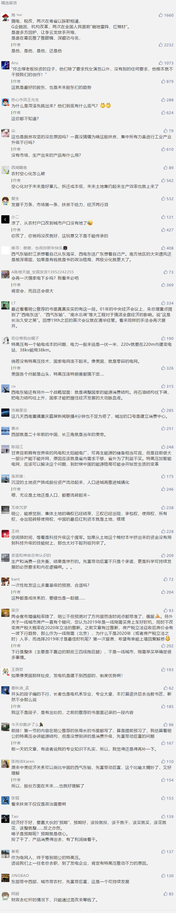

##正文

 
一

十九年前的一个夏天，在北戴河畔，饱受缺电困扰的广东向中央请求，批准在省内新建1000万千瓦发电机组。
 
当时改革春风下 ，“先富起来”的广东从原本辽宁GDP的80%，变成东三省加起来也只有广东的80%，高速的发展带来了电量需求的激增，因此，新建发电机组，在广东省方面看来理所当然。
 
不过，这个看似理所当然的申请，并没有得到通过。
 
春节刚从中国最穷的省份贵州考察归来的朱总理，当时却有另一层的考虑，他提出，在贵州、云南建设1000万千瓦的水电站向广东输电。
 
由于新建电站会为当地带来巨大的税收和就业，在核定电价之下，收益堪比印钞机。因此，用电大户的广东本着“肥水不流外人田”的原则，并不想把到嘴的肥肉丢出去，从技术层面提出了一系列的反对意见，试图阻止西部的电能千里迢迢运到广东。
 
面对地方上的“围攻”，为了大西南的困难群众，人民的总理还是毅然站了起来，向在座诸位立下军令状：“如果不能完成向广东输电1000万千万的任务，我总理辞职！”
 
看到总理如此动情，另一位戴着黑框眼镜的长者也不禁站了出来：“朱总理是清华大学学电机的，他懂电，就听他的吧”。
 
最终，两位理工科出身的老同事，硬顶着地方的强烈反对，启动了“西电东送”这个令世界震惊的大工程。
 
这项工程的伟大，不仅为为广东的高速发展提供了源源不断的能源，保护了环境，也为中国最穷的两个省份，找到了新的经济增长点。
 
依靠着输电带来的基建和售电带来的税收，云贵两省赶上了广东发展的顺风车，国家也兑现了当年先富带动后富的承诺。
 
这，就是我们中国特色的市场经济。

 
 
二

 
说起来，西方资本主义有一个天生的缺陷，叫“有效需求不足”。
 
这是因为获取了巨额利润的资本家们，并不能把他们赚的钱都消费出去，就像马云他再有钱，一年也换不了几个手机。因此，随着资本的积累，两极分化之下，市场的需求会越来越弱，直至引发经济危机。
 
对此，马克思认为经济危机，是资本主义生产关系所导致的，故而给出的药方，是国家的统供统销。嗯，节前刘主任去的供销总社，当年就是干这个的。
 
统供统销意味着消灭利润，资本家们自然不会选，于是欧洲的资本家们拿着枪炮在全球争夺殖民地，美国的资本家们则是拿着枪炮从印第安人手中掠夺，来解决他们的过剩产能危机。
 
等到全球的殖民地都被瓜分完毕之际，就像列宁说的，西方人到了自己打自己的时候，最终，引发了两次世界大战。
 
两次大战之后，出现了核武器，当后发展国家拥有了抵抗列强的杀手锏之后，资本家们就无法再通过代理人战争消灭过剩产能和侵占市场，于是也就不得不为了市场，坐下来谈判。
 
从70年代的秘密谈判，到90年代的WTO交锋，再到如今你来我往的磋商，莫不如此，毕竟，中国拥有着全球最大的消费市场。
 
甚至在改革开放的过程中，全球的资本家们为了寻求更大的消费市场，还向中国转移生产线和部分技术，并推动市场化的改革，以至于某些方面的改革，资本家们比我们自己还认真负责。
 
而正是美国的腾笼换鸟，自己发展高科技，把他们落后的产能向中国转移，让中国人富了起来，中国才有能力购买更多的美国高科技产品，形成了一个紧密的经济闭环。
 
试想，如果没有中国每年上万亿的芯片进口带来的利润，以及未来5G基建的大规模上马预期，恐怕按照供求关系考虑的高通们，现在根本不可能推出商用的5G芯片。
 
道理很简单，就像北欧人再富庶，也和马云一年，不可能一年换几部手机，他们受人口规模所限，消费规模在那摆着呢。
 
而中国的**十几亿人口中的绝大部分，只要收入一提升，就会出现以亿级衡量的消费升级。**
 
而这，也是中国未来经济破局和产业升级关键，也是一系列政策制定的初衷。
 
 
三

 
如果把中美之间的逻辑，延展到中国的西部和东部，也会发现，在2000年前后，中国上马的“西气东输”、“西电东送”、“青藏铁路”等横跨中国东西部的超级工程，也是这个道理。
 
通过这些超级工程，西部的能源和劳动力输送到东部之后，就变成了财富，而随着西部的越来越富庶，东部的工业才获得了足够大的销售市场，2000年之后的十来年，在中国做生意会有一个直观的感受，就是生产什么都不愁卖。
 
不愁卖的原因，就是广大的中西部群众有钱了。
 
有钱了，不仅东部的产品在中西部卖得好，铁路基建带出来的中西部能源资本还缔造了东部房地产与影视等一系列行业的超级繁荣。直到现在，演艺圈不少大佬们还怀念当年出手阔绰的煤老板......

 

而历史都是有惯性的，而上一轮城市里生产什么都不愁卖，同样出现在改革开放初期。
 
随着农村通过家庭联产承包富裕了起来，东部城市随即获得了巨大的市场，双轨制之下，大量的工业品向早先富裕了的农村倾销，使得城市迅速积累起了原始资本并发展了起来。
 
所以，回顾历史，如果想要解决中国的问题，那么从改革开放的经验来看，**根源一定是在中西部和农村，而且，一定要让困难的群众，先富裕起来。**
 
 
四

去年，拼多多层出不穷的山寨品牌，已经给了中国制造业升级亮一个红灯。因为随着拼多多的崛起，大量广东原本已经没落的“手工业制造淘宝村”又死灰复燃。

这意味着东部如果不带着中西部富裕，那么东部的工业体系也会被拖累，将向着降级而非升级发展，甚至会拖累接下来国家重点推动的家电下乡。

发展中西部和农村能够带来长远的好处，不发展则会带来巨大的隐患，这两点并不难理解，但是，执行起来却非常的难。
 
向中西部进行大规模的基建，受制于财政开支，东部很多城市不必要的基建就要减速，会引发地方的强烈反应，譬如货币化的棚改停止后，山东菏泽随后就跳出来喊饿。
 
而且，西部的廉价能源如果源源不断的输送到东部，那么东部本地的火电厂就要被外省的水电厂取代，将带走大量的税收和就业，在如今地方财政和就业双压力之下，地方政府很难接受。
 
就像房地产税推进了十几年还没立法，触动利益往往比触动灵魂还难，当年西电东送连铁腕总理喊出“完不成任务辞职”，可想而知会遭遇多大的困难。
 
但是，这条路虽然痛苦，但却是必须要走下去的。
 
美国只有忍痛把旧的产能转移到中国，才能让富裕起来的中国购买更多美国的高科技产品，同样，我们只有东部把部分产业利益转移到西部，才能让富裕起来的西部购买更多东部的产品，推动东部的产业升级转型。

所以，知道了我们未来的前进方向，那么解决问题就一定要有智慧。

譬如，未来西部能源向东部输送的特高压电网和油气管网，就可以推动混改，让地方政府和企业合伙参与其中，就像即将IPO做“千金马骨”的京沪高铁一样，所有人都能从中获得收益。

同样，想要让中西部的农民富裕起来，推动中国产业结构的升级，未来必然也要给他们享受到农村土地发展的红利，让他们在希望的田野上，拿到属于自己的股票，跟着国家一起飞！

近期关联文章：

加速房地产税的背后

搭上中国经济的“高速铁路”

中央一号文件，开启农村的大时代

##留言区
 

