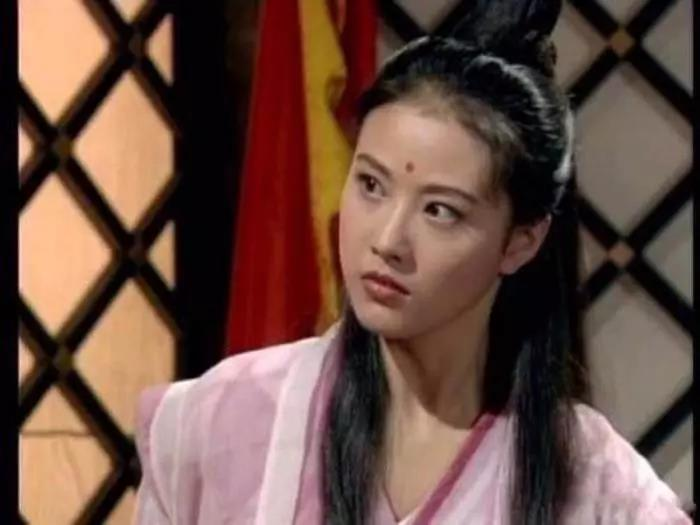
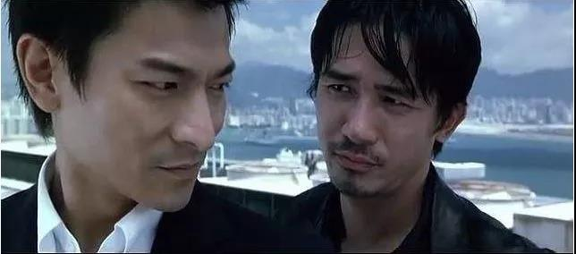
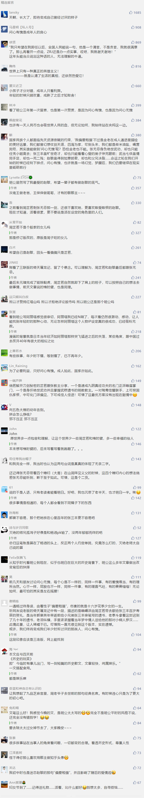

##正文

 
一

今天女神节，带着我家女神兴致勃勃去看了卡梅隆的《阿丽塔：战斗天使》，不过略遗憾的是，这部卡梅隆筹备多年的电影，替代的导演却没有拍出他的精髓。
 
就像当年长者对两会代表说的：“《泰坦尼克》讲到了财富与爱情、富人与穷人的关系，生动地表现了人们在面对灾难时的反应。”

无论是《泰坦尼克》中能够优先登上救生艇的头等舱，和与上层完全隔绝的末等舱；还是《阿凡达》中肆意掠夺屠杀的殖民者，与潘多拉星球上抵抗侵略的原住民；亦或者《终结者》中，对人类赶尽杀绝的机器，与人类奋起的抵抗军.......

卡梅隆能够取得一个个不可复制的成功背后，在于通过故事背景的设定，塑造巨大的冲突来推动剧情，并在影片的结尾，将人性的考验摆在了观众的面前。

而且无论是靠赌博赢了泰坦尼克船票的穷小子杰克，还是临时抓壮丁派往潘多拉星球的残疾人杰克，这群社会中最渺小群体，却在结尾处的危机中，迸发出人性伟大的光芒，并引发了荧幕前观众们的共鸣。

所以，卡梅隆亲自操刀的片子，都会创造票房纪录。

这就像很多人不明白为什么吴京的《战狼2》和《流浪地球》剧本瑕疵很多，却依然能够创造仅次于卡梅隆的奇迹。

其实，吴京两部电影的成功不仅于战狼和航天员刘培强的个人英雄主义，而在于危机关头，片中一个个普通人，也都能站出来，引起了观影者的共鸣。(影视行业的朋友看完这段应该打赏表示一下）

不过很可惜，今天看的《阿丽塔》中，原本卡梅隆打造的天空之城撒冷与地表的废铁城不可调和的冲突，竟被虚化，几个原本能出彩的配角，也都一笔带过领了便当，导致筹备了十几年的一锅好菜，被一个烂厨子给炒砸了.......

 
二

如果说西方大师中，卡梅隆最擅长利用背景矛盾推动剧情的话，那么东方大师中最精于此道的，莫过于去年仙逝的金庸大师。
 
《射雕英雄传》之中，明线上是郭靖与杨康拖雷两位结拜兄弟的冲突，暗线推动的却是大宋与金国和蒙古之间的国家冲突，明线上是郭靖和黄蓉之间的小矛盾，暗线中却是江南七怪、全真七子、四绝之间的冲突。

同样，《天龙八部》中，明线上是乔峰一路遭受各方的打击，暗线是契丹与大宋之间的国仇，以及雁门关前中原武林、慕容家与萧氏一族的家恨。

正是肩负着宿命的各个角色们，在矛盾的推动之下，为我们带来了一篇篇的武侠经典名著，和一个个鲜活的人物与爱情故事。

而与卡梅隆的电影类似，无论是襄阳城下还是雁门关前，在兄弟情义与国家社稷的两难之下，选择牺牲自己的郭靖和萧峰，自然也就成为了经典中的经典。

其实，金庸和卡梅隆们这些大师，写作和表现的路子，都已经趟的非常明白，只不过，有些人是不会，有些人是不愿。

 
三

说到金庸小说，令我感触最深的两句话，一句是小郡主赵敏说的“我偏要勉强”，一句是峨眉掌门周芷若说的，“倘若我问心有愧呢？”

小时候的我，被金大侠《倚天屠龙记》中这两句话迷得不要不要的。

而这部小说之中，剧情矛盾设计的堪称金庸最佳，且不说张无忌与小昭爱情的背后，是明教与波斯宗教之间的冲突，与珠儿感情的背后，是明教总坛与紫衫龙王和白眉鹰王两大独立势力的冲突。

 

最主要的两位女主，张无忌和赵敏感情的背后，是当时蒙元与汉民族之间不可调和的矛盾，张无忌与周芷若感情的背后，是峨眉教与明教之间几代的血海深仇。（谢逊杀了灭绝的哥哥，杨逍杀了灭绝的掌门师兄，还拐走了下一代传人纪晓芙）
 
而且，峨眉周芷若和元朝小郡主之间，除了创教祖师郭襄的父母兄长，以及师父灭绝师太及众多师姐们都在元朝手里，之外，也埋了一个重要的伏笔，在1348年，赵敏的父亲察罕帖木儿，镇压了周芷若父亲周子旺领导的农民起义，并将其绞首......

所以，长大后我才明白，周芷若后来的所作所为，不仅仅是因为对师父发了毒誓，肩负着国仇家恨与师门重任的她，很多事情上并没有什么选择的余地。

尤其在她知道屠龙刀与倚天剑藏着的秘密之后，就绝不能让武穆遗书和九阴真经，落在父亲掌握着蒙古全部大军，女儿掌握着蒙古全部高手的赵敏父女手里。

否则，正值全国各地起义军风起云涌之际，一旦让蒙元拿到开挂式的武器，必将导致生灵涂炭，血流漂杵。
 
因此，当光复峨眉、驱逐鞑虏成为了周芷若的使命之后，从伤珠儿盗取刀剑，到大婚现场硬逼着张无忌退婚，甚至嫁给自己极其厌恶的宋青书（武当接班人），都不是自己真心的选择。

因为她没得选。

但是，这些选择她都是违心的。
 
所以，那夜张无忌说：“咱们只须问心无愧，旁人言语，理他作甚？”时，

周芷若竟回道：“倘若我问心有愧呢？”

 

有些时候，在历史的背景的驱动之下，很多的边界就会模糊。

就像战狼2里面，跟着战狼一起拿枪对抗劫匪虽然难，但是强忍着泪水，等待上级开火命令的海军舰长，也许更难。

 

没有提前开火，挽救更多的生命，舰长一定是“问心有愧”，可即使时光倒流，他也不会做出不同的选择。

因为他也没得选。

 

每个人做选择的权力是不一样的。

从一出生就受尽万般宠爱无人敢忤逆的赵敏，自然就可以随心所欲，在父亲和哥哥的保护下，做什么都可以毫不顾忌后果；但是，毫无依靠的周芷若，根本没有资格由着自己的性子来。

小时候觉得抛弃一切，“偏要勉强”跟张无忌在一起的赵敏不容易，可随着年纪渐长，才慢慢体会到，心里从始至终只有一个张无忌，但却还毅然斩断情丝的周芷若也许更难。

就像周芷若的祖师爷郭襄，小毛驴一路滴滴答答，倚天仗剑行走天涯，不为那风陵渡口的一见，也不为那十六岁绽放的烟花。

年少时，总觉得应该像赵敏那样遇事“偏要勉强”，可长大后，才发现往往周芷若那句“问心有愧”，才是人生中要面对的日常。

 

 
##留言区
 

