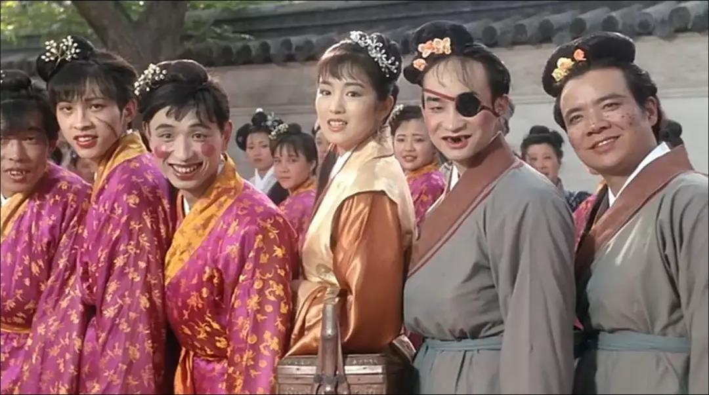
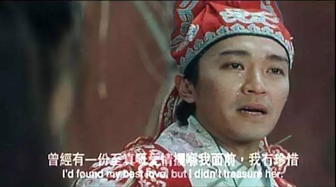
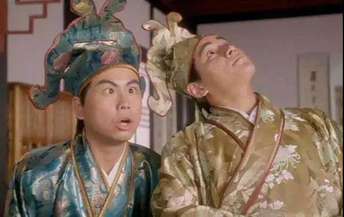

##正文

赶到风口上，猪也会飞，这句IT大佬雷军的名言，放在如今的资本市场亦不为过。

即使人民的代表周末在神圣的两会上，对割韭菜的妖精再如何痛斥，随后人民日报再如何立Flag，今早证券报再怎么连板批评，也无法阻挡创业板的妖精们继续今天继续狂拉涨停。

监管如此放纵垃圾股的背后，就是我这段时间反复说的那则《战国策》的故事，“千金买马骨”。

虽然燕王知道，“在座的各位都是垃圾”，但是为了引进千里马，也不得不捏着鼻子，为这些不值钱的马股买单。

 

花费如此代价买“骨头”，不过是为了以此吸引真正的千里马，作为我们的国宝。

不过这么做，到底能引来多少匹千里马不知道，但现在这个风口之中最爽的，莫过于那些装作国宝的奇怪东西.....

 

反正就像雷军说的，风来了，猪都会飞。

只不过可惜的是，这个风口原本还真是给雷军这个风口论的祖师爷准备的，甚至为其IPO，都吹起了CDR的集结号，集结了上百亿的资金。

可是雷军临门一脚的时候，怂了.......

对比一下，如果说A股本轮的爆炒，是靠5G物联网概念引爆的话，那么跟5G物联网除了名字之外其他都不靠边的妖股东方通讯，和5G物联网先锋的小米之间，哪个更应该受资本的追捧呢？

看看小米，再看看东方通讯这些妖股，论公司质量，雷军是不是就像一群丑女之中的那位秋香呢？

 

记得去年小米IPO之前，我写过多篇讨论互联网企业IPO的文章，很痛惜的说，**雷军没有明白小米的价值**，小米的价值不是去研究市盈率按照哪个算，而是**千金马骨的价值和双轨制的套利空间。**

这引得部分的米粉在后台留言，反诘我，“你能比雷军懂小米？”

把我问的无言以对......

 

嗯，看着如今在监管的放纵下各种妖股横行，以及创业板走势已经完全跟主板脱节，我想，去年不懂的读者，可以再把去年的互联网企业IPO系列文章拿出来再看一遍。

去年监管层希望小米能够低开高走，带头实现CDR和互联网明星的“赚钱效应”，而雷军与其身后的资本，却基于各方面考虑，倔强的没有接收这份馈赠，反而去跟市场讲道理。

 

不知道雷军和投资小米的那些资本，看着如今这一波的行情，有没有后悔自己去年的一意孤行，让如今小米的股价，仿佛那个过了风口摔下来的猪......

 

哎，原本手握一匹千里骏马，没卖出好价格，却让如今一群卖狗骨头的把钱赚了。

对此，我一直很痛心，不仅仅因为小米是中国最好的互联网基建公司之一，其募集到的资本，就像20年前启动的大基建一样，会对其他创业公司提供巨大帮助。

更因为某种程度上来说，没赶上风口的雷军，损害的不仅仅是自己，而是整个科技创新领域的生态圈。

监管层不得不以另一种更激进的方式来实现融资的目标，搞出了如今一群战五渣的垃圾股横行。

 

哎......

既然第一步走向了另一个方向，也就只能硬着头皮继续走下。最好的新基建公司不能带头，那么就只能等最好的新动能公司带头了。

记得之前有读者留言问过我，新动能的公司有什么，我回答说，我目前只看出来蚂蚁金服是，甚至未来阿里巴巴都是给蚂蚁金服做基建的。

而今天恰巧有一则新闻，蚂蚁金服的某个股东在两会上说，蚂蚁金服将准备登陆科创板，蚂蚁金服随后将其否认，引发了市场的热议。

对此，我认为，未来蚂蚁金服登陆科创板（或者其他类似名字），是一个必然的事件。

就像我昨天文章说的，我们无论是旧基建还是新基建，国家那么大规模的投入，都是指望着新动能企业把钱赚回来，因此也绝不可能允许蚂蚁金服为代表的新动能公司在海外上市，他们赚取的超额利润必须要回到中国。

所以呢，这也是未来互联网巨头们做企业架构时，必须要事先考虑的问题。

因为中国既然选择开放大规模开放包括金融在内的市场和产业，那么就必然要有一个反制措施，很可能就是对于以金融、农业乃至制造业等产业进行数字化或者互联网化的升级。

届时，中国将凭借着强大的互联网企业，形成新的长城，来抵抗海外资本的涌入，甚至也将是我们反击的先锋。

所以，一方面必然会加强互联网公司党的领导，另一方面必然也会有如科创板IPO等一系列的政策性的扶持，只要时机允许，就能扎堆上市。

嗯，**在此之前，一轮人造大牛市就会出现，仿佛2000年之前的纳斯达克......**甚至会看到各种各样的“全家桶”......

当然，一方面蚂蚁金服募集的资本规模会给市场造成巨大的压力，使得监管不敢让其乱上，另一方面蚂蚁金服又是未来科创板树立价值最好的基石，又不得不上。

所以，目前监管层对蚂蚁金服IPO，仿佛像一位初恋少女等男友约会，怕他不来，又怕他乱来......

因此，此刻马云和他的蚂蚁金服，就像他当年做出的誓言那样：

 
**时刻准备着！**
 

##留言区
 

