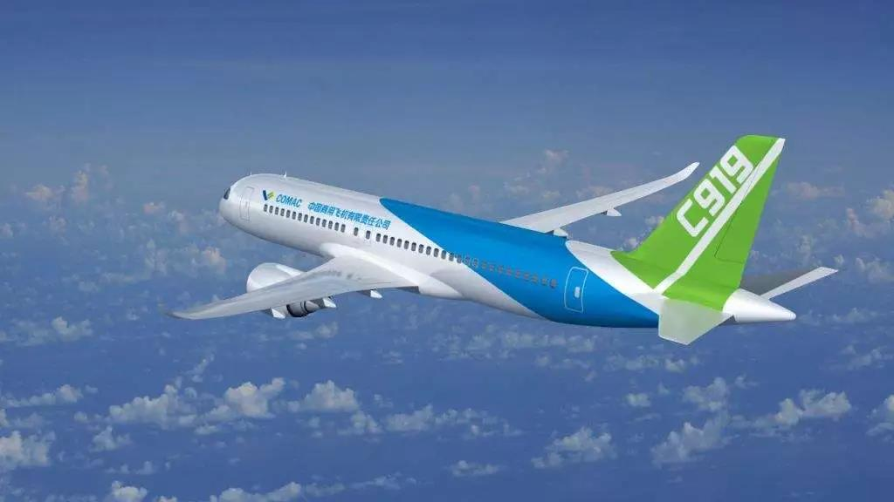
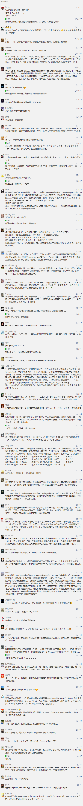

##正文

昨天，埃塞俄比亚航空一架737MAX8坠机，机上157人遇难，其中包括8名中国籍乘客，介于这次该型号半年内的第二次类似事故，我国对国内该型号的波音客机全部禁飞。

今天，外交部例行记者会上，发言人陆慷对波音737MAX8禁令答记者问，表示，在确认具备有效保障飞行安全的有关措施后，再另行通知各运输航空公司恢复波音737-8飞机的商业运行。

嘿嘿，这架埃塞俄比亚航空的失事飞机，竟然上升到了外交层面。

这是为啥呢？

原因只有一个，**波音公司是美国最大的出口商，中国又是波音最大的市场，而波音第四代的737MAX系列又是未来我们最主力的购买机型。**

而特朗普最关心的问题是什么呢？嘿嘿.....

且不说看最近各地启动的机场，好马必然要配好鞍，未来中国会有惊人的飞机采购，连波音2017年发布的《当前市场展望》报告都预测，未来20年中国将采购7240架新飞机，总价值达1.2万亿美元。

1.2万亿美元这个数字有多可怕呢？

相当于世界排名15的墨西哥其全国的GDP，也相当于建国以来解放军全军60年的军费总和。

国产航母配齐舰载机等全部人员装备后，也不过才40亿美金，1.2万亿美金足够给中国建三百艘航母，换个角度来看，美国最多也能从中国赚走三百艘航母。

更不要说，1.2万亿的采购背后，还有1.5万亿美元的航空服务，所以呢，从利益的角度一思考就会明白，为什么当年咱们中国高铁出了事故，被搞得千夫所指，而此次波音出了事故，网上一堆为波音洗白的文章。

毕竟，高铁的速度再快，爽的也是我们老百姓，赚不到差价的“中间商”，一个个都在那里装糊涂。

 

而反过来看，波音的飞机一架一个多亿，人家赚的还是美金，US Dollar.......

所以，此次事故之后的全面停飞，直接打到了波音的七寸上面。

要知道737当年的初代机，老美硬挺着继续运营，直到摔了多少架，才不得不返厂修改缺陷，毕竟，在巨大的利益驱动之下，美国人自己的命也一样不值钱，当年著名的“福特平托车”案就是典型的例子。

但是，这次这个新款的737MAX8在半年之内连续两次出现同样的问题导致坠机，几乎可以排除是地勤方面的问题，而且从飞机轨迹上来看，应该是更换发动级之后的MCAS智能系统导致的，坠毁之前，驾驶员都像《流浪地球》里面的吴京大战MOSS一样，与波音的智能系统反复争夺飞机的控制权。

而一旦最终确认是波音的问题导致发生飞行事故，那么波音就不得不对停飞的航空公司做出巨额补偿，甚至更可怕的是，**部分已经达成的购买协议，按照合同条款，也都可以据此取消已签订的协议。**

要知道，仅2017年11月，特朗普访华的同时，我们就签署了300架波音的采购协议，超过370亿美元，其中的主力机型可就是此次坠机的737MAX8。

而且，中国不用于之前坠机的狮航只能捏着鼻子认栽，一方面，刚刚放弃A380全力转战A320的欧洲空客，在天津可是有总装厂的，中国制造的效率随时可以填补美国波音737的空白，另一方面，在最近的两会上，C919总设计师吴光辉称，今年年底C919咱们中国的“大飞机”，就将审定试飞，两年后就可以完成试飞交付，像小米手机那样开始量产了.....

因此，面对老对手欧洲空客的背水一战和新对手中国商飞的强势来袭，美国的波音在这个时间点上，必须使尽全力，不能犯任何一丁点的错误，也不能允许中国民间对波音产生抵触心理和安全的担忧。

否则，就像萨德之后的三星，曾经垄断中国的高端市场，却因为一次电池爆炸，就中国的“大手机”们，几近被挤出了中国市场。

所以，此时此刻，在白宫以及建制派中，拥有极强游说能力的波音公司，必将成为我们最坚定的盟友和“挚爱”。

 

有的时候，世界就是这样的梦幻.....

因此，无论是今后在股市里面赚到钱的，还是在国际贸易中获益不菲的，此刻都应该向中航系统的同志们致敬，并向失事飞机中牺牲的中航同志们默哀。

没有他们几代人在极其艰苦情况下的奋斗，在一群白发苍苍的老人家们的传帮带下，在外忧内患的联合打击下，打破了“造不如买，买不如租的思想”，造出了我们自己的大飞机。我们就只能像马航、狮航那样，打碎了牙只往自己肚子里面吞，就像过去四十年里，每次付了钱还被西方公司像猴子一般的戏耍。

正是一代代中国航空人的牺牲和奋斗，让大飞机这个过去四十年被欧美捏着的软肋，变成了我们的铠甲和至关重要的筹码 !

 

就像鲁迅先生说的，我们从古以来，就有埋头苦干的人，有拼命硬干的人……虽是等于为帝王将相作家谱的所谓“正史”，也往往掩不住他们的光耀，这就是中国的脊梁！ 

##留言区
 

