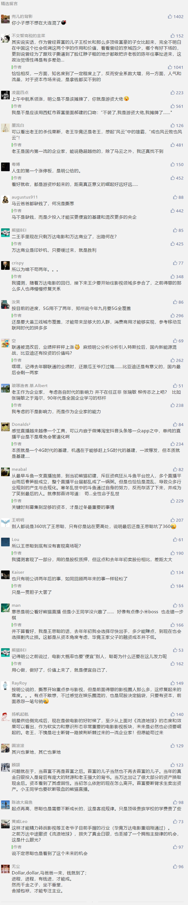

##正文

最近，沉寂已久的国民老公，因为麾下熊猫直播的倒闭，引发了媒体圈的热议。

大家纷纷研究这个既不差钱又不差流量的现象级人物是如何垮掉的，有“内斗论”，“舒适论”，“佛系论”，“3Q大战论”甚至“资源诅咒论”.....

 

对此，正规媒体也就是蹭蹭这位大IP的流量，而自媒体们则普遍借此热卖自家熬制的各种鸡汤。

可说句难听的，以上各种论，简单改改就可以套在目前几乎所有的互联网创业企业身上，甚至至少一半的互联网创业公司问题都比熊猫严重。

而熊猫垮台没那么复杂，我在去年的文章中就说了：

>和他老爹一样，需要融资的时候，市场上的钱突然钱变紧了。

视频直播这个行业，由于涉及到大量持续的人力和管理投入，别看资本们吹得天花乱坠，本质是一个重资产的基建，需要大规模的人力投入。

直播的本质和四通一达的快递以及美团饿了么的外卖差距并不大，只不过与后两者之间，有着一定的代差优势罢了。

因此，基建公司的价值，一方面会随着竞争越来越回归市场价格，看四通一达乃至顺丰的股价就能看出来。

另一方面基建公司的高估值，仅在于动能公司为了竞争愿意支付的高对价。譬如竞争激烈的时候，马云愿意为饿了么支付百亿美金，而竞争的风口过去之后，之前抢破头的ofo如今变得几乎一文不值。

而恰巧，去年王思聪的熊猫想要融资的时候，和他老爹两年前一样，市场上的钱突然就没法投他们了。

而去年3月就是一个关键的时间点，在此之前，斗鱼和虎牙就拿到了腾讯的投资，在此之后，就凉了......

因为愿意投资直播公司愿意投资的，莫过于两类，主要是以腾讯、网易为代表的游戏公司，他们意愿最强烈，还有是以头条（抖音）、快手为代表的短视频公司，他们也可以考虑。

可是在去年三月，两大行业突然出现了监管层面的“黑天鹅”。

一方面，游戏领域全面缩紧版权号，腾讯网易的新游戏也一律被喊停，整个游戏市场进入存量博弈状态，使得17年抢着买断直播公司广告位推新游戏的巨头，在18年竟搞出了起诉直播公司侵犯版权这种怪事儿，游戏公司投资直播的兴趣大减。

另一方面，头条系和快手遭遇监管严厉打击，不得不上线了一大批的审核团队，头条还被关停了部分产品。再加上之后一系列对违规主播的严厉打击，这使得原本就头疼的头条、快手甚至急于对抗抖音的腾讯微视，考虑到直播是监管重灾区，更不愿意给自己惹一身骚了。

简而言之，和两年前万达与乐视受限于内保外贷与IPO重组的停止类似，王思聪的熊猫也是在在高速扩张烧钱的时候，遭遇了上游资本的监管寒冬。

某种程度上来看，爷俩也都掉进了同一个坑里面......这个坑的名字叫做历史的进程......

当然，对于“反正没我有钱”的首富之子来说，估计熊猫一个月也就烧一个小目标，也不至于烧不起，倒闭最直接的原因，还是在于王思聪本人对直播这个行业的兴趣大减。

王思聪在15年开始整个文体娱乐领域大手笔布局的背后，一方面有着自家王老爷子几千亿文化旅游项目和万达生态圈的支撑，另一方面有着王家父子共同投资贾跃亭建立起的乐视文体娱乐生态圈的协助。

因此，所有王思聪亲自出来站台的那些文体娱乐类项目，背后都能看到可以与王老爷子的文体娱乐生态圈，形成线上线下的产业重叠。

譬如当年万达全国各地的文旅项目是要对标迪士尼的，既需要大量的IP填充，也需要引入大量的流量，王思聪搞娱乐，造IP和吸引眼光流量那可是绝配。

结果，15年王思聪开始布局，16年就市场突变，这些文体娱乐最后都姓孙了，和王家再无半点关系，甚至身在美国的贾跃亭，现在还欠王思聪一个亿的真金白银.......

而随着王家文娱领域的“基建”都慢慢不姓王了，王思聪无论是资本市场讲故事，还是体系内的资金循环周转，都成为了近乎不可能的事情，曾经巨额投入并寄予厚望的熊猫直播，此时就成为了鸡肋。

而凭借着王思聪崛起的熊猫直播，随着在王思聪眼中成为鸡肋，自然也就其兴也勃，其亡也忽。

毕竟作为首富之子的王思聪，愿意自已出任CEO来搞熊猫直播，就不是想着未来要卖给腾讯网易头条们当儿子或者当孙子公司，而是希望做出来一个能够在文旅娱乐方面，打通王家产业的线上线下，进行资源的整合，因此他才会大规模的烧钱，并以自身形象为熊猫做代言和消耗人脉资源。

凭借着王思聪的背书，不仅使得熊猫能够迅速作大，大量明星和主播看在王思聪的面子上加入，也使得2018年熊猫的融资估值中，王思聪个人价值占了非常大的一部分。

问题也就来了，投资方认可目前熊猫按照市场给出的估值，是里面包含了王思聪的资源包和后续个人投入，而王思聪一旦撒手不管，那么估值就必然出现大幅的跳水。

但是，王思聪以及熊猫的股东们，必然是希望按照市场来对熊猫估值和定价，否则按照扣除王思聪来算的熊猫，恐怕就值不了几个钱了。

而随着王老爷子和贾布斯向孙宏斌出让文旅项目，王思聪对于直播的兴趣和投入就大规模减少，目的就是为了让自己脱手，这样才能精力转战影视等王老爷子目前手握的行业（毕竟万达电影重组刚通过），这就使得熊猫的估值出现不可调和的矛盾。

因此，资方、王思聪以及熊猫的股东们，在价格以及王思聪的作用上面必然谈不拢，然后再拖到了整个行业的寒冬，于是首富之子控股站台的项目，就这么彻底凉凉......

就像当年王老爷子贱卖资产的两年后，市场上便妖精横行扎堆上市，小王同学关闭熊猫的两年后，中国5G也将全面铺开。

那个时候作为非腾讯系的直播巨头，只要推动5G转型，必将重新成为阿里或者头条重金争夺的战场，特有的噱头也将获得资本市场和妖精们的青睐........

只是，跟王思聪再没什么关系了......

##留言区
 

