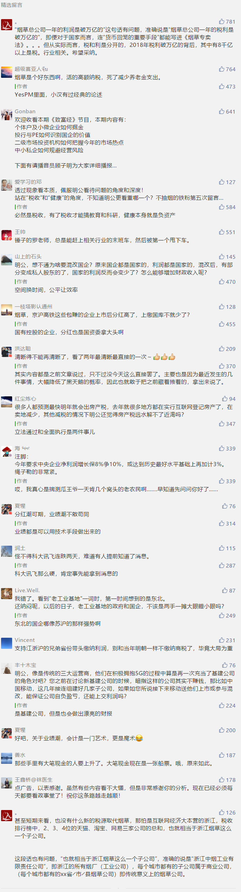

##正文

每年的315，是令无数商家心惊胆战的日子，一场晚会就会令企业股价暴跌，甚至市场荡然无存。

今年的315晚会播出之后，点名的“714高炮”的融360股价随即暴跌15%以上，点名的电子烟瞬间在天猫、京东、苏宁等全面下架。

不过，315的背后毕竟有着一定的政策导向，研究一下会对未来有所助益。

以本次点名的“714高炮”，在之前趣店刚上市的时候，国家已经对网络高利贷进行了严厉的打击，而且随着多轮的媒体轰炸，以及阿里腾讯等国民级应用也都开通了小贷业务，其实这个市场并不大。

如此高调怼的原因，如果我没猜错的话，那就是要“未雨绸缪”，并借助央视的影响力进行推广。

之前的系列文章中有过一个预判，就是未来中国会出现一线城市群汇聚人口，届时大量的青壮人口向城市群涌入，这些原本没有缺乏互联网洗礼的群体，很容易成为“714高炮”的目标群体。

其实，最近两年无论是大力推动租赁、幼儿园公办甚至整合医疗资源的背后，都有着这些的强关联，而这一波劳动力和资产的大规模流动，也意味着将带来巨大的机会。

至于机会都有什么，其实看看过去40年流动中带来的机遇就会明白，嗯，介于篇幅，今天就不展开了，日后在写系列的专题。

然后接下来聊一聊昨儿被怼的很厉害的电子烟。

如此怼电子烟也许并非巧合，毕竟，电子烟的直接竞争对手，就是庞大的传统烟草。

烟草总公司一年的利润是破万亿的，一家可以直接挑战四大行+二桶油，而且，烟草的利润几乎是全额上缴，占了中国财政收入的近十分之一。

 

甚至短期来看，也没有什么新的税源取代烟草，那怕是互联网经济大本营的浙江，税收排行榜中，2、3、4位的天猫、淘宝、网易三家公司的总和，也就相当于浙江烟草这么一个子公司。

而且更重要的是，在未来几年，烟草这种公司还将肩负着更重要的任务。

大家都知道刚刚结束的两会，我们开启了大规模的减税政策，但同时，并没有增加政府财政赤字，这意味着，各级政府必然要增加新的财源，否则账就做不平。

随着未来大量新市民的涌入，地方政府在医疗教育甚至租房补贴等领域的政府公共开支将急速增加，而房地产税等新税源也是远水解不了近渴，因此，唯一的来源只有一个，那就是**国企将在今年开始，进行大规模的利润上缴**。

所以，就可以推导出今年资本市场的许多重大变化。

首先，短期内国企要上缴利润，最便捷的方式就是对下级子公司推动IPO、混改和资本化，譬如铁总今年将拿出印钞机的京沪高铁IPO，甚至全球第一印钞机的中烟，下属的孙公司中烟国际去年年底也一度递交了IPO。

因此虽然大家把眼光都集中到了科创板，但是未来估计还是偏军，市场的主力还是主板，**科创板除了解决创新企业融资外，恐怕也有着拉动资本市场热度，以杠杆的力量，以小博大推动主板的任务。**

其次，国企大规模集中上缴利润，必然会带来上市国企的大规模分红，再考虑到涉及混改，如联通一般，必然涉及到亮眼的财报。

这意味着在相应的时间，**A股的主板市场，将会出现分红潮和业绩潮的双潮联动，而大量权重企业高业绩和集中分红带来的激励效应，也会促使一个真正的大牛市到来。**

第三，由于分红的国企主要集中在国资委直属以及少数老工业基地，因此，在接下来财政苦日子的过程中，会出现两极分化，在央地层面转移支付以及中央投资，**会迫使地方积极“跑步”**，同样，上少数拥有优质国企的老工业基地，**以上海、江苏为代表，日子会比较惬意并起到带队作用整合的用作。**

第四，由于国企开启大规模的集中利润进行分红，以及地方政府开启苦日子，也就意味着很多原本靠着**吃市政饭以及依靠国企单的中小企业，将会面临一个结款困难的阶段，因此，一方面，考虑账期和未来增加的通胀系数之后，大家要注意好自己的现金流，另一方面，这也是一个重新洗牌的机遇期。**

嗯，话都说的这么明白了，接下来就交给读者们自己把握了。

##留言区
 

