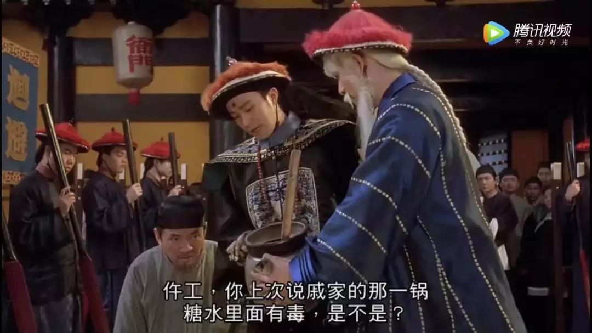
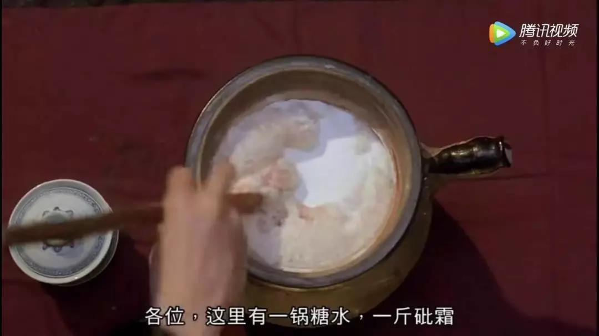
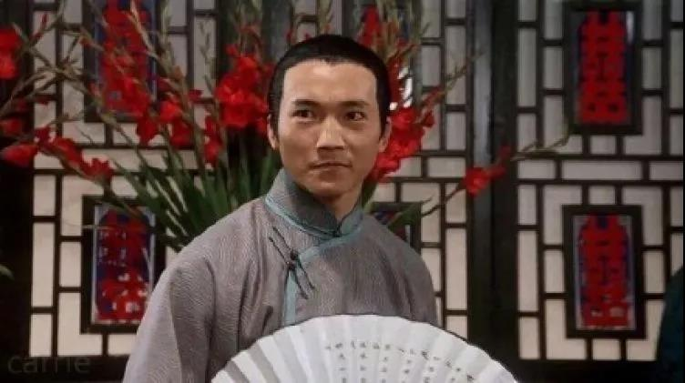
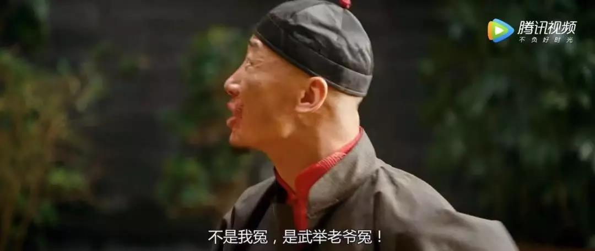
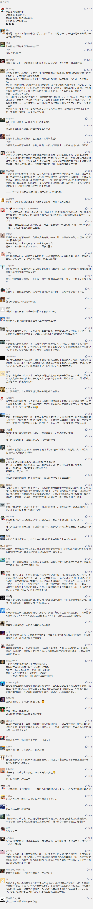

##正文

今天的文章估计又要大量掉粉，因为我又要为政府说话了。

周星驰有部电影《九品芝麻官》，讲的是包龙星为被陷害的戚秦氏翻案的故事。

在原来的卷宗里面，说的是戚秦氏在回春堂药方买了一斤砒霜毒，兑上糖水之后，毒杀了戚家一十三口。

在人证极其不利的情况下，包龙星为了证明戚秦氏的清白，在堂上拿出的第一组证据，是把一斤砒霜和糖水混合了起来。

 

 

 

当这个物证拿出来之后，整个案件的舆论风向就出现了根本性的变化。

毕竟，用一斤砒霜混合出来的糖水，稠的就像芝麻糊一样，根本不可能有人会喝，于是观众们就突然就明白了，这个毒杀关键性的物证是伪证。

 

因此，在“法办”了回春堂作伪证的朱二之后，其他参与作伪证的证人纷纷坦白，证明了戚夫人的清白，因此民众们也纷纷站到了包龙星和戚夫人这边。

 

之前，一斤砒霜这么大的BUG都被忽略，背后是因为思维定势，就像看惯了潘金莲会毒杀武大郎桥段的民众，看到漂亮的老婆和窝囊的老公，就会认为毒杀丈夫符合常理，不自觉的成为了巴普洛夫的“来福”......

甚至很多思维定势下中毒深的人，往往是事实摆在面前，也倔强的不愿意承认。就像成都实验七中的调查报告都出来了，很多激进者依然是政府包庇学校，很多人就像看惯了潘金莲毒杀武大郎一样，就是认定了学校的食堂有问题。

其实，只要易地而处的考虑一下，智商多低的人，才会长期食用网上那些“发霉”的食品呢？难道一整个学校的学生都是“猪头”吗？

而且，考虑到成本问题，在学校规模不大的情况下，老师和学生都是同堂就食，食堂员工甚至还得“打扫战场”吃剩饭剩菜，难道那么多的老师和食堂员工愿意自己给自己吃毒食品吗?

因此，小问题或者短期问题有可能存在，但如网图或者网上谣言说的那些很显然纯属扯淡。

更重要的是，人家学杂费一年就是4.5万，是整个中国西南地区最贵的学校之一，学费足够普通家庭把四年的大学本科读完两个来回。

作为一家“贵族学校”，且不说人家学生们的老爹不是“李刚”就是“张二河”，学校根本惹不起，哪怕就是看在钱的份上，人家学校上上下下也只会把各位公子当爷儿一样伺候着。

 

因此，那些骇人听闻的图片，稍微动动脑子就知道，根本就不可能存在。

而这事儿最令人捧腹的是，跟着骂政府的那些，看看自家孩子一年学费是多少，再看看实验七中一年4.5万的学杂费，恐怕99%的愤怒群众，都是在替“武举老爷”喊冤。

 

而再看看实验七中家长们的诉求，人家要求的根本不是什么提升卫生质量，而是借着这个由头，要求中国西南最好的公办学校成都七中，把私立的实验七中接管。

至于你们为他们呐喊的餐饮卫生，根本不是人家的诉求.....
 
 

看明白了套路没有？

你们还在咸吃萝卜淡操心的时候，人家的目的是只要花钱，就能进中国西南最好的学校！

嗯，如果“按闹分配”，政府满足了实验七中家长们的愿望，也就意味着中国原本靠着公平考试，变成了西方的制度，有钱有权就享受最好的教育。

然后，帮武举老爷实现了目的的普通家长，看着自家孩子被武举老爷的孩子们挤占了教育名额之后，就只能街头卖凉粉。

那些跟风骂政府的并不知道，正是你们骂的人，在忍辱负重的保护着你们！

公平的考试制度是中国历史上最伟大的发明，是捍卫各阶层流动性最好的武器，结果一群考试制度的最大受益者，非要哭着替武举老爷们喊冤，非要把他们请回来。

这是病，得治！

##留言区
 

