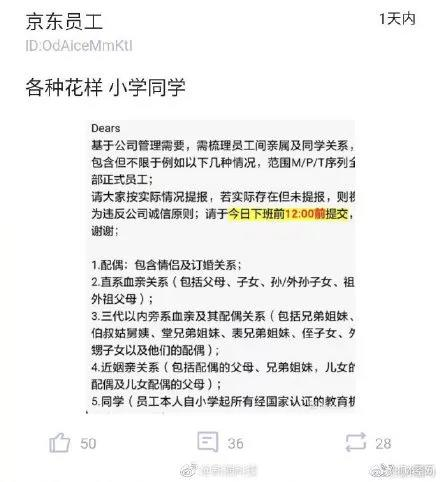

##正文

今天的文章是讲在何时何地买房，不过要绕一个很大的弯......

 
一

近日，曝光的美国“史上最大”的名校招生贿赂丑闻，让富人特权、名校招生制度、社会公平等话题在美舆论场被激烈讨论，耶鲁、斯坦福等名校也深陷舆论漩涡。

有趣的是，此次作弊事件在美国形成了一边倒的局面，不光穷人，连富人也都对此表示了极为愤怒之情，权威媒体也不像之前那样对教育方面的不公平遮遮掩掩 ，反而主动的怒斥。

原因只有一个，那就是虽然看起来此次贿赂丑闻都是“富人”，但实际上他们一色都是刚刚富起来的“new money”（新钱），这些顶着闪亮名头的大佬，几乎都在案发后迅速就被所在公司开除了。

你见过老板自己把自己开除的吗？

很显然，媒体口中的那些富人，本质也不过是一群打工仔，只不过算是高级打工仔。

在美国，想要上好大学基本上有三条路，要么是超级学霸靠着超人的智慧碾压同龄人，要么是靠着超强的体魄被作为特长生选中，要么是靠着超强的老爸以校友传承的方式进入，譬如罗斯福家族“世袭”哈佛，布什家族“世袭”耶鲁。

还真别以为有钱就能在美国进名校，国内好多土壕往美国的名校捐了不少钱，可一样都是打了水漂。某种意义上来说，美国的名校仿佛丛林法则，只有最优秀的基因才有机会得到最好的教育。

同样，在美国即使很多“new money”是拿钱也进不去的，1/3的名额都被那些“old money”（老财）家族垄断了，因此也就出现了这次招生贿赂丑闻，“new money”通过斥上百万美金的巨资收买教练，以某些小众的体育运动，把孩子送进了顶级名校。

嗯，国内类似路子也是有的，几年前南京某高中就保送了一个练健美操的妹子去了TOP2......

可怜天下父母心，这些作弊的美国“new money”，就像成都实验七中那些刚刚富起来的家长们，冒着拘捕的风险闯学校食堂作弊，为的不还是自家孩子的一个好前程么？

这都是刻在人类基因里面的天性。

 
二

今天微博上有个大新闻，京东以“管理需要”为名，要求员工梳理亲属及同学关系，不仅要求填写情侣关系以及三代以内的旁系亲属，甚至从小学起的同学也必须提交，搞得网上议论纷纷。

 

介于连女友和同学都得填，使得网友们纷纷调侃，刘强东自己是不是应该把在公司任职的前女友们都填上？京东的员工们是不是应该填写刘强东是我的兄弟？......

当然，玩笑归玩笑，其实京东做这个无可厚非，有领导工作经验的朋友，可是都填过领导干部个人有关事项报告表，以及非常清楚领导干部回避制度，那里面远比京东要填报的复杂多了。

毕竟，京东麾下十几万员工，涉及数万家供应商，服务数亿用户，相当于管理一个省部级的单位，所有体制内的毛病，也会出现在京东身上出现。

且不说连美国顶级名校里面1/3的学生都是裙带关系，在源远流长的中国文化中，亲情友情同学情更是迈不过的坎，在公司利益和亲属利益之间，几乎所有人都会选择去损害公司的利益。

这都是刻在人类基因里面的天性。

所以，若如果京东不搞这些，恐怕才是要完蛋的节奏。

 
三

说到互联网企业，今天跟朋友聊天，朋友慨叹说，看最近几年崛起的互联网新贵，如摩拜，ofo，饿了么，甚至乐视等公司创始人纷纷丧失公司的控制权，感觉对新一代的创业太难了。

听罢之后，我跟他说，恰恰相反，你说的这些例子反而证明了环境对于新一代的创业者实在是太友好了。

就像中国首富马同志，当年以垫底的成绩在各种机缘巧合之下入学，后来都能当学生会主席，还有另一位马主席，人家老爹90年代就坐车奔驰过来给儿子做账，就明白当年的成功最起码有个台阶。

而如今移动互联网的新贵们并不太需要家里殷实的背景，很多普通家庭的孩子赶上了机会就能成互联网新贵。

而且，一方面，这些新贵他们普遍没有什么实质性的创新，却在短短两三年的时间里，就创造了实体经济大佬们甚至传统互联网大佬们十年才能够积累下来的财富。

另一方面，从近年来频频爆出的贪腐和撕逼丑闻中，这些初出茅庐的年轻人们，在公司管理极其混乱，内部撕逼严重之下，都能把公司市值做到这么大，反而证明了这些新领域拥有着巨大的“容错率”。

反观京东2018年的财报，利润率才1.6%，稍微大一点的腐败甚至撕逼都会把这点利润消耗殆尽。

所以，大家也就会明白，为什么刘强东那么痛恨腐败和裙带关系了，毕竟人家也是从宿迁穷乡僻壤靠考试拼出来的，真要是裙带关系把进阶的名额都挤了，他恐怕现在还在苞米地里面啃窝头呢......

 
四

中国成功的秘密，在于大规模基建带来的资源流动，千禧年之后启动的大规模基础设施建设，带动了全国人口和资本的大流动，诞生了无数的房地产富豪，2014年4G基建的大规模推动，使得互联网巨头们一个个的涌现。

因此，未来随着中国即将启动大规模的5G互联网建设，意味着有一拼年轻的新钱即将诞生。（之前文章讲述了逻辑，这里就不复述了）

所以呢，就像私立的成都实验七中家长勇闯食堂那样，拼老命要让公立名校成都七中接管，未来这种高端的教育需求只会进一步激增。

甚至在需求的激增之下，4.5万一年的学费只是起步，没有想不到的只有不敢想的。

 

而跟教育的需求类似，这些新钱们从来都是推动房价的主要推手，从在北京买房的煤老板，上海置业的金融才俊，到深圳城中村的拆迁户，再到全国三四线线城市拿着货币化棚改抢房子的老百姓，莫不如此。

买房子就像教育一样，无论是贿赂丑闻的美国“new money”，还是成都实验七中的“新钱”家长，我们都能看到这些新兴的“成功人士”，愿意为了子女的教育不惜血本，甚至付出巨大的代价。

这背后，都是人类的天性。

 

毕竟，房子和教育都是刻在我们基因里面的，新钱们有钱了必然会对房产进行改善，对教育提出诉求，届时，在这些新钱的带动下，部分地区部分地段的房价，就会像某些股票那样不讲道理。

 

所以呢，**对于手头比较紧，又对教育有需求的刚需来说**，未来看科创板的企业的所在地比例，就是中国未来房价强弱的风向标，再考虑到科创板的股票解禁时间，估计合适的入手时间差不多也就在这一两年。

毕竟，市场的逻辑，都是刻在人类基因里面。

##留言区
 

