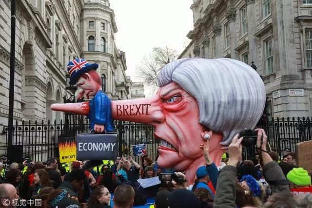
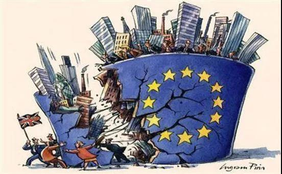
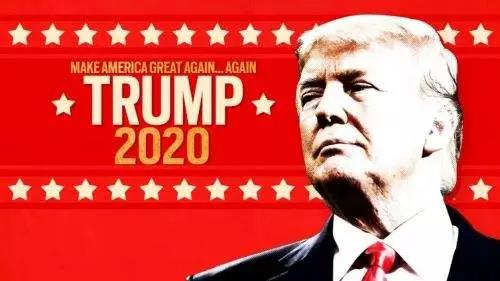
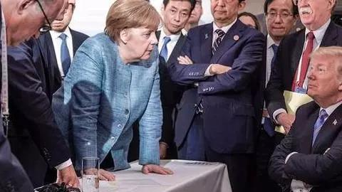

##正文

To be or not to be , that is a question .

就在我方出访意大利与法国之际，英国也将面临第二次世界大战结束以来最重要的战略抉择。

昨天，上百万的英国民众走上街头，要求英国政府就脱欧举行二次公投，并要求梅姨下台为“脱欧”负责。甚至据报道，十多名内阁大臣正在商议让梅姨数天内走人。

 

云诡波橘的“脱欧”之争，正在撕裂英国政坛，而这场撕裂的背后欧，是**整个欧盟与英国一起陷入了“零和博弈”之中。**

“零和博弈”之中，一方的收益必然意味着另一方的损失，博弈各方的收益和损失相加总和永远为“零”，因此，参与各方都想尽一切办法以实现“损人利己”。

这就使得欧盟各国谁不会为了英国的利益让步，同样，英国的各个党派谁也不愿损害自身的利益向其他党派让步，更不要说梅姨的执政党内还有好多派系。

因此，在如此多的博弈方的参与之下，任何建设性的方案，都很难满足一半以上人的满意。

最终，各方逼到“无协议脱欧”之下，面对GDP的大幅下降，就看哪一方先抻不住选择认输，或者都不认怂，大家一起同归于尽。

 

而就在欧洲深陷英国的脱欧危机之际，明天，美国总统特朗普将丢出一个巨大的“外交炸弹”，正式签署文件承认以色列对戈兰高地的“主权”。

戈兰高地原为叙利亚领土，在1967年的第三次中东战争期间被以色列占领红后吞并，此后便成为“阿以和谈”中最大的障碍，各方都不愿意退步。

各方均不让步的背后，是因为戈兰高地拥有巨大的经济和地缘价值。

来自地中海的湿气在戈兰高地遇阻后形成大量雨水，因此被誉为“中东水塔”，在水比油贵的中东，仿佛一台源源不断的印钞机。

而且，戈兰高地是黎巴嫩、约旦、叙利亚、以色列四国的交界之处，可以俯览各国并形成巨大的军事压力，以色列控制后，便可以确保西侧与北侧的地缘安全。

 

因此，站在对中东离岸平衡的角度，无论是美国还是他的北约盟友甚至是俄罗斯，一贯都是保持“中立态度”，拒绝承认以色列主张的主权，认定其为非法占领。

同样，哪怕对于以色列来说，闷声发大财慢慢消化戈兰高地才是硬道理，把囊中之物摆在国际舆论的镁光灯之下，反而会刺激阿拉伯国家以及伊斯兰民众的反抗，使得消化戈兰高地变得异常复杂。

更不要说美国，继特朗普将大使馆搬迁至耶路撒冷后，再一次通过戈兰高地问题碰触阿拉伯世界的神经，这意味美国最近准备推出的中东和平新方案，根本不可能获得阿拉伯国家们的支持，这不仅影响美国的中东战略，甚至可能会挑起伊斯兰世界新一轮的反美思潮。

可以说，从各国的角度来看，这么搞都是一个“零和博弈”甚至“负和博弈”的亏本买卖，那为啥白宫和以色列当局都如此积极推动呢？

原因很简单，下个月就是以色列的大选，特朗普的坚定盟友内塔尼亚胡将面对反对派联盟的强力挑战。

就像近期印巴激烈冲突的背后，是莫迪面对大选需要强硬派选民的支持。明天特朗普给将给访美的内塔尼亚胡送一张国家安全牌，也将使得这位右翼强硬派的盟友，轻松获得国内强硬派选民的选票。

当然，拥有强大情报能力的以色列军方，明年的美国大选时，很可能也会“投李报桃”，像四年前的俄罗斯那样，在安全方面为特朗普的连任保驾护航。

不过，介于支持以色列对美国国家战略的巨大伤害，某种程度上来说，特朗普也算是将个人的利益凌驾于国家利益至上了。

 

上周末，西方各国经济上黑天鹅频发，英美法德各主要发达国家债市集体暴跌，美国三大股指集体重挫，土耳其里拉大跌跳水6%，一时之间，新一轮经济危机又成为了大家心心念的事情。

这一轮暴跌的背后，市场普遍认为是美联储对于加息的过度谨慎以及整个欧元区的制造业数据大幅下滑，让全球投资者对于全球经济动能丧失出现了巨大的担忧。

不过在我看来，这是因为西方的政治家们把个人的利益凌驾于国家利益至上，使得美国及其西方盟友陷入了巨大的“零和博弈”之中。

土耳其里拉大跌背后的主要原因之一，是即将举行的土耳其大选前，以摩根大通为代表的金融资本对埃尔多安进行狙击，纷纷唱空，试图打击埃尔多安以增强以对土耳其的控制。

而作为北约传统盟友的土耳其，与美国甚至西方世界闹掰的背后，则是埃尔多安为了保证自己权力，鼓动国内的民粹与西方国家的冲突以转移矛盾，因此也有了近日在竞选活动中，主动播放全球屏蔽的新西兰恐袭视频来获取支持，搞的新西兰和澳大利亚狼狈不堪。

就像南亚印度和巴基斯坦这俩难兄难弟，都那么困难了还不忘打架那样，这些总统们为了继任根本顾不上经济问题。

而在这一来一往“零和博弈”的打击中，随着土耳其股市汇市的双杀，在土耳其境内有着巨额投资的欧盟也沦为了牺牲品......

同样，在特朗普上台后也转向了一对一谈判的“零和博弈”，让曾经保持步伐一致的北约，在伊核问题、巴黎协定、中导条约、世贸组织......等等一系列的重要决定上都南辕北辙，欧美之间的投资与贸易遭受了严重的影响。

 

更不要说欧盟这还是屋漏偏逢连夜雨，三年以来迟迟不决的英国脱欧，给整个欧元区的经济都带来了极大的不确定性，在一群政客之间的相互推诿之下，资本不敢进行投资和雇人，民众不敢消费和就业，整个欧盟的市场信心遭遇了严重冲击。

再看美国，回顾这几年，特朗普所有的谈判背后，都举着地缘大棒威胁作为威胁。而地缘博弈必然是个零和游戏，因为地缘上一方的绝对安全，也就意味着其他各方的绝对不安全。

所以特朗普中止中导条约，那么欧盟就必然要推动欧洲军并亲近东方某大国，特朗普要退出TPP，那么东盟各国必然就会积极推动与东方某大国之间的关系，特朗普要求朝鲜弃核，那么朝鲜就必然要寻求东方某大国的庇护，特朗普把大使馆迁到耶路撒冷以及此次的戈兰高地，那么原本依赖于美国的中东各国，必然就需要寻求东方某大国的支持并签订更多的合同.......

所以，用商人的思维在国际上搞地缘的“零和博弈”，经济上虽然能够得到满足，但往往会在其他领域遭受损失。

而想要走出这个“零和博弈”的陷阱，则必须跳出地缘博弈的惯性思维，譬如最近我们出访欧洲，跟意大利推动的“新丝绸之路”，就是**全力主打经贸合作，几乎不谈地缘政治。**

这就使得我们进入到一个“正和博弈”之中，各方都能从经贸合作中获益，区别只在于哪一方的获利更大。因此，沿着这个思路，就没有谈不成的生意。

这就是中国式智慧的关键，通过“新丝路”的概念，将**台上各方从地缘安全的博弈中，拉回到纯粹的经贸合作**，就像这次与意大利的合作，虽然我们可能会少赚一些，但是变成了各方的合作共赢，让丝绸之路连贯东西，绵延古今。

而这和中国改革开放四十年的思路有着极为相似之处，都是先发展经济，让一部分人先富起来，让先富起来的这批人，成为我们最坚定的支持者，然后再来慢慢推动最难推动的体制改革。

因此，意大利这个西方七国集团中最边缘化的国家，就像在80年代广州旁边的深圳和90年代的上海旁边的浦东，自然而然就成为了我们推动经济“正和博弈”的一个试点。

未来，随着西方在地缘冲突下的“零和博弈”愈发严重，必然会导致经济的停滞不前，届时，中国方案中的经济合作，自然而然就会吸引到越来越多的好朋友，让意大利这个“先富”带动“后富”。

朋友多了，路也就多了，此消彼长之间，一个跨越修昔底德陷阱的发展之路就出现了。

而且从历史的角度来看，虽然我们喜欢调侃意大利“面”，但不要低估意大利这个“千金马骨”。一战和二战的经验告诉我们，每当意大利准备改旗易帜的时候，都意味着胜利在向我们招手~~~

嗯，不要忘了，特朗普可是祖籍德国的......

##留言区
 

