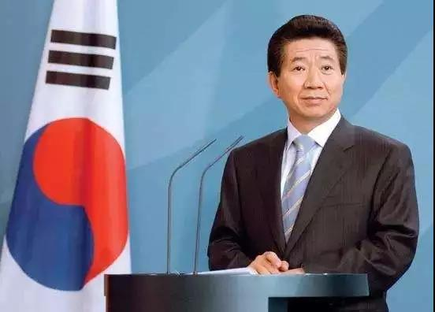
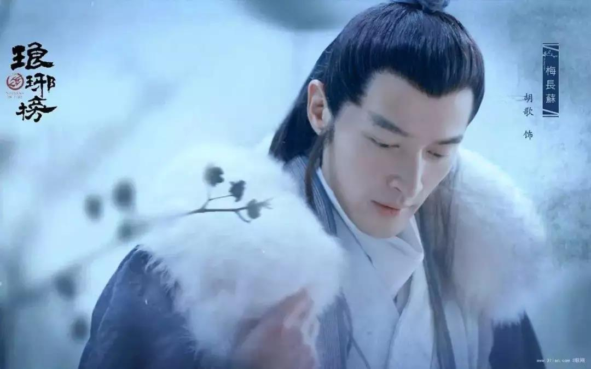
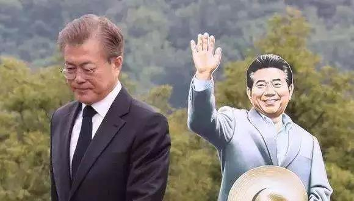

##正文

 
一

艺术来源于生活，却又高于生活

23日凌晨，一名酷似涉性贿赂案的韩国前高官，试图乔装“出逃”飞往泰国曼谷时，被记者发现后遭遇围堵。 

 

而让编剧都编不出来的是，真正的出逃者金学义，却在用围巾挡住了脸，跟在酷似自己的男子身后，随时准备利用替身来“金蝉脱壳”。

 

不过世事难料，逃过围追堵截的他，却在登机前5分钟，被韩国法务部签发了“禁止出国令”，让当“韩国丁义珍”的美梦成为了泡影....

 

说起来，这位临飞前被抓捕的金学义可不简单，作为一系列事件关联人物的他，将拉开一场韩国近代最狗血的宫斗大剧。

首先，在金学义担任检察长期间，聘请韩国YG公司的BIGBANG为法务部宣传大使。而近期引爆韩国朝野的娱乐圈性丑闻主角，就是BIGBANG成员李胜利。

其次，在李胜利被曝光的聊天记录中，他在群聊中说到：“不要担心，警察（检察）总长会帮我们处理这件事情的”，暴露了李胜利和检察系统的亲密关系。

第三，据悉，李胜利夜店被爆出来的那位施暴者，是崔顺实的侄子，崔顺实是前总统朴槿惠的闺蜜，大规模干涉了朴槿惠的人事任免。而金学义就是被崔顺实推荐给朴槿惠后，被任命为司法部次长。

只不过金学义这位老检察官刚上任没几天，就因为在别墅里与30名女性一起“学外语”事情泄露，在舆论的压力下不得不被免去职务.....

 

所以呢，把以上几点联系起来，就会发现这个看似娱乐圈的大瓜，实际上隐藏着韩国政商界庞大的地下交易。

一方面，韩国的财阀通过娱乐圈向官员们提供性贿赂，以换取保护；而与此同时，这些财阀又通过特定人物，将这些“自家的官员向总统推荐，来维护巨大的政商关系网。

而那些被迫出卖肉体的明星们，就成为了韩国门阀和官员之间牢不可破的纽带。

因此，作为交易中心的金学义此次被捕，劣迹斑斑的他一旦坦白，也就意味着一张足以掀翻韩国政商权色交易的大网即将拉开......

3月18日，韩国总统文在寅发誓，要赌上命运彻查。

而文在寅同时还要赌上命运彻查的，是10年前的张紫妍案。

 
二

张紫妍是一名韩国女明星，在26岁的花季，用结束生命的方式向社会抗争。

 

张紫妍自杀时留下了遗书，称自己长期被公司逼迫为媒体界、商界、政界人士等权力人士提供性服务，曾被胁迫与4个男人同床，甚至乐天公司的老板父子还同时用啤酒瓶对她性侵。

而且，公司为防止张紫妍怀孕，也为了方便客人，在临死前几天，还安排她去做了结扎手术........最终张紫妍崩溃了，在临死前写下了一份遗书，记录下了她陪睡过的30多名韩国重要政经界人士的名字。

不过，这血与泪刻写出的遗书，却没有将名单中的任何一人绳之以法，毕竟，名单中的“重磅人士”，有控制舆论喉舌的老板，有控制韩国经济的门阀，更不要说还有多位司法体系内的高阶检察官。

因此，张紫妍的遗书，相当于是以一己之力对抗整个韩国的现行体制，结果自然是可想而知的，毕竟，财阀们垄断了韩国80%以上的经济。

最终，法院认为证据不足，张紫妍是被迫陪酒，让公司赔偿其家属14万人民币了事，媒体也纷纷有默契的闭嘴，将事情压了过去。

在财阀面前，人命可能还不如一条狗，这，就是韩国。

 
三

九州生气恃风雷，万马齐喑究可哀

对于财阀对韩国的垄断，自然也会有人挺身而出，他就是卢武铉，韩国的第16届总统。

 

卢武铉出生于韩国庆尚南道金海市峰下村的一个普通农民家庭。初中毕业后靠勤工俭学进入高中，最终通过司法考试取得律师资格。

在韩国，早年律师们都是为财阀服务的，通过难度极高的司法考试意味着改变命运，而卢武铉却专心给穷人们打官司。

因此，在民间获得了的极高的声望，使得他一步步的迈向了总统的宝座。

卢武铉上台后，不仅打破财团提供非法选举资金的惯例，还打击遏制财阀垄断与腐败，SK集团总裁崔泰源因侵吞公司资产被判入狱，现代集团郑梦宪因贪腐被调查自杀，三星集团会长李健熙也因逃税等指控被迫辞职。

在打击财阀的同时，卢武铉还推动房地产税遏制日益高涨的房价，推动监察系统廉洁改革，可以说，一切为了人民的卢武铉，改革得罪了几乎所有的韩国统治阶级。

不过在卢武铉精神洁癖和清廉之下，他的政敌们始终找不到下手的机会，只能通过媒体不断的讽刺他的高中文化进行打击。

直到卢武铉卸任后，政敌们才找到机会，从卢武铉的老婆入手，查到了他老婆收受贿赂，随后，那些“开发”过张紫妍身体的媒体，纷纷对卢武铉发起了全面攻击，民众也在舆论的引导下，对这位誓死维护他们利益的人进行无情的唾骂。

民众一边倒的唾骂，让一直视名誉比生命还重要的卢武铉备受打击，把一生都献给人民的他，决定用最后的生命来唤醒民众，在5月23日，家对面的猫头鹰岩上，一跃而结束自己的生命。

直到卢武铉死后，那些唾弃他的民众，在他财产继承申请时才发现，这位与财阀抗争的总统穷尽一生，一点余财都没有，甚至还背负了约240万人民币的债务。

于是，在李明博与朴槿惠两位卢武铉的政敌执政之后，觉醒过来的韩国民众，将卢武铉的继承者文在寅推上了总统的宝座。

 
四

儒家文化圈的中日韩三国，在儒家文化的熏陶下却有着三个不同的分支，中国人更尊崇“孝”，日本人更尊崇“忠”，而韩国人则更尊崇“义”。

而韩国的现任总统，视卢武铉为兄长的文在寅，堪称是一位标准的“义士”。

 

虽然是一位“义士”，但当年跟卢武铉一起开律所的文在寅，却是一个理想派的自由主义者，除了他一直追求的是田园生活，自己并不喜欢政治甚至讨厌政治，卢武铉每次把他请入青瓦台，他都很快退出。

而只有两次他选择挺身而出，一次是因为卢武铉被朴槿惠弹劾，一次是因为卢武铉被李明博陷害。

对于文在寅来说，他不喜欢政治，去徒步、去爬山、去疗养，那才是他喜欢的生活，他规划好了和卢武铉一起的退休，在家当个农夫，没事就饮茶对弈，有事就一起出游走访，高山流水，与尔同行。

但是，卢武铉之死，将文在寅“塞上牛羊空约许”的梦撕扯的粉碎。

在担任卢武铉治丧委员会主任之后，义字当头的文在寅，不再相忘于江湖，决心出山复仇。

 

 
五

5月23日，对于文在寅是一个特殊的日子。

2009年5月23日，卢武铉跳崖，成为文在寅永远的痛

2017年5月10日，文在寅就任韩国总统

2017年5月23日，弹劾卢武铉的朴槿惠出庭受审

2018年5月23日，陷害卢武铉的李明博出庭受审

已经退休多年的李明博怎么也想不到，自己的起诉书足足有207页，罪名包括受贿、贪污、逃税、滥用职权等16项，案件涉及到李明博所有的身价财产，身边的每一个亲戚朋友，甚至涉及时任的韩国军方，每一个细节都被挖了出来。

如此细致的证据搜集和调查，不放过任何一则罪证，岂是一两年内就能完成的？

而且，就任总统之前，作为一个毫无背景势力的议员，面对两任视自己如眼中钉的总统和财阀们，又是如何瞒天过海的呢？

真相只有一个，文在寅的两次复仇，绝非临时兴起，而是多年来的呕心布局。

2004年，在野的朴槿惠弹劾卢武铉，2017年，在野的文在寅以其人之道还治其人之身，最终令朴槿惠被弹劾下台。

2009年，总统位上的李明博起诉卢武铉，2018年，登上总统大位的文在寅再一次以其人之道还治其人之身，令李明博身陷囹圄。

以眼还眼，以牙还牙，这不是斗争，而是复仇，这是文在寅义之所在，虽千万人吾往矣的决绝。

 
七

而再过两个月，就是卢武铉逝世10周年。

十年前的文在寅，强忍着悲愤向仇人们敬礼以求卧薪尝胆，十年后的文在寅，等到今天，绝不会再忍辱负重。

 

也许，登机前5分钟，被韩国法务部扣住的前司法次长金学义并非巧合，也许，李胜利案中，不断外泄的的内部聊天内容也并非巧合。

文在寅先后除掉朴槿惠和李明博，就像琅琊榜里面的梅长苏一步步剪除梁王羽翼之后，再发起最后的反击。

因为文在寅知道，真正害死卢武铉的，不是2017年被弹劾的朴槿惠，也不是2018年被审判的李明博，当年通过媒体挑起民意，拉拢检察官的韩国财阀们，才是害死卢武铉的真正凶手。

这些财阀们多年来利用李胜利和张紫妍这些明星，勾结检察官员，收买人心控制舆论，建立起来一个庞大的保护网，所以如今，文在寅就是要以其人之道还治其人之身，用李胜利和张紫妍打开这张保护网，以人民的名义，对逼死卢武铉的财阀们进行绝地反击。

 

再有两个月，卢武铉的十周年忌日，面对阴阳两隔的挚友，文在寅又会做什么呢？

那些罪孽和痛苦，那些兄长未尽之事，就让我来背负吧！

 

既然我活了下来，就不能白白的活着。

 
君子一诺，死生相随，

 
虽千万人吾往矣！

##留言区
 

