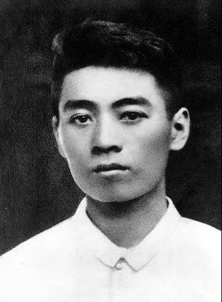
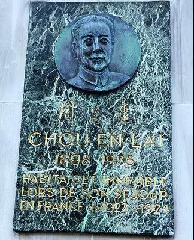
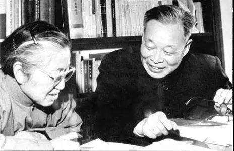
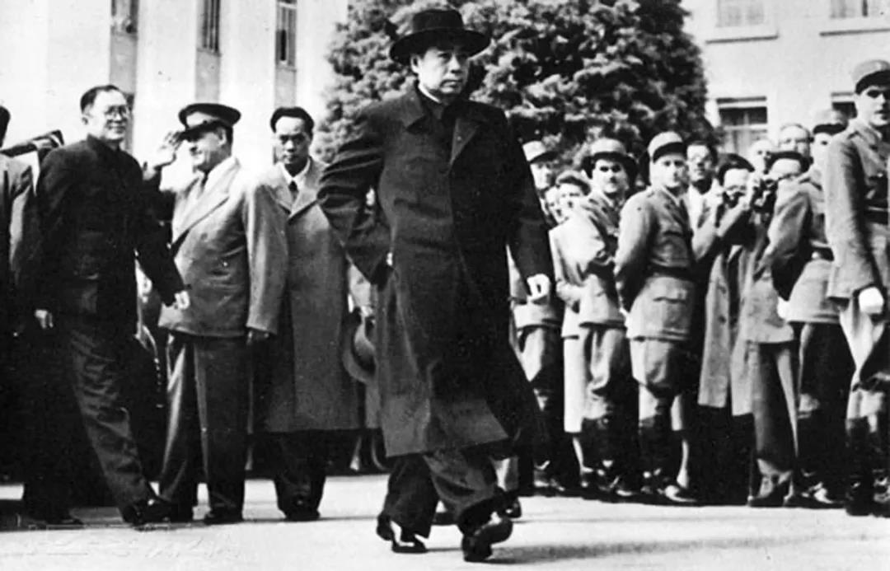

##正文

 
一

1920年11月7日，一艘两万吨级的法国邮船“波尔多斯”号沿黄浦江顺流而下，载着197名勤工俭学的学生驶向法国马赛。

望着游弋于黄浦江上的外国军舰和外滩上的万国建筑群，这些即将走出国门的同学们热烈地谈论着自己的志向，有的说想学建筑，有的说想学铺路，有的说想学采矿......

而有一位青年却浓眉紧锁，郑重地说：我要学习改变中国社会的本领。

这句话一开始并未引起同学们的共鸣，但邮轮在香港停了一夜，又在越南西贡待了3天，经过新加坡和科伦坡，驶过苏伊士运河，途中不是英国就是法国的殖民地。这些同学们感到距离国家越远，自己就越被瞧不起，也越看到西方列强的强大。

看着眼前的一幕一幕，这位青年带着同学们追溯历史，回顾鸦片战争以来中国如何逐步沦为列强的殖民地，说到激动之处，他愤然而起说道：“同学们，国家兴亡，匹夫有责，我们绝不能袖手旁观！”

他，就是时年22岁的周恩来。

 

 
二

在巴黎上千条街道中，位于巴黎13区“意大利广场”附近的戈德弗鲁瓦街毫不起眼。

不过当中国游客走进戈德弗鲁瓦街，就能看到一面墙上镶嵌着一方墨绿色的大理石纪念牌，上面是周恩来的铜质正面浮雕头像，头像下面刻着邓小平题写的“周恩来”三个字。

 

大理石后面的小旅馆三楼，一个不到10平米的房间，就是周恩来旅法时期的住宿。

一张单人床和一张小木桌外，容不下多少别的东西，但是这里却成为了旅欧中国少年共产党办刊物和进行党团活动的中心，也是“油印博士”邓小平刻印少共机关刊物《赤光》的地方。

随着旅法同学们的发展，10平米的房间实在装不下，就像一百年后国内的创业者们喜欢在咖啡厅谈论一样，一百年前的旅法同学们只好到广场附近的咖啡馆畅谈理想。

由于学生们拮据，同情中国学生的法国人往往会允许赊账，因此，法国街头的咖啡店，成为了旅法同学们思想碰撞、畅谈理想的场所。

后来，中国革命取得胜利，周恩来始终没有忘记法国咖啡店的友谊，不仅补缴了欠的一百多杯的咖啡钱，还多次寄去中国香烟和茶叶作为感谢。

甚至1974年，接替周恩来出访的邓小平，在去纽约参加联大会议途经巴黎，仍念念不忘意地领着工作人员故地重游，并买了100多个巴黎的牛角面包，带回国内，分给当年的留法同学。

当年那些书生意气的旅法同学们，不仅有后来牺牲的赵世炎、蔡和森、王若飞、陈延年、向警予.....还有陈毅、李富春、李维汉、聂荣臻甚至朱德.....他们一个个成为了新中国最坚实的基石。

 
三

在周恩来从法国返回广州，出任黄埔军校政治部主任的15年后，另一艘远洋客轮载着他的浙江老乡钱三强，离开了黄浦江驶向法国。

1937年，在卢沟桥事变发生的次月，一心科技救国的钱三强愤然来到巴黎大学居里实验室攻读博士学位。

在约里奥・居里夫妇指导下，钱三强夫妇取得了一系列的成绩，在1946年研究铀核三裂变中取得了突破性成果，被世界称赞“中国的居里夫妇”，成为了西方最知名的中国科学家。

但是钱三强，不顾优越的科研和生活条件下，看到两颗原子弹让日寇投降后执意回国，1948年，在周恩来秘书，旅法负责人刘宁一的帮助下，随身带着一大批珍贵的文件回到北平，出任原子学研究所所长。

1949年3月，世界和平大会将在法国召开，尚在西柏坡的周恩来致电北平军管会，建议由郭沫若和刘宁一带队前赴法国，并邀请钱三强参加。

当时钱三强筹建北平原子学研究所，着手建立中国的原子科学团队，钱三强想到，去巴黎能见到自己的老师、和平大会主席约里奥·居里，若能带点外汇托他购置点被禁运的科学仪器设备和文献资料，那对于培养中国的核人才有着至关重要的作用。

由于当时战争还在继续，国家经济和人民生活十分困难，拿出一笔外汇决非易事，钱三强甚至后悔提出自己的想法。但是，钱三强的想法从北平传到西柏坡，立即得到周恩来的赞同，旅法同学李维汉在怀仁堂附近一间小房子里约见钱三强，郑重的给了他五万美元的现钞。

当时战争还没有结束，蒋介石把全国的外汇和黄金都搬去了台湾，这5万美金是当时中国共产党四分之一的家底！

接下来城市要建设，农村要发展，金融的稳定都急需外汇，可是周恩来却把这宝贵的外汇，交给了一个刚刚归国的党外人士。

当钱三强拿到那5万美金现钞的时候，却闻到铺面而来的一股霉味，显然是刚从潮湿的库洞中取出来的，不晓得战乱之中它曾有过多少火与血的经历！前几年内战多么危机的时刻都没有拿出来，今天却把它交给了一位科学工作者。

钱三强不负所望，与旅法的同学们用了几年时间，从恩师约里奥-居里夫妇那里带回了大量被禁运的科学仪器设备和文献资料。

当时，朝鲜战争已经打起来了，中国是“联合国军”的敌人，设备与资料都是一级戒备，拿回国绝非易事。

在当时计算要靠算盘的时代，旅法同学们偷偷带回来的计数器是当时最先进的100进位，比多年后苏联给我们的二进位计数器要先进的多，帮助新中国迅速培养出如于敏等一大批自己的核科学带头人。在“两弹一星”的攻坚战中，创造了世界上最快的发展速度。

在中国的秘密团队回国之际，约里奥-居里让人带话给毛泽东：“要保卫世界和平，要反对原子弹。你们要反对原子弹呢，就必须自己先要有原子弹。原子弹的原理又不是美国人发明的。你们有自己的科学家，钱三强”。

 

世界上没有无缘无故的爱，营救被美国扣押的中国物理学家，帮助中国购买并将禁运设备资料偷运回国，帮助中国建立核科学研究基础的约里奥-居里，这位链式反应的主导科学家，是一名法国共产党员。

 
四

1964年1月28日，中法同时发表了两国建交公报。

世界当时还处于冷战时期，法国不管美国的公开威胁和抗议承认中国，给了美国一记响亮的耳光，也让美国封锁、扼杀新中国的政策彻底破产。

随着中法建交，大量的法国投资迅速解决了中国的能源问题，也解决了中国的温饱问题。即使如今，中法之间合作的最主要领域，依然是核能.

而且中法建交打开了封锁的口子之后，不仅法语国家，随后西方国家也纷纷改变孤立中国立场，开启了中国的建交潮，并开始对华投资，甚至法国的铁杆小弟阿尔及利亚更是牵头将中国送进了联合国，

可以说，没有中法的建交，基辛格的秘密访华破冰就会等更久，没有法国乔治·蓬皮杜总统访华，美国总统尼克松也不会着急访华签订联合公告。

因此，中法建交就像当时被认为的那样，这是一颗“外交原子弹”。

而引爆这颗外交原子弹的，则是周恩来、邓小平、陈毅等四十多年前留法的同学，为之长达十余年的布局和秘密谈判。

 

 
五

1964年10月16日上午，就在中法建交的半年之后，一道密语电波在罗布泊20号办公室和北京177办公室之间穿梭。

>8点钟，老邱住上房，开始梳辫子。
>10点30分，梳完辫子。
>11点30分，第一次检查完毕，结果正常。
>.......

老邱是中国第一课原子弹的代号，原因是他长得像一个巨大的“球”，而装原子弹的容器代号"梳妆台"......

下午3时，罗布泊的一声巨响，巨大的蘑菇云腾空而起，中国第一次原子弹爆炸试验取得完美成功，成为继美、苏、英、法之后，第五个拥有核武器的国家。

消息传来，前线的指战员们泪流满面，认识不认识的，都拥抱在一起，男子汉们热泪纵横，用嘶哑的嗓子怒吼着。

无数放弃优越地位从海外归来报效祖国的科学家，从四面八方拥向大西北的贫瘠不毛之地，没有人计较个人得失，他们顶风冒雪，他们饥餐露宿，他们断绝了和家人的所有联系，甚至以牺牲在研制原子弹试验场为荣，

巨大牺牲背后的目标只有一个：唤醒中华睡狮，怒吼震撼世界。

就像邓小平说的：没有两弹一星，就没有中国的大国地位。他们在一切不可能的质疑中，谱写了一曲曲让人热血沸腾的华丽篇章。

 

核试验的次日，周总理逐一致电世界各国政府首脑，阐明中国对于核武器问题的原则立场：中国政府一贯主张全面禁止和彻底销毁核武器，中国掌握核武器，完全是为了防御，为了保卫中国人民免受核威胁。

 
六

44年前，站在两万吨级的法国邮船“波尔多斯”号上，周恩来细数着自鸦片战争以来中国人民遭受的列强压迫，向一同赴法的同学们高呼：要学到改变中国社会的本领，国家兴亡，匹夫有责，我们绝不能袖手旁观。

44年后，周总理兑现了他的诺言，带着他的同学们打破了西方国家的封锁，用一颗两万吨当量的原子弹，向世界证明，中国人民不再是任人欺凌的，我们已经站了起来！

这四十四年之间，支持他们孤身飘零海外，支撑他们在枪林弹雨下一路走过来，支持他们不断为之奋斗牺牲的，不是名也不是利，而是中华之崛起读书的初心。

 
**出走半生，归来仍是少年**

 

##留言区
 

