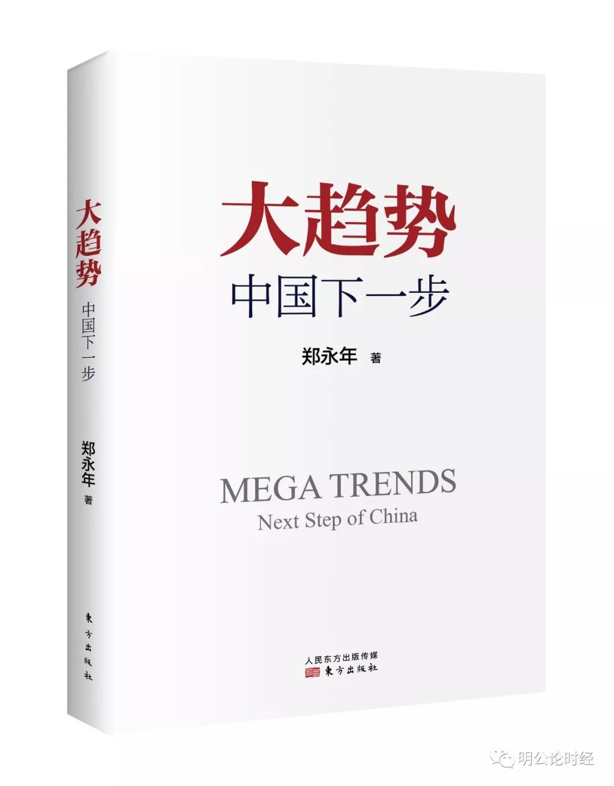
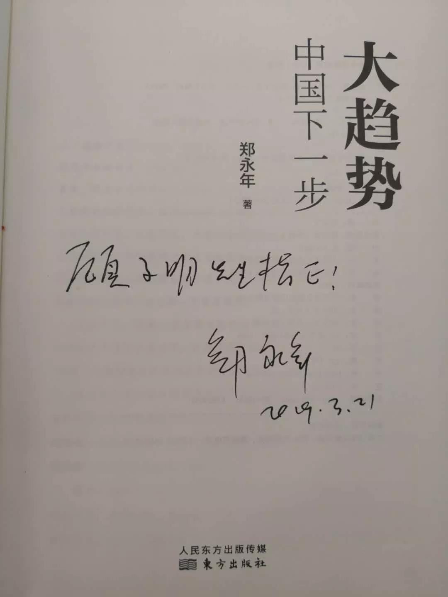
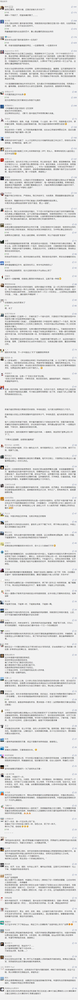

##正文

近日，有幸得郑永年先生赠予新书《大趋势：中国下一步》，如获至宝，拜读数日，颇似当年子在齐闻《韶》，三月不知肉味。

先生作为一位独立学者和中国研究的专家，近年来一直在中国问题的各个领域进行深耕和实地走访调研，对中国改革有着极为清醒的认识和独到的见解。

 

而本书作为先生研究的集大成之作，从政治改革、经济建设、社会重建、国际关系四个方面，全面的探讨了中国下一个四十年的发展改革方向和趋势。

学生在这几天拜读的过程中，读到“反腐剑指何处”，“修昔底德陷阱走向何方”等一系列精彩段落之处，不仅将之前的所思所想与先生逐一印证，零散的思维脉络也在先生的梳理之下得以提升。

 

就像孟子说的，独乐乐不如众乐乐，快乐应该跟大家一起分享，于是今天把自己的文章放在次条，头条文章跟大家分享这本书，分享先生的所思所想，分享先生推演问题的方法，在如今这个风云变幻的时代，形成自己的判断，准确判断大趋势，面对未来。

毕竟，知道了中国的下一步会怎么走，也就会知道自己的下一步该怎么走。

此外，小子厚颜，向先生讨得10本亲笔签名的赠书，我会从留言区选出内容相符的留言，其中点赞靠前的读者，将有机会获得先生的亲笔签名赠书。

##留言区
 

