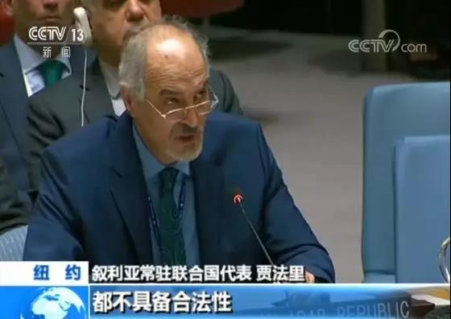
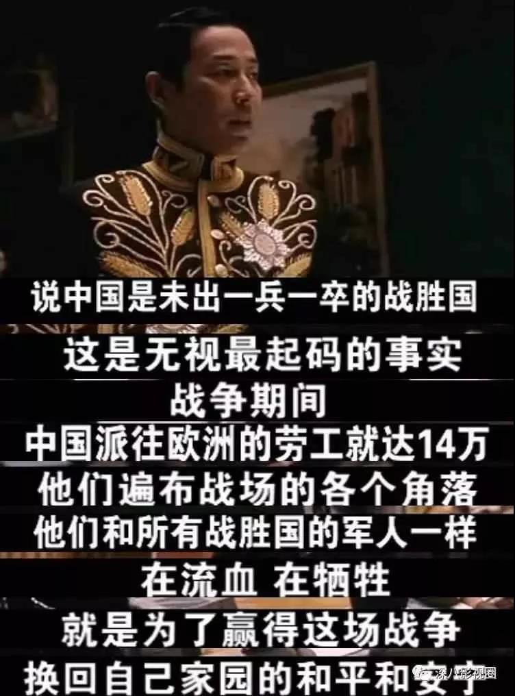

##正文

古老的《伊索寓言》中有这样一个故事：

>狼在河的上游，责备下游的羊把水搅浑了。羊说，自己在下游喝水，不可能把上游的水搅浑。狼又说：“但是你去年骂了我爸爸。”羊回答说，那时候自己还没有出生。狼于是对羊说：“即使你善于辩解，我还是要吃了你。”

昨天夜里，历史再一次的重演。

随着周一特朗普承认以色列拥有戈兰高地“主权”，在联合国总部，应叙利亚驻联合国代表贾法里要求，安理会召开紧急会议。

 

会议上，贾法里代表用它低沉而富有磁性的“男中音”，向在座的安理会各国代表做出了慷慨激昂的陈述。

且技术层面，贾法里不仅睿智的将特朗普与美国政府区分了开，凸显特朗普的一意孤行：

>特朗普听从以色列总理内塔尼亚胡的“命令”，承认以色列对戈兰高地的“主权”，是为了讨好在美国国内势力强大的以色列游说团体。

而且，面对安理会上美国一大群的军事盟友和傀儡国，贾法里很机智的调侃美以两国的私下交易，来分化美国和他的盟友：

>为什么不把北卡罗来纳州送给以色列？这是一块很好的土地。既然这么想支持以色列，那就送给这个国家两个州吧。

 

最终，在贾法里的精彩陈述与辩论之后，除美国以外，与会安理会成员集体对美国表示反对和谴责，达成了14:1的压倒性结果。

可以说，这是多年来美国首次在联合国安理会上被完全孤立。

 

但是，贾法里再完美的外交努力，在美国绝对实力的碾压面前，显得惨白无力。

由于美国对以色列的安全承诺，此次随着特朗普承认以色列在戈兰高地的主权，意味着美国对戈兰高地也有安全义务，叙利亚再想取回失去的领土，希望将更加渺茫。

这就是弱国无外交。

还记得去年这个时候，联合国安理会召开叙利亚化学武器会议，这位白发苍苍的老者代表自己的祖国叙利亚，与各国理事展开激烈辩论，舌战群儒，呛得美国为首的代表纷纷退席。

 

可即便如此，贾法里大叔依然无法改变祖国的命运，就在他60岁生日的那一天，美国数百枚导弹将他的家园炸成一片废墟。

可即使国家已经摇摇欲坠，他依旧在外，努力维持着一个外交官的体面和尊严，因为他现在是这个国家唯一的代表，也是数千万叙利亚人民的希望。

因此，在代表席上故作坚强的他，只能把疲惫的背影留给自己。

 

这个场景，可能我们并不陌生。

一百年前，巴黎和会在法国召开。中国作为一战的战胜国出席，到了会场，却发现座位被分为三等，一等的五个大国英美法意日有五个席位，中国被排在末等，只能有两个席位。

随后的会上，中国表示要收回在战败的德国在山东的一切权利，没想到日本却提出，按照战前的密约，接手德国在山东的权益。

 

面对日本的咄咄逼人，顾维钧不仅连夜拜访老朋友美国总统威尔逊寻求支持，随后还在巴黎和会上做出了震惊全场的演讲。

不顾维钧仅通过陈述14万华工的英勇牺牲，确定中国战胜国的位置，并从法理上让各国中国的巨大贡献本应获得属于自己的权益。

 

而且，顾维钧还用西方人听得懂的方式，陈述山东是中华文明的摇篮，是一块中华子女绝不能割舍的圣地。

 

顾维钧的杰出表现，引得巴黎会场上的集体喝彩，不仅英国首相劳合·乔治和美国总统威尔逊啧啧称赞，法国总理克列孟梭更有“顾之对付日本，有如猫之弄鼠”的至高评价。

甚至可以说，大放异彩的顾维钧不仅赢得对手们的尊重，令日本政府深感屈辱，也为中国后来收回山东权益奠定了法理基础。

可是，会谈期间，随着意大利因未能满足率先退出巴黎和会，在日本随后也要推出的威胁下，美国总统威尔逊为了保留住既得利益，不得不转向牺牲中国，允许日本先获得德国在山东的全部权益。

1919年6月28日，巴黎和会签字仪式在凡尔赛宫举行。当各国代表陆续进场后，他们惊讶地发现，中国代表团的座位是空的：中国代表没有来。

最终，一百年前中国的顾维钧，就像一百年后叙利亚的贾法里那样，虽然在台前的雄辩中取得了完胜，但却在桌子下的交易中完败，只能进行无声的抗议。

原因，就是他背后的国家，没有任何可以交易的筹码。

 

没办法，这个“狼吃羊”的世界一直都是如此。

一百年前，几个国家商量一下，中国的山东，就那么没了，一百年后，特朗普发个推特，叙利亚1300平方公里的戈兰高地，就那么没了。

一流的国家做棋手，二流的国家做棋子，三流的国家做棋盘，一百年前的中国和一百年后的叙利亚，都是列强们眼中的“三等国家”，只能任人鱼肉。

 

可是如今，就在叙利亚的贾法里在为国家和民族，向联合国祈求的时候。中国不仅在安理会手握一票否决权，还在一百年前受尽屈辱的巴黎，受到了高规格而热烈的款待。
 
 

闲云潭影日悠悠，物换星移几度秋。

一百年前，因国内极右翼上台，第一个愤然退出国联的意大利，如今成为第一个“叛逃”七国集团，跟我们签署合作备忘录的国家。

一百年前，在国内经济压力下急需扩张，为掠夺山东而跟我们唇枪舌剑的日本，如今公开表示在一定的基础上，愿意与我们进行“第三方合作”。

让曾经的棋盘，如今变成了棋手......

这些改变靠的不是别人，而是我们自己！就像人民英雄纪念碑题词中说的那样：

由此上溯到1840年，从那时起，为了反对内外敌人，争取民族独立和人民自由幸福，在历次斗争中牺牲的人民英雄们永垂不朽！

##留言区
 

