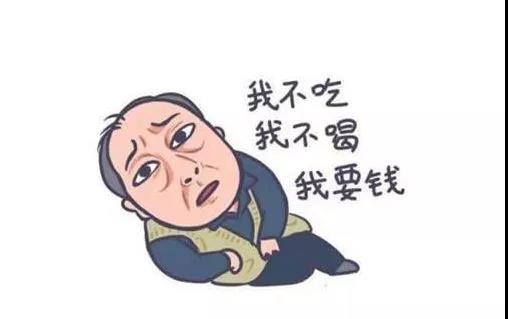
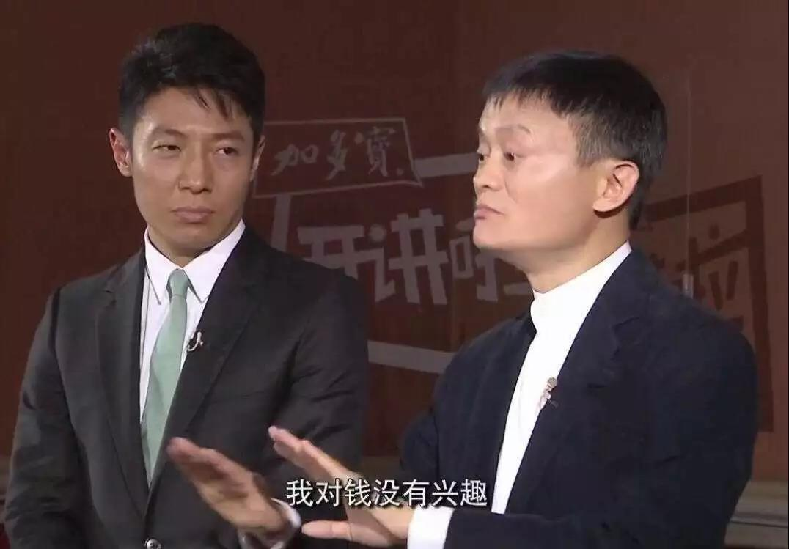
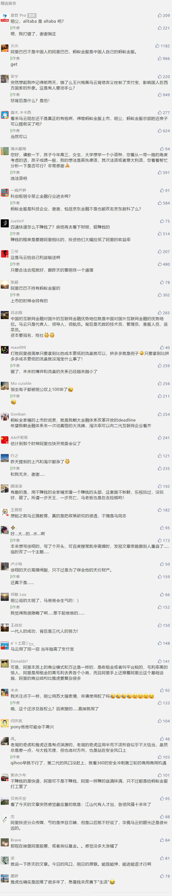

##正文

如果说，随便打开一条王思聪的微博，就会看到网友们纷纷称呼其为“老公”，那么当你打开马云微博的时候，则会看到满屏都是喊“爸爸”之声。

不过很多人并不知道的是，阿里的马云爸爸，上头还真有一个“爸爸”，他的名字叫叫“阿里他爸”（alitaba），作为阿里巴巴（alibaba）曾经的第一大股东，最多时持有40%的股份。

即使随着后来不断的抛售阿里股票，“阿里他爸”目前仍是阿里的第三大股东，持有约价值500亿美金的阿里股票。

可是，就在今天上午，“阿里他爸”宣布，不要阿里了.......计划全面清算和解散，要将手里的阿里巴巴股票兑换成现金.......

 

阿里他爸的声明一出，搞的因为纳税创纪录而股价上涨的“儿子阿里”，今天股价盘后大跌超2%。

而且，这位“坑儿子”的老爹更搞笑的是，持有儿子的股份市值500亿美元，但是自己的市值却只有420亿美元，也就是说扣除儿子的股份，手里恐怕算下来都是负资产.......

 

当然，不要嘲笑“苏大强”式的“阿里他爸”，其实，二十年前的“阿里他爸”，威名不逊于如今的阿里，他当时的名字，叫做雅虎。

 

当年雅虎鼎盛时期，占据了全球搜索市场接近一半的份额，甚至中国第一代互联网企业，好多都是仿照其来起名字的，如张朝阳的搜狐，周鸿祎的奇虎。

只不过这些全球第一代的互联网巨头们，后来都被第二代的互联网巨头们打得一溃千里，雅虎先是在搜索引擎上输给了Google，后来又在社交上面输给了后起之秀的Facebook，甚至Cosplay雅虎的搜狐和奇虎如今也都半死不活。

而雅虎唯独幸运的，在电商领域投资了中国的阿里巴巴，让雅虎“爸爸”获得了超过700亿美金的回报。

而促成这笔投资的，则是1997年雅虎总裁杨致远来中国时，由当时尚在对外经贸部工作的马云被派来做导游。

 

而正是2005年杨致远拍板的10亿美元投资，不仅让现金流一度断裂的阿里起死回生，也让雅虎“爸爸”获得了超过70倍的回报，也被誉为美国资本市场上最成功的一笔投资，甚至最近几年雅虎也总是后悔，说把阿里的股票卖早了。

不过问题来了，一直后悔卖早了股票的“阿里他爸”，为什么现在又这么急着出手阿里的股票呢？

也许，就和苏宁也在去年清空了阿里股票一样，这些深刻理解阿里的公司，都在发现作为最杰出的“动能”公司代表，阿里如今正在向一个“基建”公司迈进。

相比于阿里的“儿子”蚂蚁金服投资恒生电子等轻资产公司，近年来阿里自己则越来越重资产化，甚至近期通过入股凑齐了申通、中通、圆通、百事通四大快递这些根本不可能赚钱的重资产公司，并对其进行巨大投入来优化。

作为中国最厉害的商人，马云可不会做亏本的买卖，投资这些“不盈利”的重资产公司，最终都会使得站在利益链顶端的蚂蚁金服“非常盈利”。

因此，不出意外的话，就像当年第一代互联网巨头“阿里他爸”孵化出了第二代互联网巨头“阿里巴巴”，第二代互联网巨头的“阿里巴巴”也将孵化出第三代互联网巨头“蚂蚁金服”。

也许，把眼光放在多年之后，阿里巴巴的市值结构，可能就和如今的“阿里他爸”类似，最值钱的可能就是阿里巴巴在蚂蚁金服里的股权。

而相比于在阿里巴巴那非常低的占股，马云在蚂蚁金服里面可是拥有绝对控制权的。所以，等到蚂蚁金服全家桶等上科创板的时候，大家才会从全球富豪排行榜中认识到，什么是真正的“阿里爸爸”！

 

##留言区
 

