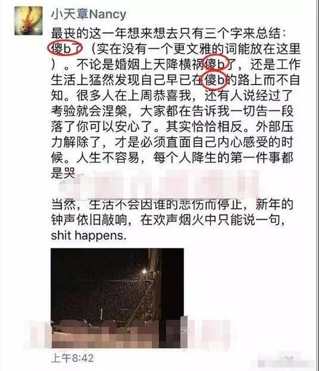
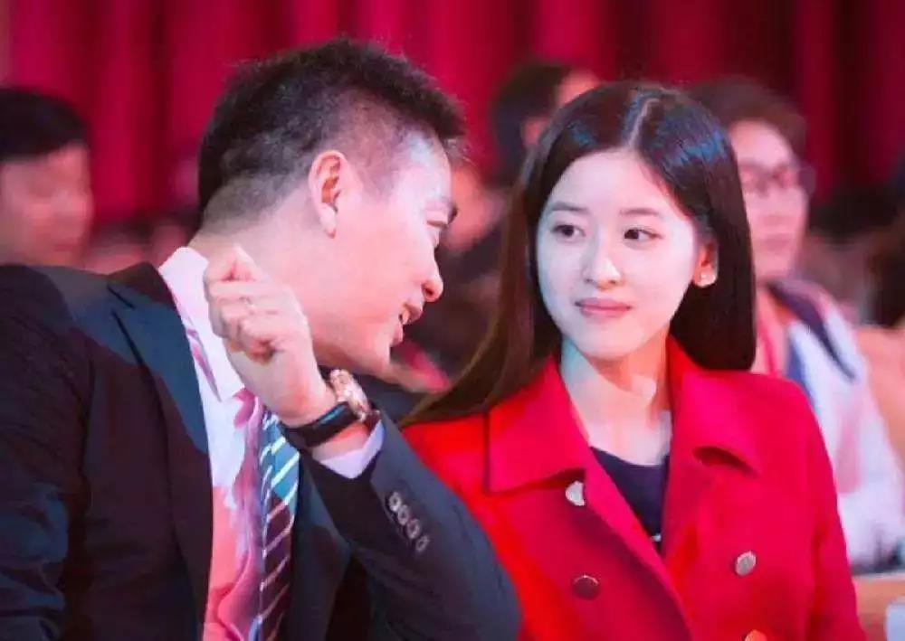

##正文

今晚，一则“奶茶妹妹将在微博宣布离婚”的消息，被广为传播，搞的吃瓜群众们纷纷坐在微博前等候，广告商都不敢今天跟奶茶抢头条了。

 

 

说起来，大家对“婚变”如此相信，也并非没有原因。

自明尼苏达事件之后，两人婚变传言就不绝于耳，先是两个人结婚时在澳大利亚购置的爱巢亏本甩卖，随后疑似章泽天的微信朋友圈流出，一连串的“傻b”昭示着内心的感受

 

还有今年年初，两人爱情的象征“京东JD+智能奶茶馆”停止营业，甚至前几天奶茶婚后第一次出现公众视野还被发现没带钻戒。

 

甚至就在昨日，章泽天卸任刘强东投资的重庆嫩绿茶艺有限公司董事一职，大量媒体跟进，纷纷讨论是不是离婚前的预兆。

 

虽然舆论纷纷认为两人会离婚，不过在我看来，从经济学的角度，两个人很难分手。因为作为移动互联网巨头，“流量饥渴”的刘强东需要利用章泽天的话题性吸引免费的流量，而作为社交界的新贵，需要扩张社交人脉的章泽天也需要刘强东这个巨头来铺设关系网。

因此，刘强东和章泽天的结合，是正和博弈，在这个婚姻的合作之中，双方都能满足各自的利益，只是看谁的获益更多。

而一旦离婚，就会是一个双输的结局，不仅刘强东多年来塑造的公众形象将在明尼苏达之后再次严重受损，“不识大体”的章泽天也很难在上层的圈子里面混了。

因此，从利益的角度来看，无论章泽天再怎么觉得“丧”和“傻b”，也只能忍着，之后再以贤妻良母的形象出现，因为这么做不仅符合她个人的最大利益，也符合她家族的最大利益。

甚至，从技术的角度来看，因明尼苏达时间名声垮台的刘强东夫妇，心理学上，非常需要民众对他们产生“愧疚感”。

因此，对于造谣他俩婚变的文章，从商业角度反而是支持的，因为只有婚变的谣言传得越真，到时候夫妻俩恩爱亮相时候，之前“传谣”和“信谣”的吃瓜群众才会越产生愧疚感，越感觉误会了刘强东夫妇。

因此，某种程度上看，这一年来适度的放纵谣言，也是大佬们的一种“救赎”手段。

 

说白了，和那崇拜的眼神一样，都是套路.....

不同于吃瓜群众纷纷相信婚变的刘强东夫妇，前两天另一则婚变的徐翔夫妇，坊间纷纷表示不相信，认为这是一场“技术性”的离婚，是为了把“私募一哥”徐翔司法冻结的百亿财产“解套”。
 
 

就像刘强东的婚变，如果从经济角度和博弈论上就会发现几乎不可能。

同样，从博弈论的角度，很容易就会看明白，徐翔夫妇几乎没有“技术性离婚”的可能。

首先，站在夫妻两个人的角度，这场财产的分配是一场零和博弈，徐翔的总资产数字是一定的，要缴纳的罚款数字也是一定的。

因此，按照所谓技术性离婚，就算徐翔老婆提前拿到被冻结的资产，之后徐翔还是得补缴罚款的，罚款的总数是不变的。

几十万的房子为了避税搞离婚都经常出现假戏真做，而为了所谓技术性的提前解冻资产，几十亿的资产就这么技术性的转移出去，让自己身负几十亿的负债，这显然不符合人情之常理，搁谁也很难做出这种决策。

而且，徐翔老婆说离婚是因为资产冻结没有钱了，其实想一想，徐翔当年都是给什么人打理资产，替什么人擦屁股就会明白，只要夫妻同心，哪怕是徐夫人刷个脸，问徐翔老朋友们借个千八百万都不是事儿。

就像网上之前有个段子，贪官进了监狱之后，告诉媳妇家里有事儿就去求以前的老领导，保证都能办妥，这都是一个道理。

其次，如果把徐翔夫妇的博弈中，再加上公诉方的话，那么徐夫人这么搞就不是零和博弈，而是负和博弈了。

因为徐翔的量刑标准，是按照“坦白松宽”，把这些年不该赚的钱吐出来为国家建设做贡献，换取国家的宽大处理。

这就像你开车撞死了人，要是赔偿能够让对方家属谅解，那么也就是赔钱的事儿，反之，如果谈好了谅解的数字，结果你有说家里离婚没钱支付，那么面临你的自然就是牢狱之灾和等着加刑吧。

虽然，对于徐翔的老婆来说，她眼中只盯着钱，但是对于徐翔来说，他需要的是时间。

徐翔的牢狱之灾就剩两年的，到时候出来，其知名度远比当年进去的时候高上十倍不止，对于这种人来说，时间远远比金钱更重要，譬如今天开春以来两个月的行情和松监管，恐怕就足够让徐翔赚个上百亿了。

因此，对于徐翔来说，这两年他的最优解，就是闷声坐大牢，争取好好表现提前出狱，然后东山再起，而不是搞什么技术性离婚给自己找麻烦。

夫妻本为同林鸟，大难临头各自飞，徐翔的老婆所谓的技术性离婚，本质是“翻供”，是“抗拒从严”，是为了让自己尽快变现，只是这样，狠狠的坑了自己的老公，不知道徐翔在狱中得知后，会不会气得吐血.....

就像前些天跟朋友讨论徐翔的爱马仕白大褂的时候，朋友们一致认为，这么丑的衣服，肯定是老婆买爱马仕包时，配货搞出来的......

也许，在徐夫人眼里，她的这个老公，也只是那些数百亿资产“充话费送的”.......

##留言区
 

