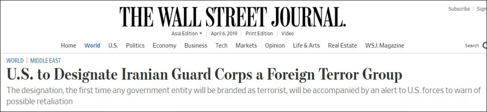
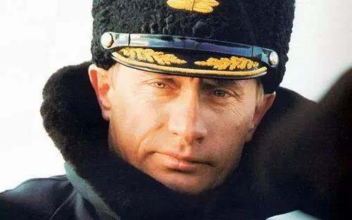
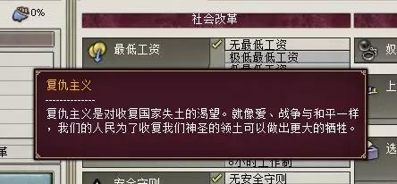
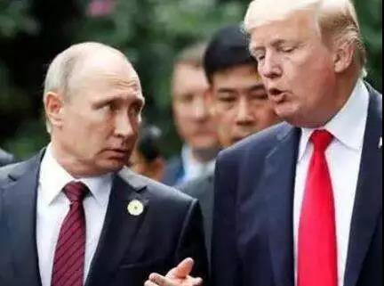
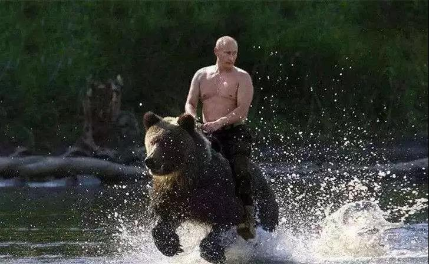

##正文

 
一

就在普京向特朗普的“后花园”委内瑞拉派兵后，一贯“睚眦必报”的特朗普，旋即就在普京的“后花园”搞了一个大新闻。

据《华尔街日报》报道，特朗普将在下周一，宣布伊朗伊斯兰革命卫队列为“恐怖组织”。

 

由于伊斯兰卫队全面控制了伊朗的军事、石油、经贸等各个领域，因此明天白宫签署后，也就意味着伊斯兰卫队背后的伊朗几乎也要从“支持恐怖分子”升级为“恐怖分子”。

这使得伊朗在国际上大部分合作，均可能面临美国的刑事诉讼，因此，被逼到墙角的伊朗必然要做出相应的反击。

而刚刚用出兵委内瑞拉，试图跟美国做伊朗和叙利亚交换的普京，估计又得继续站出来，为好哥们伊朗再硬扛一波了。

 

 
二

说起来，硬汉普京自执政以来，对内对外从来都没有怂过，从武力解决车臣战争收复国土，到出兵格鲁吉亚吞并南奥塞梯，再到压制乌克兰收回帝国明珠克里米亚，甚至还出兵叙利亚大战恐怖分子。

更不要说近期的对美国势力范围内的委内瑞拉万里救援，让不少“老苏联人”甜美的回忆到，当年鼎盛时期在美国后花园搞的古巴危机。

因此，凭借着其硬汉铁血形象，在简单粗暴的俄罗斯民众中拥有绝对的支持度，各级政府都被其统一俄罗斯党控制，甚至收获了国内国际数不清的粉丝，连特朗普也曾频频表示愿与其交好的强烈愿望。

但是，普京的强硬做派，对外并没有使得俄罗斯的生存空间改善，北约已经推到了家门口，对内的经济也没有改善经济，二十年来一直靠卖资源度日。

这是因为普京的对外强势政策，表面看似光鲜，但背后却是一个恶性循环。

**外交方面**，普京越是对外强硬和依靠武力，国际上就越被孤立并引发北约的围剿，因此原本俄罗斯地缘范围内的国家就会出现危机，而危机一出现，就又给了普京再一次秀肌肉和对外强硬和争取民众支持的机会，然后秀完强硬被进一步孤立。

**经济方面**，普京越是对外强硬，引发西方的围剿和制裁，就越会引发俄罗斯民族强大的爱国精神和超高的民众支持度，因此就能掩盖国内经济结构和增长乏力的巨大矛盾，并使得本不富裕的俄罗斯能挤出余力对外出兵，然后再被西方加码制裁。

因此，在经济和外交的双重驱动下，俄罗斯都陷入了一个“非普京不可”的状态，但这也使得俄罗斯的外交和经济都陷入了死循环。

格鲁吉亚是斯大林的家乡，乌克兰更是和俄罗斯有着400多年的结盟史，普京秀完这两次肌肉之后，也就把这两国家永远推给了自己的敌人。

俄罗斯一年600亿的军费，连北约欧洲那几个国家的四分之一都不到，更不要说还没美国的一个零头多，德国等欧盟国家早就不想跟着美国一起制裁，但扛不住普京频频的秀肌肉吞并领土，民主的呼声迫使大家只能跟着美国一起制裁。

这也就形成了一个普京式的死循环。

 

 
三

说起来，逼着年仅70岁的普京频频秀肌肉也没有办法，他能够从2000年一直执政到现在，靠的就是不断的“武力作秀”，以迎合俄罗斯民众内心深处的“复仇主义”思潮。

“复仇主义”这个词，在1870年后被广泛使用，指的是民众对于收复国家失土的渴望，并为之愿意付出巨大的牺牲。

普法战争、一战、二战的背后，都是“复仇主义”思潮在作祟。

 

当年，俄罗斯在90年代前的半个世纪，作为苏联老大哥，那可是全球数一数二的强国。

而如今呢，大片的领土丢失，大量的卫星国背叛，经济每况愈下，全国GDP还不如当年小老弟的一个省。

在这种巨大的落差之下，对胜利渴望的俄罗斯民众，自然而然就会将不断秀肌肉的普京推上台，通过不断的寻求存在感，来回味当年的美好时光。

不过，虽然“复仇主义”能够带动民众的热情，并平息民众对经济增长乏力的不满，但是，由于外交与经济上任由情绪压倒理性，往往会导致非理性的结果。

譬如，一战中复仇的奥匈被解体，二战中复仇的德国被分拆......

所以，看似同时满足政治家和民众双赢的“复仇主义”，搞不好最终往往是一个双输的结局。

 
四

说了半天俄罗斯的复仇主义，其实，不要以为只有普京是借着“复仇主义”的思潮做事儿，他的老朋友兼老对手特朗普的所作所为，本质也是在利用“复仇主义”思潮。

为什么明天特朗普会宣布伊斯兰卫队为“恐怖组织”？

很简单，后天特朗普的盟友以色列总理内塔尼亚胡的大选就要最终投票了。

以色列和伊朗是死敌，而以色列与美国国内都有着强烈的“犹太复国主义”思潮，更不要说美国国内庞大的基督教福音派虔诚的支持以色列，那么为了获取这些“狂热者”的支持，特朗普自然可以为此奋力一搏。

甚至特朗普的“Make American Great Again”，也是一种类似于“复仇主义”的思潮的产物，利用美国百人民众对于上个世纪美国美好生活的向往和荣光的恢复预期，激起他们的狂热来获取支持。

所以，特朗普从退出巴黎协定、退出TPP、贸易谈判，到如今不惜一切支持以色列和拼老命建边境墙，都是在Cosplay模仿他的偶像普京，通过不断兑现的诺言，来获取狂热支持者的无条件支持。

 

但是，这种借用“复仇主义”的方式，往往会使得国家战略方向出现问题，就像一战二战前德国的四处出击，以及俄罗斯近些年的武力扩张，把原本可以成为的盟友都变成了形同陌路的敌人。

对于国家来说，这未必是什么好的选择。

不同于两百多年前才明白国家概念的西方人，作为拥有悠久历史的中国人，对“复仇主义”更深刻的理解和血淋漓的例子。

当年北宋因为丢了燕云十六州，民间就有着强烈的收复故土的情怀，因此在辽金大战中，不理性的联金击辽，导致了靖康之耻，中华大地血流漂杵，宋徽宗爷俩被抓去五国城"坐井观天"。

而吃一堑不长一智的南宋也继续作死，在靖康雪耻和收复故土的“复仇主义”思潮之下，在蒙金大战中，又一次不理性的选择联蒙击金，导致了中华文明的唯一一次“断片”，崖山之后无中华。

所以，拥有着几千年历史的我们，自然也会明白，在接下来一连串的美俄沙伊全球能源博弈中，我们的最佳选项，就是保持理智不直接参与。

有一句话怎么说的来着？“撑着毛熊过河”.......

 

##留言区
 

