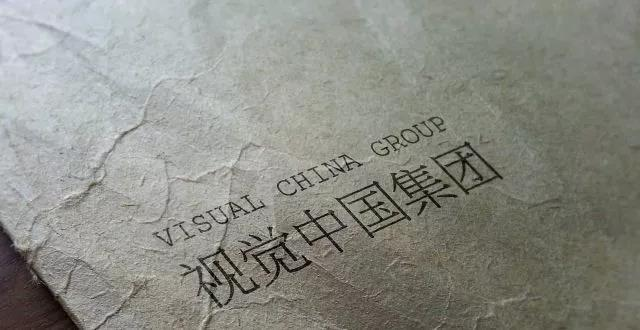

##正文

昨儿夜里，有朋友问我，视觉中国没起诉过你嘛？

我说，没有啊。

朋友说，据说，一个自媒体没收到视觉中国的律师函，说明还做得不够大。

嗯，说的我不止该庆幸还是伤神.......

昨天，随着全球第一张黑洞照片的公开，火起来的不是蹭热度的杜蕾斯，也不是各大科技媒体，而是一家老百姓并不关注的公司，视觉中国。

 

这家公司将全球免费的图片纳入到自家图库，在大V们转发后引起众怒，而随着被网友们发现其将国旗和国徽也被其纳入版权库，更是将声讨推至高潮。

 

由于视觉中国多年的“勒索”行为，得罪了一大批的头部媒体，因此媒体圈墙倒众人推，甚至也引发了人民日报、新华社、共青团中央等机构的喊话。

结果今天一早，视觉中国一字跌停。

随后更是爆出，天津网信办约谈，责令彻底整改，并在此期间暂时关闭网站。

于是，各个自媒体和吃瓜群众们纷纷“额手相庆”，庆祝自己又打赢了这一仗.......

本来呢，作为自媒体的我也应该乐呵乐呵。

不过，我突然想到，即使做到了我这个阅读量，每天都写文章都从百度借图，都还没有接到过视觉中国的“勒索信”.......

大概，被“勒索”的那批，还真都是真的体量足够大，广告刊例价报得足够高的“真.头部"自媒体。

而问题是，能做出来广告刊例价，商业化的自媒体，哪个不是在历史的进程中挣得盆满钵满？

这些头部自媒体一篇广告几十万，可以说是躺着印钱，如果文章用了人家版权的图片，被版权方发现了，交个千八百块钱难道不应该吗？

而且，视觉中国只盯着头部媒体收版权费，对中小媒体采取放任不管的模式，我倒是觉得和政府税收类似，对中小企业和个体工商户进行大规模的税费减免，培育市场，增强活力，而对站在食物链顶端的个人和企业收取高额的税收。

从这个角度来看，我倒是觉得视觉中国的收费模式没毛病，如果视觉中国们针对所有的媒体一视同仁，哪怕是一张图只收取几块钱，都会极大的扼杀那些刚刚冒出芽的新自媒体，反而会促使大媒体形成托拉斯垄断。

进一步说，我认为那些抨击视觉中国收费过高的，也站不住脚，如果仔细看一下视觉中国的财报，人家成本中，近3/4都用于支付版权服务费。

 

也就是说把收到的钱，很多都交给了那些图片的原创者，作为他们原创应得的回报。

所以，我倒是觉得视觉中国的看似不公平的模式，反而很公平。

一方面，平台收取的费用，能够为摄影爱好者和专业人士提供他们的劳动报酬和知识产权，以鼓励更好的作品出现。

另一方面，把收费主要集中在那些头部盈利能力强的媒体上，而不是把图片版权变成扼杀初生媒体发展的拦路虎，让很多中小自媒体可以不考虑版权免费用图片。

因此，这就像政府对富人多征税，对穷人减税，反而会促进整个媒体市场进入更加良性的循环。

而且，当所有人都盯着视觉中国“勒索”的时候，其实翻过来想，人家也是一种“维权骑士”，帮助签约视觉中国的30万职业供稿者维权和主张权益。

这些无力主张自己权力的供稿人，本就需要视觉中国来帮他们维权。

想一想近年来，凭什么自媒体们一边雇佣“维权骑士”们，向盗用自己文章知识产权的人下律师函，协商的收取补偿；而另一方面，自己“盗用”了别人的图片知识产权，收到律师函和协商版权费就哭天喊地？

文章是知识产权，难道摄影的知识产权就不是知识产权了吗？

这样搞双标好吗？不好吧！

而且，舆论一边倒的背后也没那么简单。

虽然有30万职业供稿人指望着视觉中国维权和支付稿费，但是他们都是沉默的大多数，反而因为视觉中国机制，利益受损的极少数头部自媒体，他们却拥有舆论的话语权。

更不要说，那些为了少交千八百块钱版权费，大写文章抨击视觉中国的头部自媒体，人家一天有几十万的广告费。而跟着他们抨击视觉中国的很多人，“996”式辛辛苦苦加班一年，都挣不过人家一篇文章.......

嗯，这就像租着阴冷地下室住的人，却高呼给王健林和许家印减税，这是病，得治！

##留言区
 

