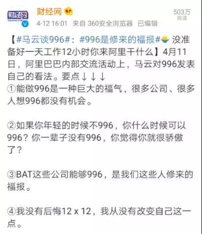
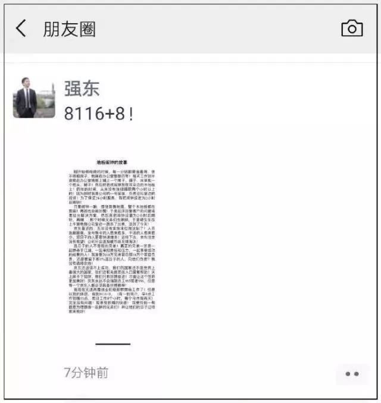
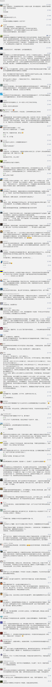

##正文

 
一

**能够996是修来的福报——马云**

**混日子的人不是我的兄弟！——刘强东**

这两位互联网界的最拉风大佬，最近又将热议“996”再一次推向了高潮。

 

 

说起来，对于早九晚九一周六天上班俄“996”是对是错，从来就不是我考虑的问题。

毕竟，只有小孩子才分对错。

为什么会出现“996”，接下来会怎么走向，才是我关注的问题。

 
二

两百多年前，随着第一次工业革命如火如荼的发展，面对工人们“996”式的加班，英国社会主义者欧文提出了“八小时工作制”， 主张“8小时劳动， 8小时休闲， 8个小时休息”。

此后的一百年时间里，越来越多受压迫的劳工们加入到这场抵抗浪潮之中，甚至让欧罗巴的天空上，也盘踞了一个幽灵。最终，迫使各国政府先后推出法案，规定企业需执行八小时工作制。

但是，在资本主义市场经济之下，掌握供求关系中主动权的企业主们，很快就推出了“计件工资”制，也就是工人能拿的工资，按照工作量来结算的。

在这种制度下，工人的确可以每天只干八小时，但领到手的工资根本不够养家，所以，大多数工人最后还是“自愿”加班“996”，以便填饱肚子。　

毕竟，在市场竞争之下，即使某个心善的资本家想要搞八小时工作，也会被市场和竞争对手所淘汰。

没办法，这就是市场经济。

 
三

在罗伯特欧文提出了“八小时工作制”的一百年之后，

那个让教皇和沙皇、梅特涅和基佐、法国的激进派和德国的警察，都联合起来的幽灵，他奋斗了十年都没有终结的“996”，却随着第二次工业革命的到来成为了过去式。

美国的亨利福特在自己底特律的工厂里面，率先推出了五天八小时工作制，严令禁止工人们超时工作以换取加班费。

甚至福特数次在厂区发表演讲，要求工人们“有时间多陪陪老婆孩子，做个称职的丈夫和父亲”。

要知道，作为一个资本家，如果鼓励员工少上班，有家庭，必然会降低生产率，导致被竞争对手所淘汰。

那么，福特为什么这么干呢？

因为这一百年的时间，世界已经从第一次工业革命迈向了第二次工业革命，整个工业体系已经从手工作坊式制作向流水线大生产升级。

以福特为例，其生产的汽车拥有5000多个零件，按照原来的手工生产极其缓慢，但是流水线上来之后，每个工人只需要专门做一件事儿，因此福特工厂的生产效率迅速提升。

但是，流水线也有一个巨大的弊端，在流水线的高效生产之下，要求员工们必须精神高度集中，一个不注意就会导致整个生产线被迫停机，并造成严重的伤残。

所以，资本家们权衡一下，发现如果一个工人过度疲劳，会导致整个生产线数百工人集体趴窝，自己还要支付高额的伤残赔偿，那么，他就会果断的禁止工人加班，也会只招募有家有责任心的工人。

这也是为什么在迈入第二次工业革命，流水线成为主流之后，之前为了逼着工人加班，不惜巨额资助反动政客们的资本家们，纷纷成为了八小时工作制的坚定支持者。

所以，不要以为是工人们的抗议和前赴后继的牺牲换来的八小时工作制，**八小时工作制的背后，是资本家们经过精密计算，得到利益最大化的那个最优解。**

反过来看，同样还是福特公司，半个世纪后的平托车案中，资本家们在经过精密计算之后，发现人命的赔偿比返厂维修更划算的时候，也会果断的让那些车主去死。

这就是市场经济的逻辑，哪怕是人类工业体系中的皇冠，波音公司，在737-800MAX升级时也是这么选的。

在资本面前不要谈人命，波音作为全球最大的武器商，每年死在波音武器之下的冤魂，可以在航班事故后面再加几个零。

所以，不要以为对着资本家们抗议“996”就会得偿所愿，看看这次抗议活动刚组织，原本打成一锅粥的IT大厂们，就像当年欧洲的君主们一样，马上联合起来进行“围剿”，那个996.ICU网站被国内的APP和搜索引擎集体封杀.......

所以，各位闹腾的程序员，看看自己比其他工作的同龄人高出好几倍的工资，就会明白，一百多年前干不成事儿，一百多年后更干不成了。

甚至，对于那些媒体的加油鼓劲也不要有啥奢望，毕竟，目前还依旧执行六天工作日的国家，只剩下朝鲜和越南。对于加班这事儿，姓资姓社真没啥关系。

 
四

对于国内“996”比较搞笑的是，“996”新闻被传到日本之后，日本人纷纷开始吐槽，一大群日本网友纷纷表示，下班真早，好羡慕......

大概，甚至中国人都无法理解日本人的加班文化，很多男人就算提前下班了都不敢回家，只能去居酒屋混日子，生怕被看不起。

而从全球的角度来看，全球加班狠的国家，中日韩朝越，一色都是黄皮肤黑头发儒家文化圈......

这是巧合么？很显然不是！

东亚的环境和历史文化，决定了所有人想要成功，就必须比别人更拼，因此，一旦搞起了“改革开放”，让市场来优化配置资源，东亚各国马上就会成为“养蛊”模式下的炼狱，形成激烈的内部竞争。

这就像我朋友玄处说的：
>这就叫做市场在资源配置中的决定性作用。我们不能一边说市场经济好，等到市场经济真的建立起来了，又被吓倒了，这就成了叶公好龙了，这是不对的。

考虑到，这种集体的拼搏和“养蛊”式的搏杀，能够给集体带来更大的利益，就像全球的制造业都在市场经济之下，向东亚的儒家文化圈转移，创造了从“四小龙”到“伟大复兴”的东亚经济奇迹。

就会明白，别说在中国，在整个儒家文化圈里面，声讨“996”都是没意义的。

一方面，政府和传统文化都不会反对奋斗，公务员们早就开始5+2，白加黑了。

另一方面，**庞大的人口基数以及无数有着出人头地年头的人，在你不想奋斗的时候，马上就会有人把你的位置填补上。**

所以，很多城市里面出生的程序员，就会痛恨那些从村镇一路拼出来的同事，质问他们为什么不参与斗争？为什么要当“工贼”？

其实，马云某种程度上说的也没错，对于很多底层一路拼上来的一部分人来说，能够给马云“996”，一年就赚取在老家种地几十年的收入，也许，还真的是修来的福报。

 
五

最近，很多读者质疑我，说一贯“很左”的顾子明，为什么在“996”的问题上，不站在劳动者一方讲话。

原因很简单，一方面，我比大家想象中“更左”，我一直主张给底层一个上升的通道，对已经上好日子 “中产阶级”呐喊助威没兴趣。

而另一方面，就像前文所述，目前在“996”的问题上，年轻人们抵制是毫无用处，就像一百多年前资本家们就会搞“计件工资”那样，处于劣势的劳动方，就算打赢了舆论战也没用。

因为劳动力本身就是市场化的，随着这几年国家大力鼓励双创，大量的年轻劳动力涌入，使得原本稀缺的IT人才，变得不再那么稀缺，因此供求关系使得博弈的天平开始向资本方倾斜。

就像刘强东为什么敢于对快递员兄弟们动刀？

随着最近发改委文件明确，大量新劳动力将涌入城市，那么资本家们的议价能力自然就会提升。刘强东自然敢说“你不奋斗自然就不配做我的兄弟”，因为有的是跟他当年一样从农村爬出来的青年，争着做他的兄弟。

同样，现在互联网巨头们都在停止社招，整个劳动力市场严重的供过于求，这些大佬们哪怕是在夜场选小妹，也挑年轻有活力的，对吧？

因此，如果站在资本家的角度考虑就会发现，有的是又便宜又拼命的年轻人等着“临幸”，人家为啥要养着一群“大爷”呢？马云和刘强东们自然喜欢通过看是否喜欢“拼搏”，筛出来性价比更高的劳动力。

毕竟，阿里和京东都是上市企业，公司是股东所有，又不是全民所有制，按照市场经济，人家有的是办法把不愿意奋斗的人清出去。

嗯，既然选了不跟张麻子回山里，去领了黄老爷们的钱，得了巨大的好处，自然也要付出对应的代价。

 

 
六

最近几年，随着中国手机的普及，移动互联网的高速发展已经走到了尽头，资本家们自然不会再愿意支付高额的员工开支，这是一个长期而不可逆的趋势。

其实，今年大家开始闹996，主要原因就是因为行业不景气，待遇下滑了。

不过，抗议是徒劳的，甭指望闹能解决，毛熊都凉了快30年。

当然，也不必沮丧，按照市场经济的规律办事儿，自然也要从市场经济中寻求机会。

两百多年前，人类开启了第一次工业革命，大量食不果腹的农民成为了能够养活全家的工人，一百多年前，人类开启了第二次工业革命，大量“996”的工人享受到了八小时工作制和高额的薪水。

因此，无产阶级的待遇提升，本质靠的还是生产力的大发展，资本家为了自身的利益，来提升大家的薪水。

而未来互联网的下半场，大数据金融和物联网是很明确的两个大方向，各位大佬们也在往其中不断投入。

所以，有空在那瞎折腾，不如多学点金融知识以及多了解各行各业的前沿信息。

亦或者想明白了为什么公司要“996”，争取早日进入马老爷们的管理层，成为一个优秀的“武举人”。

 

##留言区
 

