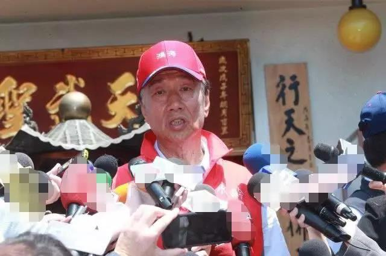
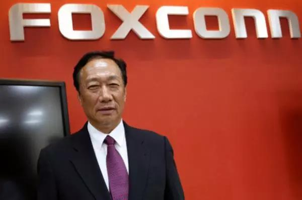
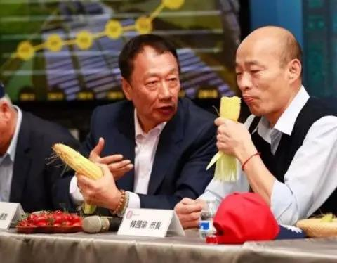

##正文

在台湾地区初选即将拉开大幕之季，今天，鸿海老板郭台铭两次参拜庙宇，称关公、妈祖托梦告诉他，一定要代表国民党参选2020台湾地区领导人。

这位深谙中国传统文化的大老板，刚出来竞选，就直接放了一个“传统”式大招，表露出势在必得之态。

 

受此影响，鸿海在两岸的股价都迎来了大涨，“郭台铭”概念股也成为一道靓丽的风景线。

其实，郭台铭此次竞选并非心血来潮，就像在岛内挂起“韩国风”的韩国瑜，虽然之前一直是国民党党内呼声最高之人，但一直都对此次竞选表示冷淡，甚至还在上个月以“老鼠偷拖鞋，大的在后头”回答是否参选。

按照韩国瑜的超高人气，比他还“大”的，在岛内只能是郭台铭了。

 

而且，在上个月底，郭台铭在LINE账号上放出一副“计利当计天下利”的对联，随后又在Facebook上放上与特朗普的合照，甚至鸿海内部已经在积极推进接班人计划了。

更不要说，由于郭台铭早在2000年由于历史原因“脱党”，而竞选又需要四个月以上的党员身份，而今天一大批的国民党大佬同时给郭台铭站台，很显然，郭台铭与国民党高层之间，早就对此次参选达成默契了。

因此，按照这个局面，搞不好“大”的郭台铭和“小”的韩国瑜，在2020年，要组成一对儿台湾地区的“大小王”。

 

那么，与国民党早已达成默契的郭台铭，为什么要等到今天才参选呢？

以郭老板在台湾的知名度，全岛根本不存在竞争对手，他唯一的对手和麻烦，就是他自己。

因为，他和他的鸿海，过去一年却陷入了巨大漩涡之中。

鸿海是全球最大的代工厂，最大的生意就是给苹果做代工，说白了，就像给马云当跑腿的四通一达，苹果和阿里的效益会直接反应到他们的身上。

正所谓皮之不存毛将焉附，在过去一年多的时间里，由于中美之间的互加关税以及苹果与高通之间的专利官司，导致了郭台铭的鸿海集团不仅经营惨淡，生产线大规模停摆，更是深陷高通巨额的官司之中，使得股价屡创新低。

甚至郭台铭都由2017年73亿的身价跌至2018年的44亿，并将台湾首富的位置拱手相让。

而鸿海又属于劳动力密集型产业，企业不景气会导致大规模的降薪和裁员。

看看马云站在资本家的角度支持了一下996，那么多年说教打造出来的光环瞬间暗淡了一大半。可想而知，如果鸿海自身不从泥潭中走出来，郭台铭竞选，反而会将自己陷入两难的境地。

而更重要的是，在中国和美国均有巨额投资的郭台铭，如果处在一个中美激烈博弈之时竞选，更是很容易搞出“猪八戒照镜子--·里外不是人”的境地。

所以，郭台铭一直等到了今天。

一方面，中美之间经过第九轮会谈之后，只剩“临门一脚”，不仅两国关系将更进一步，关税以及对抗情绪的消失，会极大的刺激中美两国的电子产品消费，鸿海又可以招募大量的工人重启生产线。

另一方面，今天，苹果与高通之间也达成和解，鸿海面临的天价官司直接取消。更重要的是，原计划推迟5G手机的苹果，未来将成为第一批5G手机的玩家，巨头们争抢的5G订单，会让鸿海将成为最大的受益者。

鸿海没有了后顾之忧，那么郭老板自然就可以开创自己的星辰大海了。
 
 

话说，这次无悬念的台湾地区竞选，真没啥好说的了，台湾八分之一的人口靠着鸿海吃饭，不出黑天鹅事件的话，大局已定。

那么接下来，展望一下郭台铭当选后的影响。

郭台铭最大的筹码，就是与中美两国领导层良好的私交和巨额的投资。去年特朗普当着全世界的面儿，盛赞投资美国的郭台铭是最伟大的商人之一。在大陆，“工业富联”更是在监管层一路绿灯的护送之下登陆A股。

可以预见的是，如今解决了经济后顾之忧的郭台铭，鸿海美国工厂的进度会提速，大陆的工厂也会大规模的招人。而郭台铭大规模的投资，又会进一步拉进对美国和大陆的政治经济联系。

这样下来，民进党执政期间两岸的冷淡即将过去，两岸又将迎来一波新的合作高潮，甚至新一轮的家电下乡，也可能会增加电子类产品，分鸿海一杯羹，两岸产业合作进一步升级。

至于房价方面，最受利好刺激的，恐怕就是厦门，这个过去几年已经跌了不少的计划单列市。

最后，大家最关心的两岸统一，不要误以为换上一个领导人就会有本质上的改变，两岸关系的本质是中美关系。如今中美国力差距在那里摆着，接下来两岸会继续按照九二共识“穷则搁置争议”，趁着国民党上台，用时间换空间，加强两岸之间的产业联系。

就像台湾有300万人靠鸿海维生，会使得郭台铭轻松取胜那样，未来，随着我们综合国力地位的持续提升，对台湾经济结构影响的不断深入，迟早有一天会像郭台铭那样，兵不血刃的完成我们的历史大业。

##留言区
 

