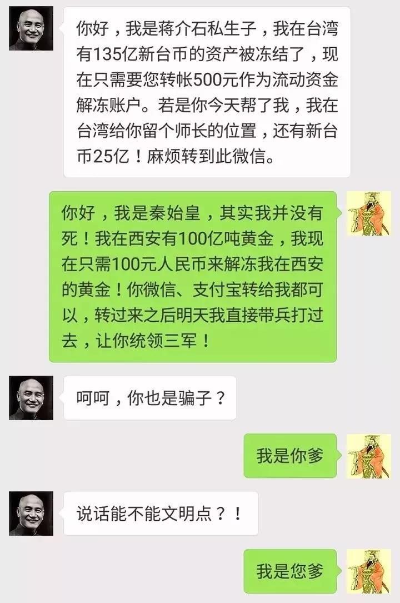
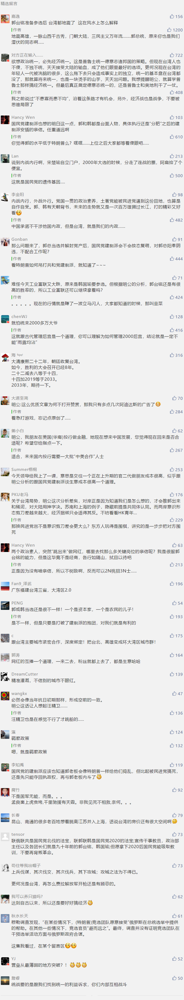

##正文

两天前，鸿海集团董事长郭台铭宣布加台湾地区领导人国民党党内初选，两天后，国民党主席吴敦义今日表态，希望征召高雄市长韩国瑜参选党内初选。

本来，郭台铭已得到党内众多大佬的首肯，结果又闹出这么一出。一时之间，岛内“泼天洒狗血的宫斗剧本”瞬间蔓延，“韩国瑜大战郭台铭”之声此起彼伏，“内战内行”百年招牌的国民党，似乎又在发挥其优良传统.....

虽然岛内议论纷纷，不过在政事堂看来，大家可能要失望了，本次国民党的党内选举，恐怕是看不到西式选举中的相互攻讦。

 

首先，本次郭台铭一亮相，搞的就是中国传统的“天人感应”，称因“妈祖托梦”来参选2020；而高雄市长韩国瑜搞的则是“三请三辞”，每次国民党口头征召他，他都会推脱一下，但是把话又不说死。

可以说，不同于全盘西化的民进党，两位传承中华传统文化的大佬，起手玩的都是祖宗传下来的套路。

 

好了，既然知道是“中华传统套路”，那么我们就会知道，这哥俩必然就会私底下达成一定的共识，即使斗起来也是斗而不破，然后哥俩一起对民进党“外御其侮”。

其次，今时不同往日，对于国民党建制派来说，2020选举是一场生死战，过去几年，民进党借着清理党产为由，将国民党数百亿资产系数冻结，因此，如果此次败了，党内建制派基本上就散架了。

因此，虽然国民党建制派一贯内部撕逼严重，但是到了“党国存亡在此一役”之季，必然会像当年抗日初期那样，形成空前的一致。

所以，无论是郭台铭和韩国瑜之间，还是国民党建制派内部，在2020选举时，都会奔着一个目标，那就是击败民进党，相互之间不会怎么拖后腿。

不过，解释了这个，恐怕大家会有疑问，为什么能够稳稳击败民进党的郭台铭出山之后，国民党主席仍要征召韩国瑜参选呢?

一方面，韩国瑜已经与高雄市民有了一个四年的“政治契约”，即使想选也不能表露出来，否则政治信用就毁了，所以国民党主席就主动跳出来“当坏人”，强行“征召”。

而另一方面，则是与台湾地区的体制有关。

当年孙中山先生从檀香山启程归国，带回来的“三民主义”中，就有不少美式政治的印记，因此，国民党带去台湾政府，体制也相对比较“美式”。

故而台湾除了领导人选举之外，同时还有立法院的选举，立法院颇似美国的众议院，对于领导人和政府（行政院）拥有非常强的制约能力。

就像2016年，蔡英文上台后能够清算国民党的党产，原因就是这一年是民进党历史上首次拿下了立法院，蔡英文的行政指令能够轻松变成“立法”，完成了当年陈水扁“八年抗战”都没有完成的任务。

 

 
 2016年台湾“立法院”选举结果

 
民进党VS国民党 68：35

而国民党丢了立法院这个半个多世纪的护身符之后，就变成了被民进党围剿之势，可谓兵败如山倒，有空数百亿资产，可是被“党产会”逼得连工资都开不出来，不得不上街讨薪......

 

甚至国民党一度被逼急了，都扬言青岛啤酒就是国民党“党营事业”，让民进党去向大陆讨这个债.......

 

而更严重的是，习惯了靠党产助力选举，上位后再给“党产”增值的国民党建制派，如今，在没有党产的情况下，一群纨绔子弟连怎么参选都快不会了。

 

所以，对于掌控着国民党的建制派们来说，本次立法院的竞选重要度不逊于台湾地区领导人，国民党只要不惜成本赢了立法院，那么就可以控制“党产会”，解冻被查封的巨额资产。

额.......怎么感觉这话说得跟电信诈骗差不多......

 

本着有钱就是“爹”，本届立法院的争夺国民党可谓势在必得，但是上次竞选35：68可以说一败涂地，这次想要扭转战局也没那么容易。

不过，台湾的竞选制度正好给了国民党一个机会。

台湾和美国类似，领导和立法院同时选举。而美国的特朗普这几年已经成功的证明了，高人气领导人的“带票”能力。

因此，**只要让国民党内高人气的竞选人去参加领导人竞选，选民们因为支持他们心仪的选手，很容易把选票投给同一党派的“立法委员”。**

 

所以，可以预见的是，不今年国民党的初选会非常精彩，大家不会因为郭台铭出来而放弃，**国民党党主席也会强顶着让韩国瑜出来竞选拉人气**（避免造成国民党放弃韩的样子，导致韩的粉丝不满），甚至各个有基本盘的国民党大佬都会积极参与其中。

当然，除了为立法院拉票之外，在初选的过程中，也是国民党各股力量内部角力的时刻，毕竟，无论是郭台铭是韩国瑜，这种长期游离于党外的“政治素人”没有什么亲信，一旦当选之后，必然涉及到“党内分肥”，大家也都得展现实力和提前布局。

而论这方面，那可就是国民党建制派们的特长了......

最后，再说说此次变化对于两岸关系的影响。

某种程度上说，正是因为民进党对国民党党产的穷追猛打，不仅给了韩国瑜和郭台铭这种“政坛素人”的机会，还让国民党庞大而脆弱的建制派现了原型。

而这对于大陆，是一个非常好的机会。

两岸关系的本质是中美关系，**随着未来中美关系缓和，两岸关系将迎来一个发展的契机**，而无论是民进党还是国民党建制派上台，均不符合我方的利益。

一贯搞分裂的民进党咱就不说了，国民党建制派们很多都是从北洋甚至满清时代传承下来的家族，不仅家大业大，而且门多故吏，一个政治人物背后有着数不清的关系网。

因此，取得他们支持的成本，高的令人发指。而且，这帮政治老油条，吃了你的东西，到了需要的时候还一样在那“打太极”。

但是“政治素人”就不一样了，他们没有过多的裙带关系，因此，就像韩国瑜来大陆卖货，几个亿的销售就让他和高雄人民心满意足那样，双方的“交易”成了“没有中间商赚差价”。

同理，这与让特朗普满意，比让贸易代表莱特希泽满意，成本要少得多是一样的。

而未来，两岸想要和平统一，唯一的道路就是加强经贸和文化纽带，就像江苏的苏南地区，产业链与上海融合，昆山和南通的老百姓好多都想着脱离江苏并入上海，也是一个道理。

因此，我们需要的是绝不是由建制派领导抱成一团的台湾省，而是一个个能与大陆形成经贸外来的城市。

而郭台铭和韩国瑜这些“政治素人”的崛起，刚刚好打破了台湾旧有的政治版图，给了大陆“精准滴灌”的机会，让大陆得以通过庞大的存量市场，以及新丝绸之路的增量远景，将台湾一个个城市逐步绑在中华文明复兴的战车之上。

到时候，你想走也走不了。

这就像孙子说的，不战而屈人之兵，善之善者也。

关联文章：郭台铭参选！锁定台湾地区领导人

##留言区
 

