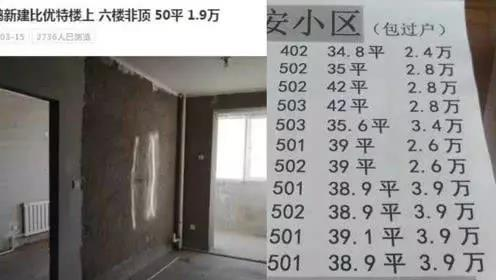
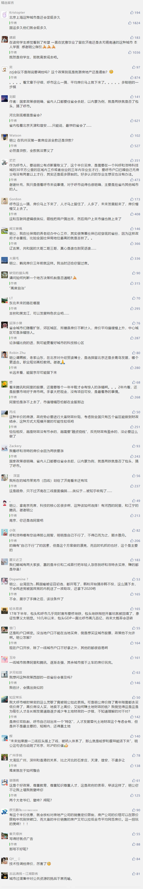

##正文

 
一

中国楼市政策方向标的呼和浩特，刚刚公开发布一则重磅消息，全日制本科及以上的应往届三年内毕业生，**可半价买房，并享受两成首付。**

 

这意味着，大学生只要结婚落户呼和浩特，不仅可以用市场价格“一折首付”买房，极大的降低了购房门槛，还能获得政府“买一平送一平”的政策，简直就是白捡补贴。

在低门槛和政策补贴的推动下，对比去年几大热门准一线城市的人才大战，不出意外，呼和浩特的**本轮刺激，又将激活刚刚降温了的房地产市场。**

考虑到如今，国家在遏制房价方面丝毫不动摇的态度，此番呼和浩特政府通过大量“半价房”，**不仅能够通过低价卖房来平衡过高的房价，对上面能有交代，还能借着政策顺理成章的刺激房地产市场，让自己得到土地财政实惠**，这一枪，可谓是“一箭双雕”。

因此，不出意外，打响第一枪的“呼和浩特模式”，这种针对性的大减价，很有可能成为后面不少地方政府的“操作指南”。

而这也是我一直说的，**这两年是刚需瞅准机会上车的好机会**。

 
二

说起来，呼和浩特一直是国内房地产政策重要的风向标，2014年抢在国家“去库存”政策前，第一个取消“限购”；2018年又在政治局会议提出“坚决遏制房价上涨”前，第一个终结“去库存”。

这个最“自治”的自治区首府，在贯彻中央精神方面，有着不一般的敏感度。

而考虑到近期超级重磅文件《2019年新型城镇化建设重点任务》的公布，很显然此次呼和浩特“新政”必然也是有的放矢。

就像我前几天对此文件解读的文章《四十年未有之大变局，”超级文件“今天公布了》中说的，此番国家将过去“限制大城市，发展中小城市”的思路扭转，改为**鼓励发展形成大城市群，鼓励农村人口进城**。

因此，在面对巨大政策红利面前，呼和浩特这种决策机制通畅的地方政府，必然要秉着“先下手为强”的态度，积极加入下大力气，抢在其他城市之前“收割”这一波释放出来的青壮劳动力。

最起码，也要抢在其他省份之前，把本省的劳动力抢到自家省会，肥水不能流了外人田。

所以，网上一些业内专家对认为呼和浩特此举“透支部分需求不利于房地产未来发展”，并没有看到问题的本质。

中国即将面对一个人口的转折点，各个城市都陷入到了囚徒博弈之中。

 
三

最近出台的《中国养老金精算报告2019-2050》，预测2035年我国养老保险基金累计结余将耗尽，而更可怕的是，此次打响第一枪的内蒙，以及辽吉黑等省份，已经出现当期收不抵支。

养老金收支不抵表面上并不可怕，毕竟有国家兜底。但是，其背后体现出来的有效劳动力大幅降低是非常可怕的。

随着青壮的大幅减少，届时投资、消费、生产等各个方面都将面临萎缩更不要说，长期看完全依赖于人口的房价，也将面临崩盘。

就像与内蒙经济结构极其相似的黑龙江，最近不是也闹出了鹤岗房价的笑话嘛？

 

要知道，在接下来几年地方要进行痛苦的“财政去杠杆”，各项收入大幅减少，因此二线一下城市收入大头的房地产，是绝对不能放弃的，毕竟，老百姓缴纳的房价中，有一半以上都是地方政府收走的。

自08年之后的十年，是地方政府的黄金十年，高房价和土地财政之下，大家日子过得特别舒服。

但是，“黄金十年”，正好是“80后”和“90后”们毕业，开始工作和购房的时间。而井喷式的人口”，提供经济发展和房价提供了庞大的劳动力和消费力。

因此，在人口高峰之下，源源不断的青壮人口的增量，就像前两年的移动互联网用户的高速增长那样，不仅形成了巨大的泡沫，也把很多问题都遮掩了。

出来混都是要还的，移动互联网与房价一样，一旦“增量”出现下滑，所有的问题也都浮出水面了。

所以，如果想研究房价，可以将人口红利结束的房地产与流量红利结束的互联网相互对比，就会发现有很多的相似之处。

一线超级城市，就像阿里和腾讯，流量红利中止的冲击虽然有，但并不致命。毕竟都有着良好的产业和现金流，因此现在都在做着产业的升级转型，以及对周边城市（公司）的资源整合。

某种程度上看，大规模并购的腾讯就像整合起来的大湾区，阿里倾力打造的蚂蚁金服就像独树一帜的雄安。虽然这俩股票这两年走的都不好，可是一旦整合完毕或者横空出世，到时候保准涨的吓人。

二线城市，如此次“”打响第一枪”的呼和浩特，颇似今日头条和拼多多等二线巨头，都在大规模募资和做市值，不惜成本的去收割三四线和农村的残存流量，都在向“一线城市”挤，希望赶上流量的末班车希望实现逆袭。

至于前几年火热的三四线城市和他们的房价，就像同样火热的共享单车那样，本身有价值的并不多。未来如果跟一二线巨头搭上了线，被纳入体系了，那么就是哈罗和摩拜能活下来，如果没有搭上线，那就是ofo，怕是要透心凉.......

从经济学的角度，买房子颇似买城市的股票，关键在于选好标的和入手的时机。而恰巧，中国走在前面的互联网，给了走在后面的房地产一个“前车之鉴”。

所以呢，看看国内那些互联网公司的股价走势，也许大家会对未来城市之间的竞争合作，以及房价的走势有另一种的理解。

关联文章：

四十年未有之大变局，”超级文件“今天公布了

未来两年的投资购房指南

##留言区
 

