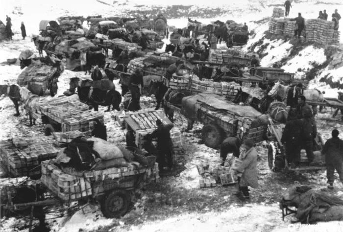
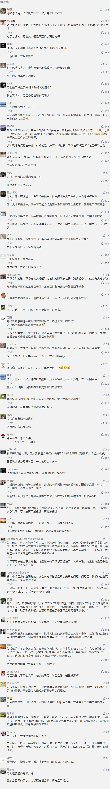

##正文

今年一季度的政治局会议，由于接下来一连串的重要活动，来的比以往要早一些。

不过，本次会议释放的信息，却非常重要。

一方面，用了一连串的词看好一季度经济，如“市场信心明显提升.....一季度经济运行总体平稳、好于预期，开局良好。”甚至GDP增速也超预期达到了6.4。

而另一方面，自去年下半年中国经济下行压力下提出的“稳金融、稳外贸、稳外资、稳投资、稳预期”，在本次首次被取消。

这让很多人看不懂了，到底经济会持续向好，还是会因为退出了刺激计划要凉？

其实，想明白这一轮经济政策组合的妙招，可以**从经济为什么转好，以及刺激计划为什么要退出**，这两个方面着手。

 

首先，我们从宏观的角度来看几个关键数据。

2017年年底的财政赤字为3万亿，2018年年底的财政赤字为4.3万亿，**2019年两会给出的财政预算赤字是6.4万亿。算下来，2019年2.1万亿的财政赤字增量，相比于2018年的1.3万亿提升了60%以上。**

而且，2.1万亿的新增赤字，对比中国90万亿的名义GDP，可以说，中央为今年的“六个稳”，我们准备了非常充裕的“弹药”。

那么，接下来就要看这批弹药怎么用了。

过去，一季度由于有春节长假且主要是冬季，因此政府都不会在此时使用“弹药”，譬如自十八大以来，**每年的一季度均不仅不会消耗“弹药”，还都节约出少许的“盈余”。**

但是，今年仅一季度，财政赤字增量就超过了1个亿，相比于去年全年1.3万亿和今年全年2.1万亿的增量预算，意味着**我们在今年一季度不仅没有像以往“韬光养晦”，还一鼓作气就打光了相当于去年一年的“弹药”，也相当于也打完了今年为了“六个稳”，特意准备的“弹药”当量的一半。**

所以，如此大规模的财政在短时间内集中投入，**不仅使得今年GDP增速超出各方的预期，还让资本市场和房市都出现了一波小阳春。**

而从这个角度去理解本次的政治局会议，就会明白，自去年下半年以来，首次不提“六个稳”的背后，是因为一季度财政已经把今年机动的弹药，一次性都打出去了，**剩下的弹药加起来，还没有“兵败如山倒”的去年后三个季度多。**

这样，我们就会明白了，今年一季度的经济形势好，是因为我们一口气把维护“六个稳”的主力部队一次性都投进去了，**而不再提“六个稳”，是因为财政政策已经没剩下多少预备队可用了。**

要知道，财政赤字的线，是全国人大批出来的，不可能朝令夕改。

所以，**今年一季度的房地产小阳春，并不具备可持续性**，随着下半年财政强刺激的陆续“枯竭”，全国房价整体上还是会趋于平稳，而**那些没有拿到这一波财政政策的城市，房价反而会有危险。**

这也是此次政治局会议为什么重提“房住不炒”定位。

同理，房地产商和地方政府，下半年还是要过苦日子的，尤其是在三四线城市囤地过多的，接下来都要在银行面前装孙子的......

那么，在今年一季度把弹药一口气打出去的情况下，接下来经济走势会是如何呢？

也许，我们要从制定政策的初衷来考虑。

如果回顾历史的话，此番一改过去的“添油战术”，转为“集中弹药”的思路，颇似1946年毛教员起草的《集中优势兵力各个歼灭敌人》。

 

而正是在贯彻这个思路之下，我军在极度劣势解放战争中，取得了最终的胜利。

因此，如果把国内接下来问题最大的资本市场改制、地方隐形债务、产能结构调整，比作“三大战役”的话。那么今年的一季度，颇似在相对优势的东北战场上，集中全军的优势兵力和弹药，率先打了一场辽沈战役。

而资本市场的繁荣，不仅为化解巨额的地方隐形债务问题，提供了稳定的大后方，更重要的是，在资本市场繁荣下科创板的推出，将成为产业结构调整提供源源不断的“弹药”和“优质兵员”。

也许，这也是本次政治局会议重点提科创板的原因。

这样我们再看，今年一季度把原本都关起来的“妖精”都一股脑放了出来，这思路颇似当年我们在东北，将日本留下来的伪军统统整编，变成革命的力量。

毕竟，团结一切力量，方能集中优势兵力打赢辽沈战役。

如果辽沈战役战局扭转了，那么自然就可以摧枯拉朽之势横扫全国，就像淮海战役中，用着东北兵工厂不限量供应弹药的粟裕说的：“我们打杜聿明，几乎用炮火推平村庄，一个村子打几千颗炮弹。”

同理，资本市场也是如此，中国的科技创新和海外并购，不再依赖过去的财政拨款和内保外贷，而是要通过资本市场，为他们提供杠杆式的扩张之路，让他们拥有取之不尽用之不竭的“弹药”。

因此不出意外，**在科创板出台之前，本着集中优势兵力的原则，二季度的财政政策会继续发力，有可能将原本用于三四季度的部分弹药也提前打出来，不给下半年留预备队。**

也许，只有这样，才会有大量推着独轮车和三轮车的“散户们”，加入淮海战役的补给大军。

 

当然，财政不怎么留预备队也什么关系，随着科创板一连串企业的IPO，届时，就可以用资本市场创造的货币信用，来对冲下半年财政政策停滞引发的经济动力不足，**让资本市场接棒财政政策来继续驱动GDP、就业**，并推动产业升级和高质量发展。

虽然这样对于经济的推动会非常明显，不过这样下来，未来中国城市之间的两极分化也会愈发明显，因为不仅今年上半年的财政政策刺激，大部分都集中在了一二线城市群，甚至未来科创板的企业，也几乎都集中在一二线城市群。

可以预见的是，这样各项资源的大规模集中，必然会使得“一部分人先富起来”，届时，新一轮的改革开放，又将带来一轮经济的高速增长。

看着如此大手笔之战略布局，不仅慨叹，我们正在面对一个数十年未有之大变局。

幸甚，幸甚！

近期关联文章：

四十年未有之大变局，”超级文件“今天公布了

A股的春天，似曾相识燕归来！

##留言区
 

