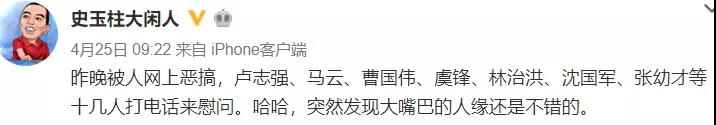

##正文

 

 
一

史玉柱遭到了“暗算”。

近日，大量“史玉柱因涉p2p平台团贷网，被杭州警方带走”的谣言充斥于网络。

逼着史玉柱连续发微博向外界报平安，甚至学起了他的老朋友柳老英雄，抬出了一大批的商界大佬给自己撑腰。

 

不过，在政事堂看来，凡是辟谣力度越大，反而实际情况越危险，如果真是流言，又怎么可能这么多人纷纷打电话“慰问”呢？

尤其是从打电话的名单中能够看出来，这些大佬们给史玉柱打电话，除了友谊之外，恐怕为的更多的还是利益。

因为名单中，柳传志、段永基等老朋友都没有，而打电话的卢志强和林治洪哥俩是民生系资本，马云、曹国伟、虞锋、张幼才、沈国军则是云峰系资本。

而稍微梳理一下关系就会发现，这两大资本，都被史玉柱的一笔巨额收购案，绑在了一条船上.....

 
二

2016年的时候，史玉柱跑到了以色列，跟一群犹太人喝了顿酒，常自嘲“酒量不大却好酒”的史玉柱被灌趴下了，发微博说“史大嘴无能”。

而就在酒局几天之后，史玉柱旗下，刚刚通过借壳回归A股的巨人网络，便宣布将以305亿收购以色列游戏公司Playtika。

当然，这与同期筹备万达商业回归A股的老王，路子近乎如出一辙，都是一边在海外大肆购买资产，一边将自家海外的上市公司国内借壳回归，最终再把海外资产装进国内公司的壳里面。

这种路线不仅能够规避监管，而且，随着海外资产的并购，国内上市公司借壳时的业绩对赌自然就能够完成，届时，所有的参与者都可以从资本市场上获得巨大的收益。

因此，史玉柱高兴地被灌趴下的背后，是这家以色列游戏公司早就被他和他的小伙伴们买下来。股权穿透之后就会发现，除了史玉柱之外，最大的三个金主，分别是民生系资本，云峰系资本，以及宁波郁氏家族。

而对照那天打电话给史玉柱安慰的名单，与投资游戏公司Playtika的资本，近乎完全一致.......除了宁波的郁先生。

 
三

说起这位郁先生，可以说是中国资本市场上的一位奇人，人送外号“小宁波”，坊间传言在宁波地界上就没有他办不成的事儿。

尤其在两千年初的时候，郁先生在浙沪地界，可谓风头无二，2003年收购了上海第一家五星级酒店，2005年买断了杭州绕城高速公路的经营权，超大的手笔让大家都不知道他到底有多少钱。

不过，2007年的时候，郁先生遭遇了他的人生低谷，因被查出向《蜗居》中宋思明的同僚行贿，手眼通天的郁先生被合肥公安逮捕后判刑，此后，郁先生和他的朋友们，混迹于香港纸醉金迷的酒店和米其林餐厅当中。

直到多年之后，当新一代企业家们开始住进香港酒店时，郁先生和他朋友黄先生开始出山，在美股史上最大规模的IPO之季，一同出现在纽约。

而明白了这一层关系，穿刺一下股权就会发现，此次跟着史玉柱入股Playtika的，不仅有郁先生，也有黄先生。

所以，虽然马云和虞锋这些浙江大佬们纷纷打电话给史玉柱慰问，而且这点钱对于马老板来说就是毛毛雨，但介于复杂的关系，真到了危机时刻，恐怕他们多半也只会保持中立，并不会对史玉柱伸出援手。

 
四

当年，无论是老贾还是老王，这些搞海外并购注入国内资本市场的大佬，就是在盟友们纷纷放弃救助之后，如今要么“断头”要么“断臂”。

同样，同期收购在海外Playtika的史玉柱，如今已经是第三个年头了，而也到了最关键的时刻。

而今年4月1日晚间，巨人集团发布公告，称收到证监会对于收购Playtika的进一步问询。

如果问询得以通过允许并购，那么史玉柱满盘皆活，可如果证监会再一次否决，那么史玉柱就可能要步贾王的后尘。

因为这个并购已经进入第三个年头，原本计划只用一年的钱，如今已经屯放了三年，高额的资金成本，让大家很难再忍不下去了。

更不要说这三年的时间，资本市场出现了极大的变化，且不说卢先生都在拼拼割肉，哪怕是郁先生，入股Playtika用的是中植解先生的钱，这后来可都是一系列的麻烦。

更不要说史玉柱本人，当年回归A股与收购Playtika本是一步连环棋，巨人网络需要通过收购来的业绩，满足当年借壳时候的对赌协议。倘若如果没有完成并购，就得大规模的“做账”和给股东分红。

因此，这几天在没有完成收购之下的18年年报一出，史玉柱的巨人股份基本上就被迫掏空了，变得极为虚弱，只能依赖于未来Playtika的收购，来解放现金流和平账。

而现在的局势对现金流薄弱的史玉柱来说非常不利，三年前史玉柱牵头做项目的时候，史玉柱混迹于的民生系资本势力尚处于巅峰期，而如今呢，大家都自顾不暇。

因此，再按照原有的利益分配模式，自然不合适了。

尤其对于苦等了多年的郁先生来说，将Playtika注入到自己旗下的上市公司当中，赚取巨额的利润才是他的最佳选择，即使退而求其次，也得要求史玉柱给予更多的利益补偿。

于是，也就有了证监会再次重启审核20天后，史玉柱遭受暗算，被捕流言的迅速泛滥。

似曾相识燕归来，当年针对老贾老王的负面新闻和监管压力，也都在史玉柱身上再一次上演，暴雷的团贷网这样人人喊打的过街老鼠，自然就能够成为对史玉柱施压的利器。

更何况，Playtika本质是一家外国的赌博公司，监管层有足够的理由否决史玉柱的此次并购，稍加一点压力，可能就是压死骆驼的最后稻草。

所以，看看对手是谁就会明白，史玉柱躲不了这一支射来的暗箭，也许他唯一能做的，就是在“老贾式断头”和“老王式断臂”之间，进行一个无奈的选择。

##留言区
 

