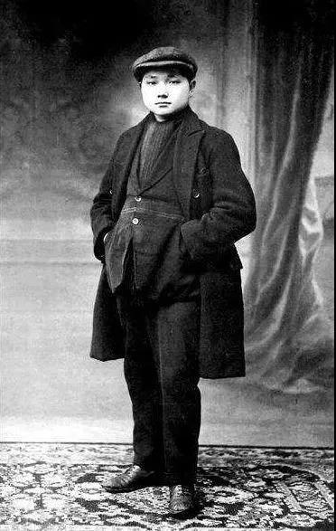
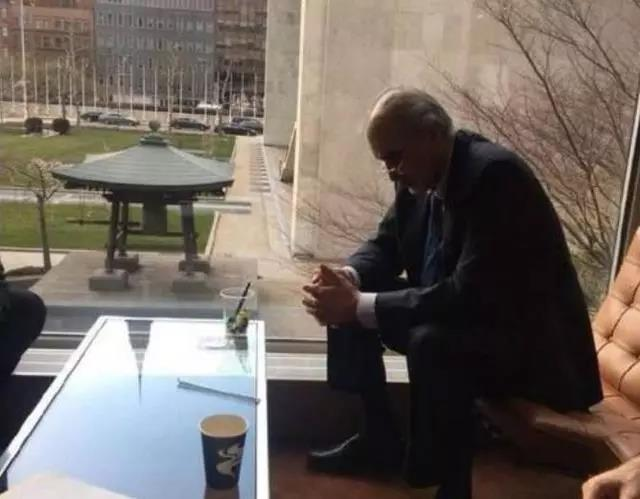
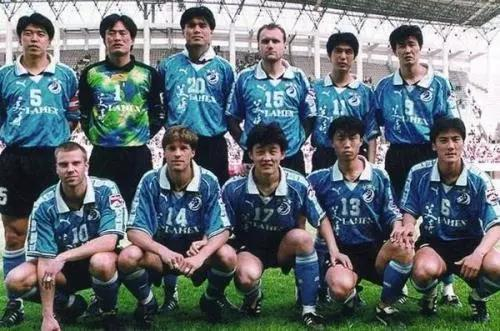
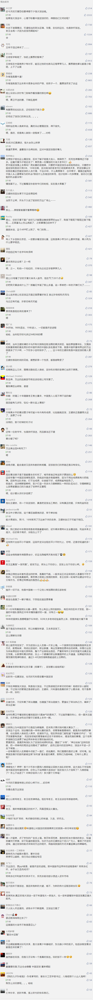

##正文

时隔20年，王者归来。

刚刚要在延安修万达广场的王健林今天宣布，万达集团重返中国足坛，重点将立足青训，大力振兴大连足球和中国足球。

 

王健林，他终于回来了。

 
一

大连万达，曾经是中国老球迷们最熟悉的名字，自1994年征战甲A夺取冠军后，王健林和他的万达成为了中国足坛的超级豪门，五年四夺冠，55场联赛不败，57场联赛主场不败。

郝海东、孙继海、李明、张恩华、徐弘、王涛.......可以说，大连万达以一己之力支撑了半个国家队。

甚至在国际赛场上，当其他国内球队出国被打成筛子的时候，王健林的万达靠着一条国产前锋线，和外援云集的亚洲豪门球队杀到难解难分。

万达队成功背后的原因有很多，值得注意的是，其他俱乐部的老板，看球时往往是陪同其他大人物，而王健林不仅训练的时候经常参加，更几乎没有落下过一场万达队参加的比赛，哪怕是客场，他也会在比赛前的一晚上赶到。

 

因为，对于其他老板来说，足球是一门生意，而对于王健林来说，他是一个球迷。

 
二

球迷对于足球的热爱，往往能够推动历史进程。

1924年，第八届奥运会在法国巴黎举行。

那场决赛之前，一名在雷诺工厂勤工俭学的小个子球迷却犯了难，他太想看这场比赛了，但是当时工厂给他们的薪资太低，根本买不起门票。

于是，这位青年人将身上唯一值钱的夹克衫送到当铺，最终，拿着典当衣服换来的钱买了足球决赛的门票。

他的名字，叫做邓希贤。

 

新中国成立后，他一如既往地热爱足球有球必看，连在北京先农坛体育场娃娃队的比赛都不放弃，甚至骨折住院期间，还不断的催促负责国家体委工作的贺龙元帅：“几时能多看几场足球转播赛？”

后来，即使年龄和身份不方便现场看球，他也不会放过重要的比赛。1990年世界杯，中央电视台一共转播了52场，这位86岁高龄的老人，整整看了其中的50场。1994年世界杯时，已经90岁高龄的他，实在撑不住深夜进行的直播，就让工作人员录下比赛，白天再看。

正是在这位铁杆球迷的推动之下，中国开启了轰轰烈烈的职业化联赛。

 
三

顺应着历史的进程，往往才会实现个人的奋斗。

1990年，王健林刚刚从西岗区政府办公室主任位上，接盘了区政府下属的西岗区房屋开发公司，开始了他的万达王朝。

与此同时，大连市西岗区体委打算在足球场附近建一个体育馆，再加上王健林夫人就是西岗区体委的工作人员，因此两者一拍即合，也就有了王健林和足球的第一次试水。

就在万达与体委进入热恋期之际，轰轰烈烈的中国职业联赛大幕旋即召开，大连市体委找到王健林，希望他能打造一家足球俱乐部，铁杆球迷王健林二话不说就答应了。

在当时，国内正在从计划经济向市场经济的转轨过程中，要想拿项目，不仅得有钱，还得有“计划指标”，因此凭借足球为大连争光的万达，得以频频从市政府手里拿到好项目。

而正是凭借着政府初期的输血，王健林和他的万达得以迅速完成原始资本积累，开始撰写自己的传奇。

 

 
四

某种程度上来说，王健林是中国足球的一个方向标。

从1994年王健林进入足坛后，中国队的国际排名持续上升，一直冲到最高的37，等到1998年王健林宣布退出后，中国队的排名就开始了江河日下。

98年的时候，中国队还可以靠实力硬拼世界杯，02年的时候靠着这批老将和运气勉强冲进了世界杯，等到06年之后，随着那一批老将的退役，中国队的全球排名已经惨到爹妈都不认识了。

开个玩笑，如今国足排名低也不能都全怪自己，毕竟90年代初的苏联解体，一次性让我们下降了十来名，千禧年后又赶上了南斯拉夫解体，我们又往后掉了五六名。

因此回顾一下历史，中国男足能取得目前的成绩，必须要感谢德国人俾斯麦，要是德意志那几十个诸侯国没有统一，像英国分成英格兰苏格兰威尔士等各自参赛，中国男足的全球排名，稳稳的将在一百名开外......

嗯，我们就能够理解了，中国为什么在国际上一直都是反对分裂鼓励统一，就像西班牙的加泰罗尼亚一旦独立了，男足的排名就又得跌一下，而朝鲜和韩国一旦合并，中国队冲出亚洲的微乎其微的希望瞬间暴增。

所以呢，我们就会理解为什么在叙利亚问题上，外交部坚决而连续的动用否决票。

毕竟，那个在世界杯预选赛上把中国男足按在地上摩擦的叙利亚，一旦因为内战分裂成三个国家，那么中国队的主教练恐怕比叙利亚在联合国的代表更加绝望.......

 

 
五

中国足球绝望的根源是什么呢？

也许，从当年退出足坛的王健林身上就能找到答案。

1998年，王健林在一场被裁判黑掉后愤然退出足坛，当然，这只是表象，受了这么点委屈就闹分手的背后，则是市政府对于足球的过多干涉。

一方面，当球队取得成绩后，市政府频频对王健林施压要求给球员发奖金，另一方面，当球员出现违纪被惩罚时，市政府又频频对王健林施压要求宽大处理。

甚至，王健林请青训特长的徐根宝出任主教练，发布会开之前，被市领导叫到办公室一顿臭骂，怏怏出来王健林回来后只好宣布迟尚斌官复原职。

当一个原本可以自发生长的商业运动，但被领导过多干涉之后，自然而然就会被扭曲。

就像王健林时代的大连万达以及与其对抗的上海申花，都是有着完善的青训系统，就像被健力宝淘汰的孙继海18岁就能进入万达一队，源源不断的青年球员得以通过竞争在一线队踢上主力。

 

在激烈的队内竞争之下，万达队可谓“兵多将广，后继有人”。强大的万达青年梯队，不仅让万达队除了郝海东之外一色都是大连球员，还为其他俱乐部以及各级国家队输送了大量的主力，因此万达鼎盛的时期也正是国家队鼎盛的时期。

 

但是后王健林时代的中国足球，为了所谓的世界杯成绩，体育总局把中国足球90%的经费，都投入到国家队身上，一掷千金的请世界级教练，只看重短期的结果，却不考虑在青训体系崩溃之下，所谓的国家队不过是在几百个矬子里面拔将军。

几乎所有的国内俱乐部都在涸泽而渔和拔苗助长，为了成绩弄虚作假虚报骨龄，整个青训体系不投钱，逼着小球员们一层层的行贿，最终让好苗子都被淘汰了。

甚至一群外行官员们，脑子里只想着自己任内的政绩，还搞出了“国家队踢联赛”这种脑子被驴踢了的主意。

可以说，自从王健林这个真正的球迷退出中国足球之后，原本市场化的中国足球，就在开倒车上越走越远，本来一个市场经济的行为，愣是被一群啥都不懂的官老爷搞成了计划经济，整天搞大跃进、搞浮夸风、搞放卫星。

而搞这些的背后，是上到体育总局下到各个俱乐部老板，虽然都在玩球，但是几乎没有一个是真的球迷。

因为，真正懂球的球迷，不会利用手中的权力去干涉市场。就像那位挚爱足球的老爷爷，即使一言九鼎，也从不给国家队定指标，只是对下属们反复说着一句话，“中国足球要从娃娃抓起”。

如今，另一位真正球迷的王健林，则在践行这句话，不顾前两年不断甩卖资产之痛，今天还掏出20亿元为国家搞青训。

就像万达盖楼一样，第一步要做的就是打基础。在这位中国最优秀的企业家，中国足球必将再一次崛起。

而万达，也将随着中国足球再次崛起。

##留言区
 

