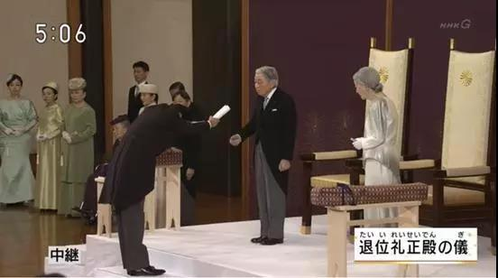
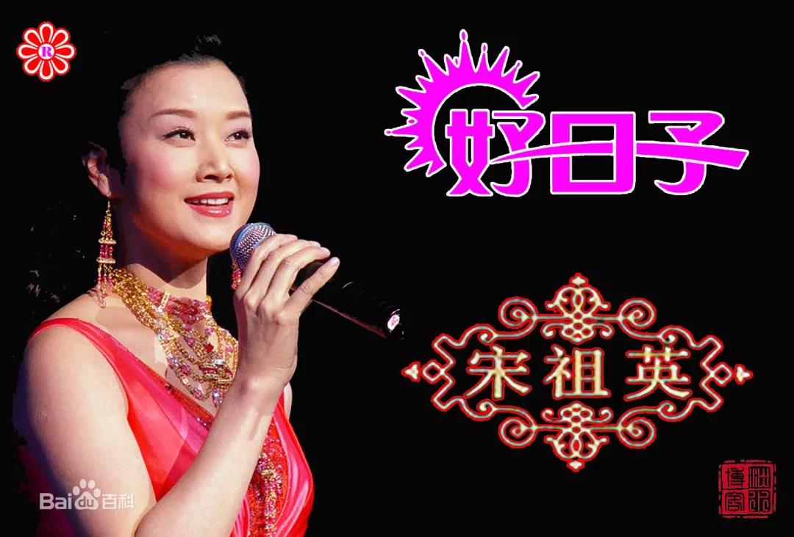
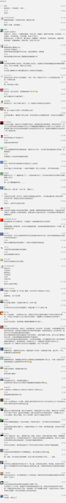

##正文

今天文章写得急，有点形散神散.......

今天下午，日本明仁天皇在“松之间”宫殿进行天皇退位仪式，德仁皇子将于5月1日即位为新天皇。

 

日本天皇是个非常累的工作，每天都要工作加班也是惯例，工作强度不逊于最近那些在闹得“996”码农，因此高龄的明仁提前退位，成为日本历史上又一位“太上皇”。

届时，日本也将正式停止旧年号“平成”，启用新年号“令和”。

 

由于日本年号按惯例都取自中国古书，因此中国网友们纷纷调侃，“令和”应该是取自《清史和珅传》.......

 

 

当然，这都是开玩笑的，乾隆虽然也是太上皇，但此“令和”非彼“令和”，该词取自日本“诗经”《万叶集》中的“初春令月，气淑风和”。

那这八个字啥意思呢？

嗯，如果看古文费劲的话，宋祖英的那首《好日子》的歌词，就是对“初春令月，气淑风和”的完美注解。

>今天是个好日子

>打开了家门咱迎春风

嗯，别笑.......意思还真是这个......

没办法，过去日本的年号，主要从中国的四书五经中选取“圣人之道”，而这次铁了心的将年号“本土化”，就只能从日本诗经里面选了。诗经嘛，里面大部分都是“关关雎鸠”之类，因此，逼格就不得不下滑了......

不过，不仅是日本，任何文明将外来的文明本土化，都是自身文明发展的最佳途径。

就像100年前的五四运动时期，教育总长蔡元培，就将法国革命时代的口号，全部进行了“中国化”与再融合，来推动本国文化的发展。

譬如，法国的“博爱”就是孔子说的“仁”，“己欲立而立人，己欲达而达人”，法国的“平等”就是孔子说的“恕”，“己所不欲，勿施于人”，法国的“自由”，就是孟子说“义”，“富贵不能淫，贫贱不能移，威武不能屈”......

说到这，这让我突然想到了小时候看的一部日本动画片《魔神坛斗士》，这部当年大热的动画片在直播过程中，就遭遇了昭和天皇驾崩，直接被掐了。

 

片中九个主角，分别是代表着儒家的“仁义礼智信忠孝悌忍”，而其中，正派的五小强是“仁义礼智信”，反派的打手四魔将分别代表“忠孝悌忍”。

这么设定并非没有原因，这部动画片的背后是在影射二战的军国主义，日本民众就像反派的打手四魔，脑子里面只有对天皇和对上级的“忠孝悌忍”，而忘记了应该有的“仁义礼智信”，最终沦为了军国主义的杀人机器（铠甲）。

而人民想要摆脱控制，就得找回“仁义礼智信”，用“仁者爱人”来驱除心中的魔念.........

片中，主创团队用武士铠甲和大名设定等大量的日本传统，与中国儒家文化进行了完美的融合，不仅将中华文明的吸收到日本传统文化中，也根据本国情况对其进行了深入的反思和升华。

包括前段时间上映的《战斗天使阿丽塔》等等，这种反战教育从娃娃抓起的小事儿，也能看出来日本战后思想的大转变，统治阶层从整个意识形态上对民众进行遏制。

而这种端倪，在日本天皇的年号中，也有着非常明显的体现。

早年，日本天皇的年号是这样的：

>明治，取自《易经》，圣人南面而听天下，向明而治
>大正，取自《易经》，说而顺，刚中而应，大亨以正，天之道也。
>昭和，取自《尚书》，九族既睦，平章百姓，百姓昭明，协和万邦。

这三个日本天皇，都是军国主义思潮泛滥的时代，因此选的都是非常强势的年号，不是“圣人南面而听天下”、“天之道”，就是“九族既睦、协和万邦”，每次年号变更的背后，扩张的意愿和大国心态，都在愈演愈烈。

 

而二战之后，日本成为战败国之后，数十年的努力功亏一篑，随后军国主义思潮锐减，朝野上下一门心思的“闷声发大财”，于是也就有了“平成”的这个年号。

>平成，取自《尚书》，地平天成，六府三事允治，万世永赖，时乃功。

而“闷声发大财”的平成，明仁天皇打破西方封锁强行访华，还曾专门参观西安碑林博物馆，找到自己的年号“平成”的出处。

至于这次换的“令和”，则更进一步，一副“今天是个好日子”的春风扑面而来......

 

其实，某种角度来看日本选择“中国化”和“去中国化”，背后也有着两国实力此消彼长的过程。

同为儒家文化圈，当日本强中国弱的时候，他们不会推动去中国化，反而会积极推进中国化以塑造自身的正统地位。

明治逼着我们签了马关条约割台湾东三省，大正逼着我们签了二十一条割山东，昭和发动了全面侵华要让中国人都做亡国奴。

而在此过程中，大量的中华文化专家，就能为军方提供了非常充分的理论，证明侵华的合理性，并推动对中华文明的同化。

但是，随着中国国力的增强，中华文明的向心力会迅速同化其他的儒家文化圈国家，因此，国力逊于日本的韩国，就在李明博政府时期迅速推动去中国化，连首都都从汉城改名首尔了。

因此，同为儒家文化圈的日本也不得不打破传统，用日本传统文集来命名年号。

不过，从玄学的角度来看，这个年号可能取得不咋地。

“令和”其取自的《万叶集》序，几乎就是东晋《兰亭集》序的翻版，里面存在着大量向兰亭集致敬的地方，其中“初春令月，气淑风和”对应的就是“暮春之初，天朗气清，惠风和畅”......

遥想当年兰亭之上，一群掌控着国家最高权力的东晋名士们，在大后方喝得烂醉如泥，不思进取得过且过.......也许，这个年号也是“令和日本”未来的一个缩影......

##留言区
 

