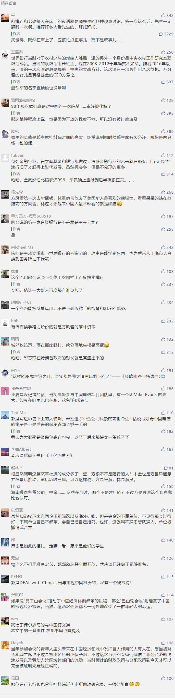

##正文

 
一

随着1979年中美建交，美国控制的世界银行恢复中国席位，世行也派遣高级代表团来华，磋商启动中国业务事宜，推动中国经济发展。

虽然中央领导已经决定与世行开展全面工作，希望拿到世行的廉价资金用于发展，但地方上的官员对此依旧疑虑重重，在过程中各种阻挠。

当然，这无法阻挡中央改革开放的决心，旋即安排了一个工作组与世行并肩工作，里面既有国家计委、财政部的领导，也有相关部委的陪同人员。

其中，令世行官员们最刮目相看的和钦佩的，莫过于来自社科院工业经济所的一名朱姓官员。

最终，在工作组的积极配合之下，世行完成了题为《中国：社会主义经济的发展》的正式报告。

随后，一大批世行贷款梯次发放，为改革开放初期缺乏资本的中国解决了部分原始积累，尤其是贷款流入中国的教育领域，以社科院为代表，为中国的改革开放建立了强大的人才储备。

当时，世行中国项目的负责人，是一位名字叫做林重庚的菲律宾籍华人。

手握世行的巨额投资，让林重庚在中国经济官员中非常受欢迎。每当冬季凛冽的北风在四九城上呼啸之际，他微暖舒适的办公室，常常是中国金融高层和经济学家们的聚会地点，其中就包括那位社科院的官员。

而在林重庚的办公室中，西方市场化的思想与传统观念的激烈碰撞，也成为了改革开放过程中，打破计划经济体制的一个重要发源地。

 
二

上世纪80年代初，在东欧国家改革失败教训的影响下，中国开始认识到市场经济的重要性，在1984年10月的十二届三中全会上，提出“有计划的商品经济”改革方向。

说起来，改革往往都是危机倒逼的。

当时中国经济走到了一个关键点上，1984年四季度中国发生银行信贷失控，投资猛增，消费增长过快，物价上涨幅度达到10%，中国经济何去何从，面临新的抉择。

在这个背景之下，在中国政府的邀请下，由世界银行牵头，林重庚邀请了数十位国内外顶尖经济专家来华进行“诊断”。

不同于刚刚结束的莫干山会议，本次会议定在重庆的一艘豪华游轮上召开。由于空间太小，中方的参会人员受到了严重的控制，因此，中方最初计划的参会人员中，只有一些高级领导。

但是，在林重庚的强烈要求下，会议给学术人士和中青年留下了几个少数名额，因此社科院得以派遣大量才俊参与。其中，就包括了社科院副院长刘国光等人，而青年才俊的代表，则是社科院在读博士，年仅29岁的郭同学。

这场游轮上历时6天的 “宏观经济管理国际研讨会”，史称巴山轮会议，被誉为中国经济转向学习外国先进经验的一个转折点，而这场会议，也间接促成了中共十三大提出了“国家调节市场，市场引导企业”的市场化概念。

 
三

1993年7月，林重庚借着来中国发表演讲的机会，去拜访一位在北京的老朋友，试图说服他与一家外国投资银行成立合资公司，去帮助中国的企业融资。

此时，这位老朋友正在启动中国从中央到地方的一系列铁腕式的市场化改革。

两人的见面很友好，也很成功，作为世界银行的代表，林重庚先是与老朋友讨论了中国金融改革的问题，然后自然而然的提到了关于组建合资投资银行的想法。

而那位一直鼓励“市场换技术”，并积极融入西方市场的老朋友，对此意见非常感兴趣，当林重庚说金融行业也可以“市场换技术”，中国可以利用合资公司作来提升自身的金融管理水平时，这位老朋友对他郑重承诺，他将给予全力的支持。

随即，林重庚的《关于申请成立中外合资投资机构》的报告得以被批准，这位刚刚兼任央行行长的老朋友，旋即要求建设银行负责向央行提交可行性报告。

当然，林重庚并不会没准备就去拜访如此位高权重之人士。

早在1992年的冬天，林重庚就通过社科院副院长刘国光介绍，与方风雷相识，两人在游览华盛顿国家动物园，站在大熊猫的面前，深入讨论了在中国成立一家投资银行的想法。

而这位方风雷早年在河南省工作的时候，将河南省最大的4家外贸和国际信托公司捏合在一起，因此得到了当时来河南调研的北京农村改革政策研究所所长的赏识。

从此，方风雷得以进入建行体系，成为建行历史上的三名救火队长之一，并被另一位救火队长誉为“中国最优秀的交易人”。

而此时，建行历史上的第三位救火队长，早已从社科院博士毕业，此时正在批准了林重庚方案的老领导所领导的国家经济体改委担任司长。

 
四

1992年的那个春天，当一位老人家刚刚坐着专列从南方返回，中国开启新一轮改革开放之际，摩根斯坦利亚洲业务的负责人Wadsworth，就给时任建行副行长，写了一封关于摩根与建设银行成立合资公司构想的信，不过这个计划随着这位副行长被调去央行救火而搁置。

但是，机会往往都是留给有准备的人，当Wadsworth听说了林重庚的合资投行的计划后，旋即就飞往华盛顿与林重庚会面，并展示出了他给副行长的那封信，很快，两者一拍而和。

而此时的国内，在刘国光等人不断给领导们写信，建议他们学习美国模式推动中国金融改革之下，最终，那位刚刚上调央行的副行长，又从央行返回建设银行出任行长，肩负起中国第一家合资投资银行的任务。

这样，新中国第一家合资投资银行水到渠成。

时任建行行长出任新公司的董事长，世界银行的林重庚出任CEO，建行的方风雷，这位“中国最优秀的交易人”出任副总裁，并主持日常工作。

 
五

>摩根士丹利：“我们是专家，我们了解业务。”
 
>建行行长：“高盛也是，而我有市场”

从外资从进入中国之初，就面临着中国式智慧的挑战。

1997年，在海南的一家酒店中，召开了一个秘密会议，拿着摩根投资的方风雷，在得到老行长的授意下，与一批高盛银行家一起制定了中国电信香港IPO的计划。

这笔中国有史以来最大的IPO交易，竟然从摩根的眼皮底下溜走，给了他的老对手高盛......这对于摩根来说，是一个非常重磅的打击。

这让摩根在当年东南亚金融危机之中的，再也不敢公开唱空中国，甚至也不得不与高盛等巨头开打价格战，将中国随后一连串利润丰厚的国企IPO，打成了白菜价。

这种“一女两卖”的思路，并非临时起意。

早在老行长们搞金融开放的时候，就打定了决心，是用市场换技术，并利用各方市场竞争，降低成本并倒逼自身金融体系的迅速发展。对比一下，后来中国高铁四国招标，走的也是这个方式。

而站在高层的角度来看，金融开放为的也不仅仅是金融。

当年批准林重庚的方案，力主推动金融开放，除了考虑世贸谈判，更重要的的是服务90年代启动的国企改革。

90年代的中国，金融体系实在是过于低效，不仅融资成本高昂，而且资金的运用效率只有美国的几十分之一，这使得国企改革过程中步履维艰，甚至还容易引发黑箱操作和群体事件，大型企业要想实现跳跃式发展几乎不可能实现。

而随着90年代末开始的国企改革和上市，一大批募集到资本的中国超级央企不仅在全球称雄和海外扩张，还成为了中国高速发展的发动机。

所以，如果明白了90年代的金融开放与国企改制的背景，就会明白，如今这一轮金融开放的背后，也有着接下来国企重组混改以及海外扩张的大背景。

因此，就像今天银保监会发布的文件那样，我们也会像20多年前那样，打开大门，向全球相互竞争的金融机构发出邀约，利用他们廉价的资金和先进的技术，推动中国数百万亿资产的国有企业资本化、海外并购以及跨越式的发展。

所以，这一轮金融开放的背后，也是中国新一轮经济改革和升级转型的启程。

回想20年多前，老一辈的救火队长们的重任，如今，将由年轻一代的救火队长们肩负了.......

##留言区
 

