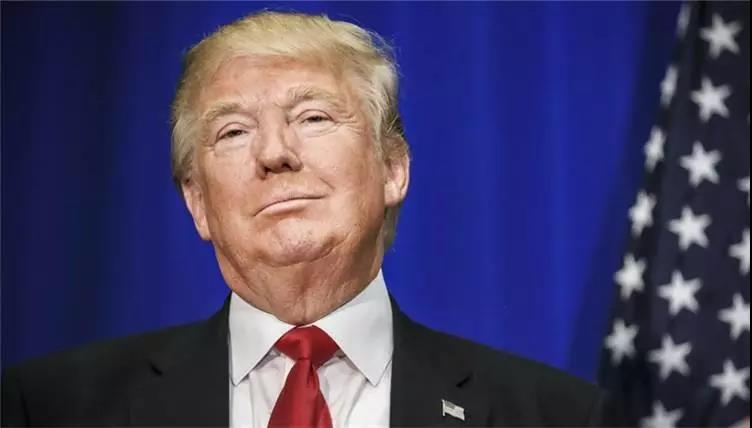

##正文

几个月前，美国民主党与总统特朗普之间，还因为几十亿美金的修墙计划大动干戈，不惜相互动用否决权相互否决。

昨日，这对老冤家竟然达成一致，宣布将启动2万亿美元的大基建计划。并将特朗普在2016年竞选时郑重承诺的5500亿，翻番后再翻番。

而值得关注的是，随着此次达成一致，也意味着特朗普就任以来，从退出巴黎协定、废除奥巴马医保、大减税，到收紧移民政策、降低药价、打击毒品、贸易谈判、修建边境墙.......几乎**所有竞选时做出的重大承诺均已兑现**。

而从历史的角度来看，就像当年的希特勒那样，**任何一位不断向选民兑现竞选承诺的领导人，只要不出现意外，接下来都将很轻松赢得属于自己的大选。**

可以说，对于2020的总统大选，民主党为特朗普送了一记神助攻。

当然，民主党此举也颇为无奈，之前在一群“白左”的瞎闹腾之下，气势汹汹的通俄门调查，浪费了民主党巨大的资源和媒体公信力。

如今，随着特朗普无罪的报告公布，若还继续咬着特朗普，必然会导致大量的中立选民认为民主党一心党争，会把他们推向特朗普。

故而此次民主党化被动为主动，主动向白宫提出“民主党模式”的大基建，**不仅能够抢在特朗普之前争夺民意，也能凭借着掌控的众议院来争夺蛋糕的分配权。**

毕竟，两万亿美金！在这史无前例的“大分赃”面前，大家嘴里都是主义，心里都是生意。

 

而对于特朗普来说，这种想都不敢想的好事儿落到自己头上，自然是受之不却，还精心策划把此次会谈在自己的椭圆形办公室内，向民众表示此次大基建是自己牵头搞的来“邀功”。

而如今，正值中西部的关键州如威斯康星、密歇根和俄亥俄展开竞选，一大群民主党竞选者都将矛盾对准了特朗普，此时正忙着给对手们起外号的特朗普，可以借此向民众表示，自己能大度地与国会修复并关系推动改革，自然能够在接下来的竞选活动中占据上风。

而且，基建是劳动密集型产业，不仅能够向低收入阶层提供大量的就业，还能够很漂亮的拉动GDP增长，更重要的是，**随着2020年启动基建，不仅能将经济维持在高水平之上，还能够避免很可能出现的经济衰退**，对于特朗普的竞选可谓之坚定的保驾护航。

因此，某种程度上来说，本次大基建的启动，让民主党和特朗普达成了一个双赢的局面。

 

有人盈利，自然也就有人受损，此次共和党集团直接被自家总统的交易带进坑里面去了。

之前特朗普的基建计划，是与占据着参众两院多数的共和党集团一起谋划的，而此次拜访特朗普的民主党，拿的可是民主党集团的方案。

就像同样是搞科技创新的基建，**“互联网+”**和**“物联网+”**两者的方向就既然不同。同理，共和党和民主党的大基建，两者投向自然也有着巨大的差异。譬如，民主党大本营的加州势力一定会积极推动5G宽带，而共和党大本营的德州势力则会积极推动能源运输。

而且，更重要的是，两党对于谁来买单的问题更是南辕北辙，一向主张“小政府”的共和党，自然倾向于官督民办”，联邦政府出10%的资金作为配套，通过杠杆鼓励民间资本参与基建“混改”，而主张“大政府”的民主党自然想发挥“制度优越性”，让联邦政府“集中力量办大事”并出面买单。

如果按照民主党的方案，“出来混，都是要还的”，巨额的政府债务必然意味着对大型企业征税，因此可以预见的是，在民主党控制众议院的情况下，第一个要被加税的肯定就是共和党内庞大的能源集团。

可以预见的是，共和党集团接下来肯定会搞出一波强力的反击。

不过，这对于特朗普来说则是再好不过的事情，不仅可以借此让两党互斗，自己稳坐钓鱼台，而且，对于共和党能源集团的打击，也有利于将共和党进一步打造成“特朗普党”。

所以，接下来的大基建，虽然共和党会坚决否决，但是特朗普一定会全力推动，让自己成为通吃的大赢家，并借此确保自己的2020年连任。

那么，这事儿对于中国有什么影响呢？

随着一轮轮的谈判，中美之间将走向和解，既然美国最擅长的金融进来了，那么中国最擅长的基建也将走出去。不仅仅有传统的铁公机建设，甚至民主党力主推动的5G基建，过程中都出现巨大的机会。（这也是之前拼老命打压的原因之一）

毕竟，美国两党撕来撕去谁都不愿意掏钱，这正好给了擅长垫资建设的中国一个机会。

届时基建狂魔的中国，会让美国人民见识到，什么叫做大自然的鬼斧神工......

##留言区
 无留言