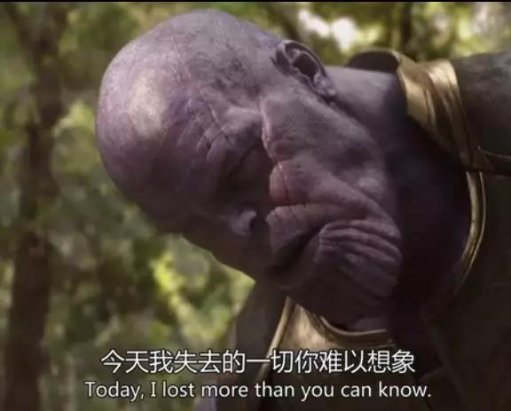
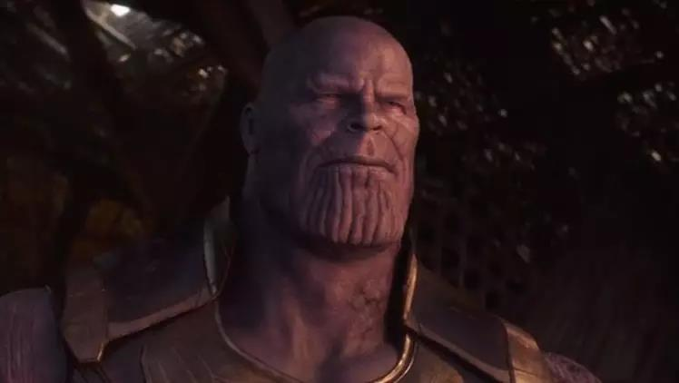
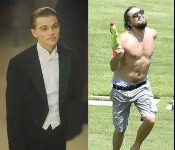

##正文

趁着五一假期，刚刚把《复仇者联盟4》和《权力的游戏》S8E3都补了一下，于是，今天决定写个影评放松一下。

今天的主题是，为啥复联4里面没有宝石的灭霸，看起来比复联3里面有宝石的灭霸要强很多。

答案很简单，总的来说，灭霸是一个纯粹的理想主义者。

因此，他在复联3之中，从来不以杀人为目的，更不以杀人为手段，甚至有的时候还有着治病救人的心态。

譬如灭霸在打指响之前，一共就杀了4个人，其中卡魔拉和幻视两个人还都是剧情杀，灭霸为了取宝石不得不杀，甚至还非常伤心。

 

 

至于开场挂了的洛基和海姆达尔，也是因为欺骗灭霸的感情侮辱、灭霸的智商而作死。

毕竟，灭霸是一个大型团队的老大，海姆达尔当众把绿巨人传送走，让事情脱离掌控，洛基更是当着灭霸的一众手下先假装效忠后暗杀，因此灭霸哪怕是再仁慈，也必须处决这俩，否则以后就没办法当老大了。

所以，如果洛基和海姆达尔如果当时明白灭霸是一个什么样的人，恐怕就不会死了，毕竟在复联4里面，这艘飞船上的阿斯加德幸存者并没有被屠戮，而是到地球定居了。

而银河护卫队的那些战五渣，灭霸肢解了他们之后，又教育了一通之后，把他们拼接起来复活了。

甚至星云在泰坦星上背叛了灭霸，按理说必须要被处决，但灭霸也没有处决这个叛徒，反而放了她一条生路。从这一系列细节中能看出来，灭霸并不是一个喜欢屠戮的人，他也有他的真实感情。

 

而整部复联3里面，让他真正想要去杀的人，只有一个钢铁侠。

这是因为灭霸佩服钢铁侠这个靠着知识能让自己流血的男人，在他的观念里，亲手杀钢铁侠是给钢铁侠以荣耀，能让钢铁侠被后人铭记。

 

 

这让一般人很难理解。

而更不容易理解的，是灭霸这个理想主义者不图名不图利，不图钱不图权，在完成了他的大计之后，卸甲归田躬耕草庐，过着采菊东篱下悠然见南山的生活。

 

甚至在复联4中，面对讨伐他的复仇者联盟，他也没有像复联3中那样使用擅长的瞬间移动脱离战场，而选择慷慨赴死，“引刀成一快，不枉灭霸头”。

所以，这一系列动作下来，不仅仅是复仇者联盟的成员，甚至包括荧屏前的观众们，这些现代思维的人，看着灭霸这个老古董，自然而然就是看不懂和不理解。

 

其实，如果理解过一些其他的理想主义者，那么理解灭霸就会容易很多。

灭霸的人口随机减半思想，差不多算是漫威版的马尔萨斯主义。背后是因为年轻的时候目睹母星因为人口膨胀而灭亡，于是就想通过平衡人口来实现乌托邦跳出这个历史的循环。

灭霸在发现了这个世界的问题之后，又试图用自己的方式，自不量力的想要靠自己去解决这个问题，向全宇宙复制自己的成功案例。

因此，在这个崇高的理想下，灭霸看待其他生灵，就像“薛定谔的猫”，是死是活要靠那个响指来决定，自己尽可能的不去干涉这些人的量子态。

为了这个使命，他不惜牺牲自己的家人，也不惜牺牲自己。

这也是为什么，复联4中，灭霸在看到自己被砍头时内心毫无波澜，因为他原本就是准备为了理想而牺牲甚至粉身碎骨的。

但是，当他从星云的记忆中，看到复仇者联盟准备穿越回来修改历史的时候，他异常的愤怒了，穿上了战袍提上了双刀，带着所有的部队一起穿越到未来，誓要“旌旗十万斩阎罗”。

这是因为对于灭霸来说，复仇者联盟摧毁他的肉体无所谓，但是要毁了一个理想主义者的毕生梦想，这就是碰了灭霸的逆鳞。灭霸绝不会允许自己的夙愿付与东流。

对于普通人来说，很难理解一个理想主义者对于理想破灭的心情。

这个时候的灭霸，看着杀不尽的复仇者联盟不断试图改变历史，已经对通过调整来改变这个世界失望了。

他决定，打碎一个旧世界，在重塑一个新世界。那个复联3中淡泊名利的灭霸，决定在复联4中去做全宇宙的神。

所以，复联4中那个为了拯救而矢志奋斗的灭霸消失了，取而代之的，是一个为了毁灭而不择手段的战神。

看美队的盾牌被砍得稀巴烂，雷神差一点送命就知道，这也就是剧情设定，让雷神、钢铁侠和美队，这仨现场肉最厚的来了一个“三英战吕布”，若换成鹰眼或者蚁人这种脆皮，估计一抬手就像“上将潘凤”被灭霸秒了。

 

而且，在过去的复联3中，灭霸是有规矩的，譬如开场绿巨人一顿胖揍的时候，既不用帮手也不用宝石。

但是在复联4中，他为了实现目的，打破了一切的规矩。

不屑于别人帮助的他，在被猩红巫女控制住的时候，果断的要求火力支援和牺牲队友，不屑于假借他力的他，在和惊奇队长争夺手套的时候，也果断的使用力量宝石将惊奇队长击飞。

所以呢，猩红巫女和惊奇队长这种实力强于雷神的尚且拿灭霸没辙，更不要那样说比小李子还胖的雷神了。

 

此时的复仇者联盟面对灭霸，就像聚贤庄里面的天下群雄面对带了铁了心大开杀戒的乔峰，打起来极为棘手。可问题是，此时灭霸相比于乔峰不仅多了一大群的小弟，还穿了金丝软猬甲。

 

所以呢，想要打赢灭霸，漫威的编剧也很明白，靠武力是毫无希望。唯一可行的，就是主打先进“科学技术”的钢铁侠，靠着他的宝石装甲，完成了最后的逆袭，将灭霸和他的泰坦一族彻底化为历史的尘埃。

 

为了宇宙前进消灭贪婪，灭霸不惜牺牲一切；为了保护人类守护历史，钢铁侠也不惜牺牲自己。站在他们各自的角度，他们都是各自的超级英雄。

而随着复联4的结束，钢铁侠、美队、灭霸、黑寡妇......这些陪伴了我们十年的超级英雄，终于也将退出历史的舞台。

感谢超级英雄们陪我们长大，如今舞台下的我们，也将在现实中，书写属于我们自己的历史与传奇。

##留言区
 无留言