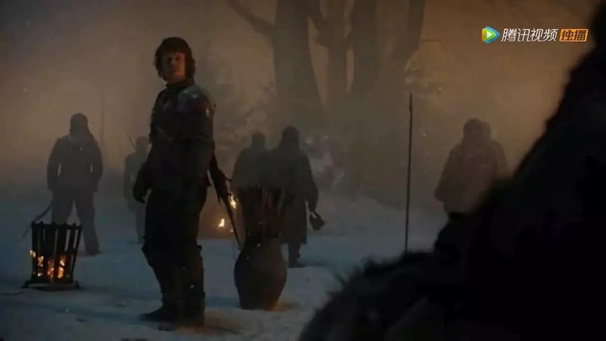
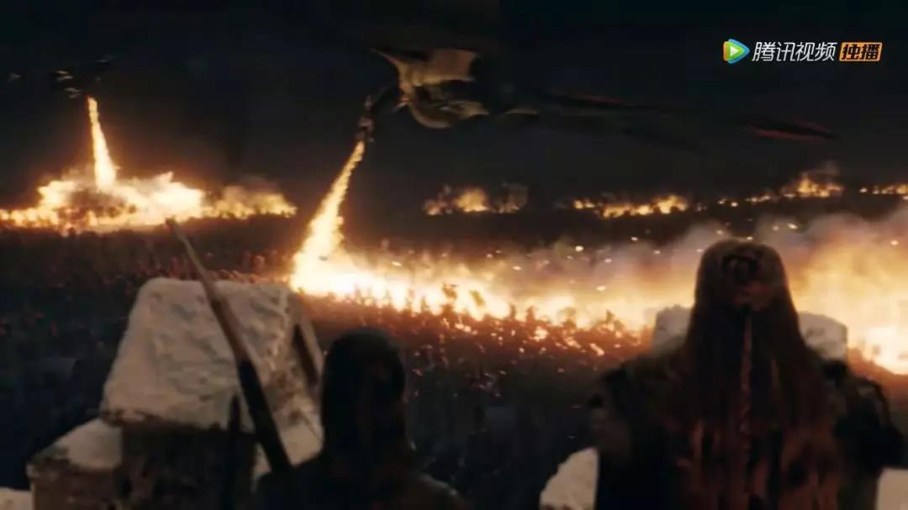

##正文

今天假期，继续写影评，明天开始正常更新。

趁着五一假期，把《权力的游戏》最终季第三季的人鬼大战看完了，实在是无力吐槽，就像我朋友说的，人类历史上第一次见到投石车、长矛兵和轻骑兵这么使用......

战争议会上集结了维斯特洛大陆上最聪明的人和最有经验的将领，竟然还用轻骑兵强冲集结好的敌阵，把投石车放在步兵线前面只放了一轮，在最精锐的长矛兵身后放拒马.......这些反人类的做法真心令人发指。

而结果呢，就像那句经典台词，“就是五万头猪，共军抓三天也抓不完”，数万装备与科技远远领先于对手的精锐大军，一个小时内就被打得灰飞烟灭，还送好几万的部队给夜王，想一想，哪怕是蒋介石运输大队长复生也打不出这个成绩。

 

看着联军的昏招频出，不由得让我想起了当年玩电脑游戏DOTA。

当对方集合兵力中路推高地，我方的五位英雄呢？

首先，主力机动近战输出的幻影刺客，在河道附近率先跳进了敌人的兵堆里，送了人头；

 

其次，我方强力近战输出的“鱼人守卫”跑到高地下面站桩，继续送人头；

 

再次，我方主力负责清兵的龙骑士和双头龙，在收了两拨兵之后，跑到敌人野区打野，还迷失了方向；

 

最后，我方主力远程输出的弓箭手小黑，站在生命之树边上看风景，坐视敌人攻破高地，再把他一波带走。（神射手的他要是在城门，可爱的小熊妹妹就不会死了）

 

可以说，打了这么多年的游戏的我，也从未见过如此坑逼之队友.......

而且，尤其是明知道夜王有能力把死人复活，还让骑兵远离己方阵营出城野战，把三分之一的家当就这么送给夜王，不仅让机动部队一次性伤亡殆尽，还让后面的杂牌军士气直接崩盘，真不知道脑子里面是怎么想的。

要知道，古代历史上劣势情况下的出城野战，目的都不是为了击杀对方的部队。要么是给城内的部队争取时间加强防线，要么是破坏敌方的工程设备，总之目的只有一个，那就是拉大守城方与攻城方之间的装备差距。

而装备的差别，也就意味着双方交换比的迅速拉大。

从历史上就能看出来，在攻城方缺乏攻城装备的前提下，千八百人守住十万人攻击的例子不可胜计。

而这也是为什么历史上大家都在不约而同的修城墙修长城，哪怕是电视剧里面，几十人的守夜人队伍也能轻松击破数万野人的攻击。

结果龙妈怎么打的？城外异鬼军队连个冲车都没有，竟让龙妈放弃了十余米高的城墙，直接在野外把自己的精锐骑兵和精锐步兵全部消耗殆尽。

更不要说，从战术角度，避免黑夜作战，尽可能的撑到天明才是硬道理，哪有天黑打野战的道理？

可以说，龙妈的议会连着编剧一起拖出去枪毙一点都不冤。

 

那么，这场仗如果交给我，应该怎么打呢？

其实在我看来，这场仗联军方面优势非常明显，只要合理布局，几乎可以以极低的伤亡轻松歼灭全部敌军。

首先，战争会议时要做的，就是要做到“知己知彼，百战不殆”，并随后制定出“以正合，以奇胜”的战略。

于是，接下来就要研究四个问题：

一、敌方的优势和劣势有什么
二、我方的优势和劣势有什么
三、如何扬长避短保障我方不输
四、如何利用信息不对称击败敌方

先说一下夜王一方，优势特别明显。

1、军队数量拥有绝对优势。
2、士兵悍不畏死，耐力强悍，而且永远士气高昂不会溃败，能战至最后一人。
3、拥有一头强力的冰龙和少量的巨人能够击破城墙防御。
4、能够复活死人，源源不断的补充兵力。

看似很厉害吧，但是，夜王一方的劣势比优势更加明显。

1、军队单兵攻击力弱，缺乏高机动力部队，除了仅有的一条冰龙和少量巨人外，无法形成关键点的突破，也无法有效增援。

2、军队就像星际2里面虫族斯托科夫的部队那样，大部分情况下，夜王只能给出一个攻击方向，他真正能“微操”的部队只有身边很少的一部分，而且部队无法使用任何科技，尤其缺乏远程武器。

3、所有的部队，包括冰龙虽然看似强大，但实际上都是非常脆，被瓦雷利亚钢或者龙晶只要刺中就立刻死亡，而且任何一位将领死亡都会导致麾下全部部队全体阵亡。

4、所有的部队，中火即死，任何烧过的死人也不会复生。

再看一下联军方面，劣势并不多：

1、北境部队在经历过一系列战损之后，战术素养低、士气低落、缺乏组织，容易溃败。

2、人类部队体能差是一个通病，很难长时间对抗。

3、部队无法补充，死一个人就少一个人。

但人类的优势也很明显：

1、拥有大量的龙晶，对于所有的敌军都是创伤即死

2、拥有足够高的城墙可以防御，大家交替休息。

3、拥有强大的科技优势，尤其是远程武器。

4、拥有大量的顶级战士，可以形成关键点的突破。

5、拥有两条火龙。

因此，根据双方的情况，联军需要先合理的使用田忌赛马策略，使得自己处于不败之地，然后根据己方缺乏兵源的现实，寻求一击必杀。

所以，首先要做的是这个：

一方面，拥有城墙的高度以及科技的优势，盟军可以通过弩床和硬弩，在高处确保己方在城墙周边的制空权，无论是冰龙还是巨人，在射程范围内都是一箭秒杀，因此夜王一方没机会物理攻破城墙，只能靠杂兵蚁附攻城。

 

另一方面，夜王一方缺乏远程武器，那么联军的两条龙就可以围绕着城墙喷火烧掉所有的杂兵，而夜王在缺乏杂兵保护和部队机动力不足的情况下，根本不敢上前去丢标枪来伤火龙，这会使得联军可以轻松的剿灭城墙附近的杂兵。

 

只要布局得当，联军一方最起码就不会输，或者说不会那么快就被打崩并尽可能撑到天明。

那么，立足于不败之地的联军，就可以考虑怎么求胜了。

而求胜，自古以来利用的就是信息不对称，抓住对方的错误而一举获胜。

那么，夜王有什么是不知道的呢？

一个，是夜王并不知道龙妈带来了大量维斯特洛大陆之外的援军，包括规模上万的重装步兵无垢者，以及多斯拉克的机动轻骑兵。

另一个，是夜王并不知道守军拥有了大量的龙晶，能够大规模的对自家部队造成破甲伤害。

（联军拥有火系魔法师这事儿，战前双方都不知道，因此我也不作弊，不予考虑梅丽珊卓可能的作用）

所以，正确的打法，是前期尽可能的先打对于夜王来说的明牌，譬如说两条火龙，而合理隐藏两个杀手锏，在关键时刻使用，作为战争取胜的关键。

反观龙妈那种一开战，就把自家的嫡系虎豹骑和青州兵放到阵前去拼消耗的做法，不但消耗了反败为胜的手牌，也让夜王警惕性大增。可以说，完全是一群门外汉的打法。

那么，具体的怎么打呢？

首先，我战前才不会让士兵把宝贵的体力用于训练，反正手头有好几万士兵以及民众，这段时间带领大家学中国人搞大基建，在城外弩床的射程范围内挖一道壕沟。（顾基建这帽子估计是没得跑了）

由于异鬼的无脑，决定了我们挖多大的坑，就能埋多少的异鬼。到时候填满了，两条火龙过去喷一下，就像诸葛亮火烧藤甲兵，一次上万的异鬼就成了渣渣，我就不信夜王的兵力再多能扛得住这么烧。

而且，异鬼这碳基生物的一旦大规模集中焚烧，在“铁索连环”之下，能形成一道足够威猛的火墙，根本不会出现电视剧中靠异鬼扑倒燃烧的拒马开路的场景，这将为后续的调整争取宝贵的时间。

最起码，这场燃烧能够帮助将战争拖到第二天的白天，到时候天气、气温和视野，都将向联军有利的方向转移，也会极大的鼓励我方士气。

其次，挖沟剩下来的土，也不能浪费了，在壕沟的后面再累积一层土墙，学曹操在潼关之战的时候，在土上浇水直接搞成一个冰墙，成为临冬城的第二道防御线。

目的，在于让异鬼大军减速和堆积，迫使从火墙中逃过一劫的异鬼部队根据兵种不同拉开距离，便于各个击破。（譬如巨人可以过来，但是杂兵就被挡在了后面）

再次，在城墙下设置足够多的拒马作为第三道防线，让北境步兵拿着斧头在拒马后面，对那些零散的能跑过来的异鬼进行定点屠杀，而所有的北境弓箭手集中在城墙上，利用高差，对于巨人的部队进行定点狙击，再强的巨人只要中一箭就拜拜。

在这样的防御体系之下，异鬼来多少死多少，临冬城的伤亡会非常低，偶尔死了的人，也尽快烧掉不给夜王增加兵员。

这样持续下来，几轮之后，兵力大幅下滑的夜王，就不得不亲自出马来对付两条火龙，否则就算百万大军，也扛不住一场赤壁大火。

而这时，联军就可以把城墙上埋伏床弩亮出来了（既然能造大型投石车，就不可能造不出难度技术要求低很多的床弩），盯着天上可能来的冰龙进行狙击，再强的冰龙，被龙晶箭头的弩箭射中也是凉凉。

而只要夜王失去了冰龙摔了下来，也就意味着丧失了移动力，跑不起来了。

这个时候多斯拉克的轻骑兵就可以发挥速度优势了，在詹姆、猎狗、乔拉等一大群万人敌级的将领带领下，后面跟着无垢者的精锐突击部队，直接对夜王进行斩首行动。

此时，两条火龙也不闲着，这时候已经白天了，视野会非常好，一个在骑兵前方开路，另一个利用机动性绕过夜王负责阻断援军。坦克+步兵配上飞机，妥妥就是一个中世纪闪电战的翻版。

而这个时候，夜王的劣势就开始体现了，一方面，夜王缺乏高级将领，士兵也无脑，夜王下命令救援自己的时候，大量的部队反而挤成一团施展不开；另一方面，联军的单兵战斗力远胜于异鬼，加上装备的优势，步骑配合能轻松能杀出一条血路。

于是，一场单方面屠杀的战斗，就会轻松结束。龙妈可以带着满编制的部队，和两条龙轻松南下夺取她的皇位。

也许，这也是为什么编剧只能无脑的把龙妈的部队写死，就像朋友们说的，否则之后打瑟后纯碾压真就没得看了……于是，编剧功力不够，就只能让夜王稀里糊涂的死在二丫手里了.....

哎，愿稀里糊涂走了八季的夜王一路走好，愿天堂没有斯塔克.....

 

##留言区
 

