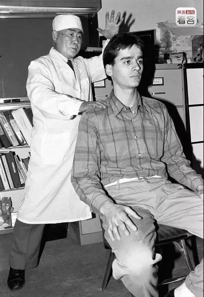

##正文

 
一

上世纪80年代末，一场轰轰烈烈的气功潮席卷了全国，一大群在中医包装下的气功大师粉墨登场。

从针灸到练气，再到头顶锅盖接受宇宙信号，各种气功培训组织遍布大街小巷，年轻人若不能动手笔画两下，老人们若不聊两句“小周天”或者“开天眼”，都不好意思跟朋友打招呼。

 

一群大师们打着能治病的旗号群魔乱舞，四处敛财。与此同时，也诞生了而李正洪、关加林、王林、张海.....等一系列的风云人物。

说起来，在那个没有互联网没有手机的时代，能够让割裂在全国的民众一致认可，可不是一件容易的事儿。

能够做到的原因不外乎两条，一个是以钱学森为代表的高级官员和知识分子的信用背书，导致好多单位评职称俩人还要比一段“功法”，因此上行下效；而另一个，则是大量权威媒体铺天盖地的全国报道，甚至不少还搬出来国内少见的“洋人”来为自己做信用背书。

 

当时，甚至很多国王、总统们都不知情下被中国气功“气”到病除，使得国内气功潮之疯狂难以想象，社会上甚至流行了一句顺口溜：十亿人民九亿疯，还有一亿练气功。

因此，很多略有中医底子的人，都纷纷“下海”搞起了气功，甚至后来还有大师叫嚣可以用气功扑灭大兴安岭大火、用气功打导弹，甚至长生不老云云，在不断的竞争和升级之下，这种宗教般的狂热，大有席卷全国之势。

当然，中国自古就不缺力挽狂澜的英雄，1994年，在一位坚信科学的长者要求下，中央发布了《关于加强科学技术普及工作的若干意见》，严禁党政干部参与迷信活动，严禁有违科学原则的宣传报道。

终于，这场蔓延十载的气功热才在各方声讨下渐渐没落。

 
二

就在气功热逐步的那一年，一款名为脑心通的神奇中药诞生了。

这款药从1994年开卖的500万销售额，到1996年就达到了5个亿，在那个城市居民月收入仅百元级的时代，用了两年的时间就创造了一个超级神话。

失败的商人各有各的不幸，但是成功的商人在成功之路上往往都有着惊人的相似。

脑心通这个超级神话的背后，本质也是一种当年气功的旧瓶装新酒。

作为一款中药，但主要宣传，依然是走的是“气功”路线，对外的宣传通稿，相信很多朋友这几天都看过了：

赵步长父子代表国家去新加坡参加一群气功大师搞的“中医与针灸走向世界国际学术研讨会”，现场表演中，竟然让瘫痪6年的病人神奇般地站起来了，新加坡权威的联合早报等大量媒体称其为“中国神医”，恳请他们留在新加坡继续行医，但是赵家父子还是毅然回国创立了步长制药......

当然，就像现实中百度里面的那些真假难辨的医院一样，所谓的"量媒体报道，不过是只有一家，而这一家业也并非《联合早报》，而是《联合晚报》，一家八卦惊悚的街边小报。

更不要说所谓的报道，不过是跟着其他来新加坡的气功大师们一起，在报纸中打了一则广告。

 

说白了，赵家父子不过是复制当年气功大师们吹嘘给某某不知名的国王治病成功的例子，利用国内的信息闭塞办法求证而大书特书。

本来呢，这么多年来，赵家搞的一直都是闷声发大财的生意，甚至都把家族企业搞成了上市公司。

可是随着五一期间，赵老爷子的孙女行贿650万美金上斯坦福被逛逛，一下子祖孙三代都被架在火上烤，所有的虚假宣传也都被扒了出来。

哎，不得不为明天步长制药的股价而担心了，有董事长性侵股价凉凉的，有财务造假股价凉凉的，因孙女上学而影响股价的，恐怕这也将开中国资本市场的先河。

 

 
三

很多朋友都对老赵家为啥非要砸钱送孩子上斯坦福，以及为啥愿意花这么多钱不理解，其实，这都要从当年的气功热说起。

80年代末的气功热，是中国近几十年来医疗行业乱象的始作俑者，因此无论是品牌推广、组织建设还是政府关系，都能看到当年气功班的影子。

而当年气功热最大的推动者，莫过于中国科学院院士钱学森。因此，钱老身边的一切，都成为了后世“不肖徒子徒孙”们的抄袭对象。

譬如科学院院士这一项，老一代的赵步长老爷子，就从“中国管理科学院”拿到了终身院士；而新一代结接班人百度李彦宏，则在挤破头想要竞选中国科学院的院士。

大家想的，都是给自己的生意披上一张科学的皮。

毕竟，从当年气功延续下来，大家做的都是收智商税的生意，把自己包装的更有学问更权威，才能更好地去忽悠人。

只不过，李彦宏是真的要选中科院院士，而赵老爷子拿的“院士”，是一家在香港注册的“中国管理学院有限公司”颁发的.....

而同样，钱老当年的政府优待以及海外知名度也是不能缺的，因此赵老爷子的百度百科上面，说他不仅是享受政府特殊津贴的专家，还被比利时国王亲自授予世界发明最高荣誉........

当然，这些胡诌八道的事儿自然是信不得，在他孙女上学行贿事情爆发后，有的是网友把他们家扒的底朝天，那个荣誉花点钱邮寄过去对方就打印证书，至于政府专家更是翻遍了也没找到。

但是，这并不能阻止中医药的赵家对于荣誉的饥渴，毕竟，人家是躺着赚智商税，需要的就是疯狂做宣传，一年光营销费用就要烧80亿。

所以呢，不要被贫穷制约了想象，一个货真价实的斯坦福心理学的学位，对于靠品牌收智商税的家族企业来说，650万美金根本不值一提。

所以，还真不要以为赵家被中介坑了600万美金是冤大头，不出意外，**这些钱不过是冰山一角，赵家为了这个姑娘，肯定走的不止这一条线，花的也不止这一笔钱**，只不过姑娘自己估计都不知道。

因此，如果**被有心人利用，估计是一连串的大瓜**，对赵家父子乃至上市公司都是地雷不断。

试想，作为一个当地的利税大户，赵家竟然十多年前把公司总部从陕西搬到了山东，联系到去年发生的一系列事儿，就能看出来未来真的不容乐观。如果有人手握黑材料，抓住医疗事故写两篇爆款文，再加上650万美金的炫富仇恨效应，难保就不会和权健一起凉了。

因此，今天文章本来想深挖一下带节奏，并顺带骂一通李彦宏的，后来想一想，还是算了吧，这种事情还是交给别人吧.......

毕竟，写着写着，想到换做是我，也会不惜代价给孩子争取良好教育的......抱歉各位，等到这么晚还没看到什么瓜......

##留言区
 

