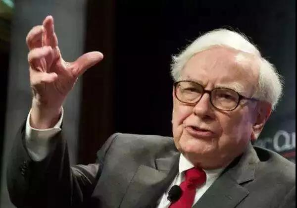
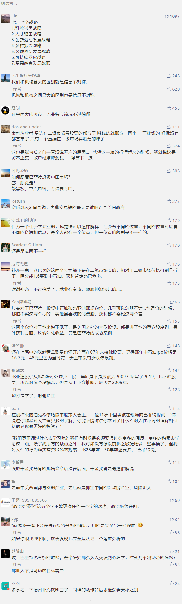

##正文

近日，股神巴菲特的2019股东大会，再一次将全球四万名投资人吸引到美国中西部一个人口40万的小城市，据说，仅从中国飞过去的狂热者就有万人规模，满大街黄皮肤黑眼睛的老乡相互寒暄。

当然，这么多国人以朝圣般的心态去拜见股神，自然也会提出一堆如何投资中国的提问。

近几年早就被中国投资人搞的不胜其烦的巴菲特，此次回答道：“我们已经在考虑中国的投资机会，但具体会投资哪些公司，我可不会告诉你。”

 

考虑到巴菲特已经89岁，他的搭档芒格已经95岁，未来还能继续释放声音的时间可能已经不多。

因此，这种悬疑式的回答，不由得引发了大量中国的财经媒体对此的解读，很多人都试图按照股神的模式，从A股中寻找到隐藏的巨大宝藏。

 

甚至很多专家们还根据标准巴菲特去年说的投资中国的标准，把国内数千家上市公司做了做了详细的分类，又是PE又是ROE，最后筛选出几个符合条件的股票，感觉比我当年研究简历专业太多了。

所以呢，今天闲来无事，也搞个跨领域，跟大家扯一下巴菲特眼中，中国的投资机会可能在哪里。（本文只讨论巴菲特在中国的投资策略，和他在美国的投资策略毫无关系）

按照我的习惯，一切未来都可以从历史中寻找答案，因此，先看看股神这十几年来在中国都投资了那些股票。

迄今为止，巴菲特在中国仅有两笔投资，还都是在港股。

第一笔，从2003年4月开始，巴菲特以每股约1.6港元买入中国石油H股，最终持有23.4亿股的中国石油股票，成为中石油外部最大的股东。2007年7月，他分批以约12港元价格减持中国石油股票，这笔5亿美元的投资，让他获得了800%的回报。

第二笔，在2008年9月，芒格说服巴菲特，投资2.3亿美金，以每股8港元的获得比亚迪10%股份，成为外部最大的股东，两年后股价就翻了十倍，此后十年的时间，持续持有比亚迪依然为巴菲特提供了超过600%的回报。

股神不愧是股神，仅买了两个票，还赚取了如此超额的利润，被国人顶礼膜拜也的确说的过去。

不过，如果真以为巴菲特会按照自己的那些标准去买A股，恐怕就只能说“图森破”了。作为全球政客和资本大鳄的座上宾，巴菲特获得的信息层级远非普通的基金经理所能比拟。

就像我一本正经在进行经济分析的背后，用的是完全另一套逻辑那样，人家股神在选择中国股票的背后，实际上是站在更高维度一种降维打击。

譬如巴菲特开始买中石油，是在小布什当选总统之后，而在港股大规模扫货中石油的那个月，恰恰是德克萨斯石油集团的布什，发动了伊拉克战争.......

所以，股神买入中石油的背后是早已知晓了，一方面德克萨斯石油集团会利用战争拉升低迷已久的油价，另一方面在中国配合美国反恐并进行能源捆绑的大背景下，负责中国海外油田扩张的中石油自然能跑马圈地大肆扩张。

因此，肩负着中国能源扩张任务的中石油，在全球油价长期看涨的阶段，杠杆化的股价自然就比油价涨的更为凶猛。

同样，股神抛售中石油的时间点，是以结束伊拉克战争为竞选口号的奥巴马等人，以势如破竹之势在美国掀起了反战和遏制高油价的热潮。

所以，不要以为看明白财报就能成为中国资本市场的股神，人家在中国的投资每一步都是踩在了历史的进程之上。

同样，将旧能源的王者中石油套现之后，股神随后就买了代表着新能源的比亚迪。而这场交易背后的历史进程，则是美国政坛由新能源集团的民主党上台，取代石化能源的共和党。

因此，随着美国政府的180度大转向，紧随美国步伐的中国，迅速在2019年启动了新能源汽车的刺激计划，使得新能源龙头比亚迪的股价一飞冲天，一年的时间就从8块涨到了85......

说白了，这就跟股神当年投资中石油，看重的是中国政府对于油企不惜血本的战略补贴（譬如46元IPO）一样，后来他投资比亚迪，看重的也是中国政府对于新能源不惜血本的战略补贴。

你以为股神赚的是价值投资？其实人家赚的是国家的战略补贴。

而这些中国政府不惜血本的战略补贴，背后也都有着美国政府战略转向的历史进程，人家股神站在美国的高度来看中国的资本市场，自然就有一种降维打击的存在感。

当然，股神若是对于美国预判错了，一样会在中国资本市场吃瘪。

押宝希拉里，在新能源上大规模投资的股神，怎么也没有想到特朗普会战胜希拉里......而希拉里的惨败，又间接引发了中国新能源补贴政策的退坡，让比亚迪的股票处于一个极为尴尬的境地.......将比亚迪作为新能源产业链布局的巴菲特更是进退维谷.......

所以呢，在中国的资本市场上，还真别把股神跟价值投资放在一起。股神他老人家在共和党在台上买石油股，民主党上台买新能源股，你以为人家赚的是价值投资的钱，实际上人家赚的是信息不对称的钱，赚的是国家战略补贴的钱。

这里呢，也建议那些一心秉承着价值投资，想抢在股神之前埋伏的股票分析家，如果想要复制巴菲特的中国模式，我觉得还不如多翻一翻十九大报告更靠谱，里面明确说了我们想要战略补贴什么........

而股票除了选标的，还有就是择时机。

巴菲特在买中石油的时候，正好是SARS肆虐神州大地，济活动骤减，人们对经济的前景感到悲观，股市大跌；同样，在在巴菲特购买比亚迪到时候，正好是次贷危机爆发，全球资本市场都在一片哀嚎，没人看好资本市场。

而股神就在别人都不看好的时间点入局了。

这就像巴菲特自己说的，别人恐惧我贪婪，每次大跌的时候都是入场契机，而看看近期的资本市场，那个巴菲特说的机会，似乎就快要来了。  

##留言区
 

