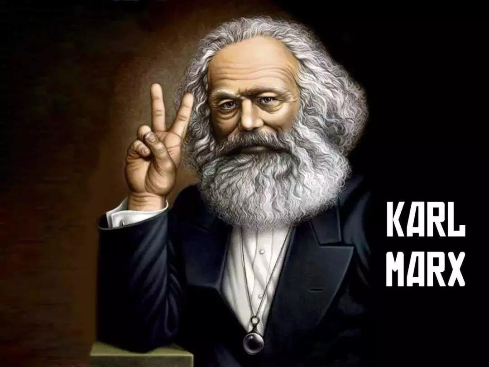
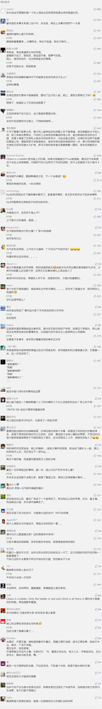

##正文

今天，全球最大的豪华车生产商戴姆勒，也就是奔驰的母公司搞了一个大新闻，据路透社透露，中国的北汽集团正在寻求奔驰母公司戴姆勒近5%的股份。

这笔预计将30亿欧元的股票购买，将使得中国北汽将超越雷诺日产，紧随科威特投资局之后成为戴姆勒的第三大股东。

而众所周知的，戴姆勒目前的第一大股东，则是持有约10%股份的中国吉利.......

说起来，德国有三大汽车巨头，大众、宝马和戴姆勒，其中保时捷-皮耶希家族和匡特家族，分别持有大众和宝马50%以上的投票权，而戴姆勒因为其掌门人飞机失事罹难后，六个女儿卖掉了股权，因此长期陷入了股权分散之中。

而随着中国吉利和中国北汽先后成为戴姆勒的前三大股东，并拥有相应的投票权，这意味着这个垄断了中国高端轿车数十载的德国品牌，将越来越有社会主义特色........

嗯，相信这会让出身德国的革命导师马克思非常欣慰。

 

当然，上面是开玩笑的，作为德国工业上的一颗明珠，如果没有戴姆勒乃至德国政府的认可，北汽是绝不敢在二级市场扫货，此次北汽入股戴姆勒的背后，是在组建中德汽车战略联盟。

而促成此事的背后，不仅有中国汽车人的个人奋斗，更是依靠了历史的进程，因为这事儿还真得感谢美国和日本，去年把雷诺日产的董事长戈恩逮捕了。
 
 

戈恩不仅是法国雷诺和日本日产的董事长，而且还与戴姆勒的CEO蔡澈，共为雷诺日产与戴姆勒联盟的推动者。

在戈恩和蔡澈的推动下，戴姆勒、雷诺、日产三方在2010年达成“德法日”的汽车战略联盟，戴姆勒分别持有雷诺和日产3.1%的股份，而雷诺、日产则各持有戴姆勒1.55%的股份。

这个做法类似于中国古代春秋战国时期的“质子”，各方都有既有了共同的利益，也有了对方的话语权，因此共同合作得以迅速展开。

因此，“德法日联盟”从最初的欧洲项目合作，迅速扩展到全球合作，领域也从零部件共享扩大至平台研发，从联合开发到联合生产，从轿车延伸至商用车，三方之间进行了大规模的技术交换。

甚至在去年，三方也商讨在新能源动力电池以及自动驾驶领域进行共同研发........

不过呢，随着去年年底将雷诺和日产捏在一起的法国人戈恩被捕，以及一手促成“德法日三国联盟”的戴姆勒CEO蔡澈将于本月底退休，这也意味着戴姆勒-雷诺-日产的汽车三巨头联盟即将成为历史。

而即将取代CEO蔡澈的，将是戴姆勒的研发总监康林松，是一位积极推动新能源电动车的技术大牛。

而众所周知，中国是未来全球新能源最重要的市场，因此在燃油时代与日本合作共享节油技术的戴姆勒，自然也得赶上历史的进程，在新能源时代，与中国的汽车巨头进行交叉换股，共享技术、共同开拓全球市场。

因此，可以预见的是，吉利和戴姆勒入股的背后，实际上是戴姆勒人管理层换届之后，所引入的新战略投资人和新的盟友。

所以，就像吉利年初跟戴姆勒成立面相全球业务的合资公司，共同投资进行未来smart的发展。未来北汽估计也将与戴姆勒组建新的合资公司，携手向全球新能源领域进行积极扩张，甚至未来中国生产的“电动奔驰”行销全球也不无可能。

当然，个人奋斗的背后，都是历史的进程。

随着特总上台后美国进行战略收缩和遏制新能源发展，有了戈恩的被捕和德法日新能源联盟的解体。

而旧秩序的解体也为中国这个新玩家带来了巨大的机会，吉利和北汽靠着个人的奋斗，先后成为了全球最大的豪华车生产商的股东。

同样，历史的进程也适应于个人，过去店大欺客的4S店，却不想被一个坐在引擎盖上哭的西安姑娘搞得关门大吉，还让戴姆勒大中华区的负责人昨天跑到市场监督总局接受整改。反之，前些天某南京女子模仿西安奔驰妹子坐沙盘维权，却因损坏模型反被拘.......

当然，这都是历史进程中的插曲。

随着在西安引擎妹引发这一轮的洗牌，北汽等中国公司向远在斯图加特的戴姆勒高层证明了自身的实力，并帮助其重整令其头疼的经销商体系之后，相信在双方进一步的紧密合作之下，奔驰这个百年老店，即将在中国掀开崭新的篇章。

同理，相互证明了实力的合作，才能是长远的合作。

关联文章：坐在奔驰上哭的历史进程

##留言区
 

