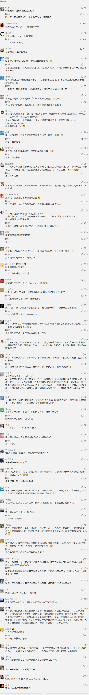

##正文

自马云辞去阿里董事局主席之后，似乎就再也不维护自己多年打造的完美人设，在刚刚结束的阿里日上连续大开黄段子，并做成图片形式，让旗下媒体大肆传播。

 

这场集体婚礼，马云给阿里巴巴的员工们制定了一个所谓的生活KPI，就是多用“丁丁”生孩子。

可是，由于前段时间鼓吹「996」上导致人设轰塌，此番马云的黄段子一经传播，便被全网声讨，“飙车”变成了“翻车“.......

众多青年纷纷表示白天「996」，晚上再「669」，那么周日只能去ICU了.....甚至满口黄段子的马云还被评价为“白天风清扬，晚上田伯光”......

说起来，马云从创立阿里之前，就非常在意自己的羽毛，作为全中国知名度最高的公众人物，二十多年在大屏幕上无数次的演讲，从没有过负面的声讨，更是从来不会涉黄。

可是，为啥今年开始，马云就如此高调的站在“人民”的对立面，并开始大规模的“毁人设”？

这还是要先从马云的KPI——“造人”说起。

两千多年前的齐国，当年管仲的治理下，是天下的贸易中心，在这里没有难做的买卖。

齐国国内有个田氏家族，特别能收买人心，对老百姓放贷就像用蚂蚁花呗领红包买东西那样，借钱的时候给红包，还钱的时候不用给利息，凭借着大规模的补贴，田家迅速把家族作大，成为齐国数得着的超级巨头。

虽然田氏财大气粗，但是人丁却不旺，面对富可敌国的产业，田家怎么掌控呢？

据司马迁记载，此时，家主田成子做一个艰难的决定，给自己找了上百个肤白貌美大长腿的年轻女子的后宫团队.......

可毕竟田氏年纪不小了，白天要「996」式的管理齐国国政和打理家族的生意，晚上哪有空去「669」生孩子啊，这么拼命搞不好就要创业未半而中道崩殂了......

于是，田氏心生一计，下令自己从各国请来的豪杰侠客们，夜间也可以随意进入田府......

这下可乱了锅了，一个个独守空闺的妙龄少女，一个个田府重金聘请的天下豪杰......

嗯，每到晚上，田府的画面实在是不忍直视........

 

不过，作为齐国“八大铁帽子王”之绿帽子王，此举迅速改变了田氏家族在齐国的局面。

不仅给田成子带来了七十多个儿子，组成了“田氏全家桶”，占据了齐国各个重要位置，女儿们也通过联姻和亲争取了国内大量的支持者。

更不要说那些从各国请来的豪杰完全绑在了田氏的战车之上，在乱点鸳鸯谱之下，也形成了利益共同体。

 

最终，凭借多生孩子以及民众的广泛支持，田氏取代了姜氏，被周天子封为齐国的侯。

嗯，也是成语“窃钩者诛，窃国者侯”的由来。

所以呢，生孩子这事儿，从小的来说对于一个想做成百年的公司，往大说对于整个国家，都是非常重要的。

就像马云不过是台前鼓吹，幕后的政府为了鼓励生育，自红黄蓝事件后，廉价的公立幼儿园没用一年就遍布全国。

所以呢，不要以为马云搞的如此夸张，仅仅是为了逞口舌之快，毕竟，今年鼓吹「996」的马云在一年前接受采访时，是这么说的：

>我后悔终日忙工作，根本没时间陪陪家人，要是能再活一次，我绝对不会再这样了。

 

马云为啥在短短一年的时间，会有如此大的变化？

这里，讲一个当年大汉丞相萧何的故事。

在司马迁的《史记萧何世家》里面，把一半的笔墨，都放在了西汉“世家”第一人萧何如何“自污”上面。

当年刘邦起兵，被西楚霸王打得找不到北，靠的都是萧何在国内筹办粮饷补充兵员。为此，刘邦多次派使者来慰问，并给予重赏，可萧何不但没有受赏，还表示“我的家产都是大汉朝廷的”，并派子弟出征。

后来，随着地位越来越高，以及子弟们位置也越来越高，萧何为了继续“自污”，故意惹事让百姓骂他，故意制造坏名声，抢着去干脏活。这样刘邦一看萧何不得民心，也就不担心了，放心让他在大后方整军备战。

从此，刘邦萧何两人其乐融融，成为了一代君臣佳话。

如果读过历史就知道，韩信、彭越、英布都是什么结局，甚至鸿门宴上救了刘邦的樊哙，也是因为刘邦提前咽气才捡了一条“狗命”。

因此也会知道，西汉“世家”第一人萧何这么“自污”，背后是智慧。

嗯，讲完历史，再看一下准备打造“百年世家阿里”的马云。

且不说如今到了互联网的下半场，移动互联网的用户流量逻辑已经结束，各个巨头要靠从推进5G物联网的政府手里争抢订单和流量。

而更重要的是，在未来对外金融开放的大背景之下，蚂蚁金服为代表的科技金融公司，将取代传统金融这些亲儿子，成为新时代的“萧何”，为我大汉筹集粮草兵源，来对抗那个抓着人质、武力威胁我们投降的西楚霸王。

所以呢，考虑到如今连八千万同志必备的学习强国用的都是阿里的“钉钉”。

那么想要成为一代佳话，把阿里做成百年世家的马云，自然也会知道怎么做，才能在蚂蚁金服大规模的补贴讨好民众、阿里全家桶产业链百子千孙式渗透全国行政体系的同时，又不会被视作“窃国者侯”。

嗯，多看看历史就会明白，年轻人尽可在「996」和「669」的问题上激烈的抨击，而那个曾经爱惜羽毛的马云，在惆怅中也会有着一丝窃喜。

毕竟，小孩子才分对错，“爸爸”们只看利弊！

##留言区
 

