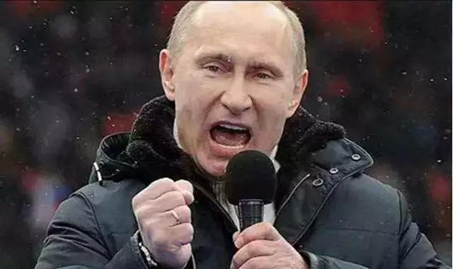

##正文

昨天，俄罗斯总统普京在黑海度假地索契，会见了美国国务卿蓬佩奥，双方同意努力化解两国紧张关系，并表示在即将召开的G20大阪峰会上，普京愿与特朗普举行最高级别的接触。

一时之间，“美俄联手”成了一则大新闻，在如今云橘波诡的全球贸易争端之际，成为了与特朗普正在极限施压各国头顶的一朵阴云。

 

 
一

自2012年开始，普京一般起床很晚，每天从一顿简单的早餐开始。

为了安全，成箱的食材定期从东正教主教基里尔的大农场运来，餐桌上常有松软干酪、煎蛋卷，偶尔有麦片粥，以及他喜欢的鹌鹑蛋和果汁。

饭后，他通常会喝上一杯咖啡，并花一两个小时游泳，在运动中思考国际国内的大事。

而沐浴更衣后，就是办公时间了。

普京一天的工作，从阅读联邦安全局、对外情报局以及警卫部队的三份报告开始，这三份报告分别为普京提供国内事务、国际事务以及俄罗斯政坛的的机密信息。

而读完三份报告之后，普京看的则是《莫斯科共青团报》这类发行量最大的全国性报纸，从中捕捉民众喜闻乐见的信息，再之后是优质报刊和外媒简报。

在完成这些大概需要三四个小时的工作后，“沙皇”才会接召见那些早已在宫殿外等了数小时的“朝臣”。

而这些之前习惯称他为“老板”的“朝臣”们，在2012年后，给了普京送一个新称呼——“沙皇”。这也使得朝臣们对于能够得到召见，并在宫殿外等待三四个小时也颇以为荣。

而此次蓬佩奥拜见普京，恰巧也被普京晾了三个多小时，而这一则新闻，恰巧是由《莫斯科共青团报》爆出来的。

 
二

2012年普京再度当选总统，但是，在全球油价进入下跌进程，以及全球金融危机和欧洲债务危机的轮番冲击下，俄罗斯的经济开始陷入长期低迷。

因此，普京也不再像他2008年之前全球能源价格暴涨阶段，主张通过发展经济来解决俄罗斯的内部矛盾以获取民意支持。

而如今的普京，已是通过民粹主义的群众运动，来维系其执政合法性，甚至自视为沙俄帝国的继承者，势要让沙俄再次复兴。

同样，就在2016，普京开启第二任的那年，大洋彼岸的美利坚也选出了一位在全球经济危机下，依靠民粹主义上台，口号为令美国再次复兴的总统特朗普。

说起来，这些旧时代的大佬们之间，总是容易找到一些共同的语言。

就像上世纪贸易思维的特朗普，不断试图通过重启传统的双边贸易谈判来复兴美国那样，作为沙皇的普京，对于沙俄的传统土地问题上也同样显现出了极强的欲望。

不过，逆历史而进，总是要付出代价的。

特朗普所痴迷的贸易大棒，将原本统一战线的传统盟友搞得剑拔弩张，给了某些国家分化瓦解的机会。

而对于土地有着痴迷的普京，不仅因吞并问题与白俄关系大幅下滑，更是将俄罗斯大门的乌克兰彻底推向了西方。

某种程度上来说，这哥俩还真“不是一家人，不进一家门”。

 
三

不同于被动防守的俄罗斯，特朗普手上的牌明显要比他的老朋友好的太多。

这位擅长做交易的老商人，挑事儿除了看有没有石油外，基本上是按照全球GDP排行顺序来的，排名靠后的对他来说根本没兴趣。

 

而普京治下那个GDP都不如中国一个省的俄罗斯，就像一堆干瘪的豆饼那样，也挤不出来什么油水，自然就不值得特朗普搞极限施压。

更不要说俄罗斯现在就像一头饿极了的北极熊，过度的挑衅还容易给自己惹一身骚。

因此，从风险收益的角度，特朗普的商人特性，必然倾向于不去压榨俄罗斯，而是通过跟俄罗斯做交易，令其变成自己的筹码，好让自己去跟其他的国家借力打力做交易。

其实，这与普京的思路也差不多，俄罗斯在上次美国大选中，充当自干五，帮助特朗普竞选的背后，也是想利用特朗普这个不走寻常路的人，打破传统建制派对于俄罗斯的遏制，好在浑水摸鱼获取利益。

 
四

说起来，相比于俄罗斯的沙皇式决策，美国的外交圈子里面，始终是传统的精英们主导，一方面，他们要为背后的既得利益集团背书，另一方面他们还需要巩固和延伸自身的外交理论。

在长达近半个世纪的冷战过程中，作为北约的头号对手，苏联成为了外交圈子中最主要的研究对象，而且研究的大佬们，都是把苏联视为最终要击败的大Boss。

因此，这也就出现了每次特朗普试图与苏联的继承者俄罗斯进行会谈和解之际，北约各国的外交势力都在想尽一切办法进行破坏，甚至大家不惜一切代价来为美俄制造摩擦，譬如离岸大佬英国就连续搞了叙利亚毒气案和双面间谍案。

毕竟，一旦特朗普真的搞出了美俄和解，相当于无数“研究生”的毕业论文全部要推倒重写，无数“教授”几十年的科研成果全部付之东流。

不过，特朗普试图与普京达成和解的背后，并非没有可行的逻辑。

因为美国的传统外交圈子都习惯于一个“定理”，美国需要维持在中东的军事投放以确保石油美元来维系美国经济，并从根源上便于控制伊斯兰激进主义。

但是，随着美国页岩油和页岩气科技的爆发，过去需要进口能源的美国，突然成为了全球能源的输出国，因此，通过控制中东的能源来控制世界的模式，将随着生产力的发展也将进行一次升级。

因此，对于特朗普团队来说，美国进行战略收缩，让欧亚大陆上的欧盟和俄罗斯来接手遍地激进组织的中东，也并非是一种不可的选择。

 
五

这几年，随着特朗普的战略收缩，享受了特朗普红利的俄罗斯，不仅守住了叙利亚和克里米亚，乌克兰危机也慢慢淡化，甚至还从北约挖了一个墙角，把土耳其的埃尔多安绑在了自家的战车上。

但是，虽然在美国战略收缩中获益匪浅，但让俄罗斯与美国走向和解，则未必符合普京目前的利益。

毕竟，2012年之后，俄罗斯人民饿着肚子还拼命支持普京的背后，是民族主义以及大国情绪在背后一口气硬撑着，老毛子们看着普京在国际上怼美帝，还搞得老美无可奈何，那叫一个开心。

这也是为什么《莫斯科共青团报》会爆出来，蓬佩奥位白宫3号人物，足足被普京晾了三个小时，就是在向国内展示自己的强硬。

 

因此，一旦普京盲目和解，失去了美国这个意识形态上面的敌人，就像当年俄罗斯邻居70年代初那样，不仅普京的支持率会大幅下滑，普京集团的内部也可能会出现难以弥和的分裂和动荡。

而且，一方面考虑到抠门的特朗普并不会像80年代的美国援助中国那样掏真金白银来大力支持，另一方面塑造沙皇形象的普京依旧是美国传统外交圈子里面很多老人的宿敌，只能把他们熬死。

因此，回顾并借鉴一下历史，**美俄在普京的任期内，大概率会出现标志性的缓和与解除部分制裁。但真正的美俄和解，也许得交给俄罗斯下一代的领导集体了。**

而后者，是我们真正要关注和留意的。

近期关联文章：

逃离德黑兰？特朗普的权力游戏

制裁伊朗背后，特朗普的世纪交易

##留言区
 

