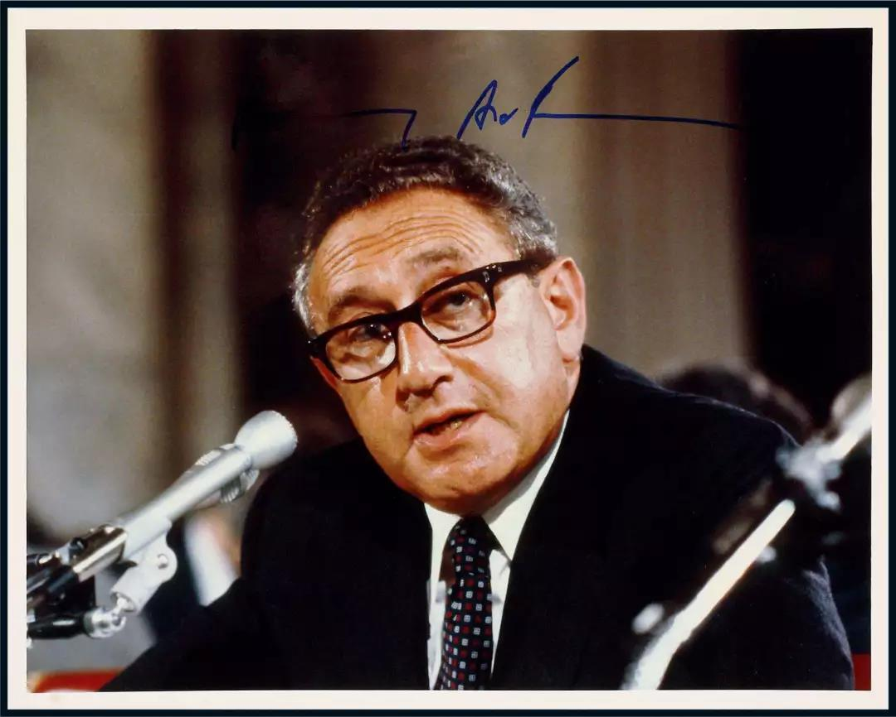

##正文

今天，华为海思芯片的“备胎正式转正”火了，而很多人并不知道，18年前，中国也有一场软件“备胎”的转正。

2001年，刚刚申奥成功的北京成为了全球瞩目的中心，而此时，一个软件行业的“备胎计划”也在悄悄的酝酿。

当时，国产软件行业才刚刚起步，资本市场却被纳斯达克泡沫破灭近乎于摧毁，大量企业破产，程序员找不到工作。

在此万马齐喑究之际，北京市政府科委商议后，希望以采购国产软件进行扶持，在逆境之下，表明政府支持国产软件的决心。

就像时任北京市科委的俞副主任说的，“如果几百万元人民币可以挽救一个产业，那就非常值得。”

十多年后，看到动辄几百亿去烧一堆破铜烂铁的年轻人，根本无法理解当年几百万的价值，当时的马化腾正准备50万把腾讯卖掉，传奇程序员史玉柱已转行卖他的保健品，雷军更是已经在偷偷的准备离职......

当然，北京方面除了扶植民族产业之外，还有一个不便言明的意图，就是打破微软在操作系统与办公软件的垄断，将其价格降至合理的位置，减少政府的采购支出。

毕竟，当时中国还差几个月进入WTO，“世界工厂”的威力并未体现，当时微软办公套装4000一套，相当于一平米优质地段的北京房价。嗯，按照这么装下去，当时的公务员规模将迅速掏空国家宝贵的外汇储备。

但是，在当时一系列的谈判过程中，蛮横的微软不仅不接受降价，也不提供便宜的windows2000，更否决了北京为了政府信息安全，绕开网上激活的提议。

虽然中国市场对微软非常重要，但是拥有绝对垄断的微软一旦停止对中国软件授权，会使整个中国的软件甚至互联网行业就将全盘崩溃，因此在谈判的过程中，微软强势的无以复加，不断以各种理由对我方施压。

最终，**在微软蛮横的“强势配合”下，北京市科委“迫不得已”将“微软备胎”计划摆明到台面上“转正”，对国产软件企业提供政策性扶持，并给予其政府采购的蛋糕。**

北京方面如此不按套路的出牌，这给刚刚市值超过通用电气，登顶世界第一市值公司的微软来了一记迎头痛击。中国区总裁高群耀旋即被解职，甚至中美关系“压舱石”之一的基辛格，都为此把电话打到了北京。

 

动用这种级别的大佬并非是“高射炮打蚊子”。

因为随着中国即将进入WTO并开放国内市场，大量的软件采购将为美国的软件公司提供极为丰厚的利润。而北京作为中国政策的风向标，拿到之后就可以在其他各省按照标准“传檄而定”。

更重要的是，作为美国软件行业基石的微软，一旦其操作系统未能取得垄断地位，也就意味着其他的美国软件公司也不得不将面临中国软件公司群蚁噬象式的激烈竞争。

就像现在微信搞出来的公众号和小程序，对苹果与安卓的APP生态造成了致命的冲击；阿里和腾讯的移动支付，让Apple Pay和VISA生态在国内寸步难行。这种行业基石类产业的突破，会为国家的一整套产业链提供强大的护城河，甚至形成对境外企业群的降维打击。

因此，即使美方通过不断施压，甚至最后将力挺国产软件的科委俞副主任调离工作岗位，但是已经启动的“微软备胎计划”，在一群不怕丢乌纱帽的官员支撑下，在一群不眠不休的老一代软件人的奋斗下，还是默默地推进了下去。

就像鲁迅先生说的，“我们从古以来，就有埋头苦干的人，有拼命硬干的人，有为民请命的人，有舍身求法的人……这就是中国的脊梁。”

由于经费不足，但是又要做出一个能够一个完全取代windows+office的体系，因此在经费极为紧张的情况下，整个“备胎计划”内部采取“龟兔赛跑”模式，一个项目两个单位一同起跑，跑在前面的那个能够拿到政府的经费补贴，跑在后面的那个只能被淘汰并承受损失。

最终，凭借着“半计划经济半市场竞争”的驱动，以及无数中国老一代软件人“007式”的拼搏，在几年的积累之下，国产的操作系统、软件以及OA系统，就达到了“基本可用”的程度，也通过政府的扶持，为整个软件行业挽留并储备了大量的人才。

并在2004年年底，在卧薪尝胆的三年后，苦心人天不负，中国的软件行业的“备胎”们，彻彻底底打了一场翻身仗，在媒体和民意的支持下，被调离的俞副主任重返北京科委主持采购工作，结束了微软的一统天下。

至此，在北京的效应之下，微软不得不在全国大幅降价进入价格战，也不得不放弃过去“视觉中国”式的频频诉讼，放任微软系统的盗版软件横行，甚至Win10都搞起了免费，为中国互联网与软件的普及奠定了坚实的群众基础。

其实，很多中国企业的成功，背后也都是“备胎模式”。

就像当年的金山雷军是微软的备胎，如今的小米雷军则是苹果的备胎；甚至中国互联网的三巨头BAT，不也是在政府羽翼保护下，成长起来的“备胎”么？

试想，如果没有像雷军们这样“备胎”的“转正”，微软和苹果绝不会主动降价，中国也不会有更多的人用上廉价的操作系统和手机，利用人口优势在互联网时代逆袭了欧洲，在移动互联网时代追赶着美国。

甚至无论是阿里腾讯，还是华为小米，当这些“备胎”们成长起来之后，就会在自身领域形成一道护城河，让国内更多的企业能够围绕着自身发展起庞大的生态网。

而可以预见的是，中国未来自己的芯片，不仅将极大的降低我们的采购成本，更将成为中国未来5G物联网时代产业链的新长城。

如果说十八年前，在微软的重重重压之下，我们坚定的启动了“备胎”计划，为中国的软件互联网行业，埋下了一颗希望的种子。

那么十八年之后的今天，一个硬件物联网的“备胎”，海思芯片，将在重重的压力之下破土而出！
 
 

“中国从古以来，就有埋头苦干的人，有拼命硬干的人，有为民请命的人，有舍身求法的人……这就是中国的脊梁。”

##留言区
 

