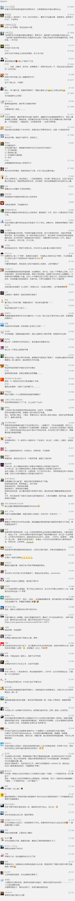

##正文

1952年10月14日，朝鲜战场。

为了在即将结束的谈判桌上赢得更多的筹码，逼迫中方让步，美军启动了“摊牌行动”。

在一块长仅2700米，宽1000米的狭小地域内，一天内，美军投下了30余万发的炮弹，以及500余枚的航空炸弹，试图以绝对的火力，一鼓作气拿下这个高地。

嗯，这片被美军炮火饱和覆盖的地方，叫做上甘岭。

 

同样，作为防守一方的志愿军，为了实现半岛的停火，为了减少谈判中的那些不可逆的损失，也在上甘岭上执行“寸土不让”的作战方针。

面对美军无尽炮火倾泻带来的绝望，不知道要坚守多久的战士们没有退缩，他们前赴后继的填补阵亡战友们留下的阵地，在43天的鏖战中，发起了59次阵地争夺，击退了900多次的敌军冲锋。

最终，这些血肉之躯挽狂澜于既倒，将武装到牙齿的钢铁洪流挡在了五圣山之下，让进攻的美军付出了两万余人伤亡的代价。

历史上，并不是一味的无畏牺牲，就能获取胜利，当年僧格林沁的精锐八旗骑兵与义和团刀枪不入的大师兄们，再无畏的冲锋，在火力绝对压制的八国联军面前无法造成任何的伤害。

同样，上甘岭第一天，美军的饱和式攻击，就将我军地表工事近乎全部摧毁。如果志愿军只会投送兵力来防守，就会陷入美军的圈套中，不断消耗我军的有生力量，最终不得不在谈判桌上认输。

所以，我军在战前就在上甘岭上做好了“备胎计划”，在反斜坡的地道里建立防御阵地，并储备了大量的武器弹药，将美军意图一次性解决的阵地战，变成了反复拉锯的坑道战。

而正是上甘岭这一场让美军陷入“绞肉机”的战役，让美国人看到了志愿军不怕牺牲的精神，也使得美国政府彻底放弃利用军事压制来换取谈判筹码的幻想。

让美国佬明白，**中国人不想给的，谁都别想拿走！**

正是上甘岭那些战士们在极限火力下的成功坚守，不仅大幅降低了停战前我军的伤亡，更加速了板门店谈判半岛停战的历史进程。

甚至后来据说，蒋介石看到曾经被自己视作炮灰的杂牌军被共产党改编后，竟能将占据绝对优势的盟国联军打得如此狼狈不堪，对其儿子蒋经国语重心长的说，“我们要研究毛泽东，要学习毛泽东。”

而海峡另一边的大陆，一位年轻时的“学毛选标兵”，在上甘岭战役结束的67年后，也正在面临他的上甘岭。

日前，美国总统特朗普宣布美国进入国家紧急状态，美国商务部禁止华为从美国企业那里购买技术或配件。

去年美国主导的中兴休克的一幕，如今又一次在华为身上上演。

记得前天，随着特朗普的总统令，CCTV6临时更改上映电影《上甘岭》。片中里面一群人传着吃一个苹果的故事并不是虚构的，而是真实故事改编的。

 

67年前，在美军绝对优势的火力封锁下，志愿军后方阵地距离上甘岭的坑道只有500米，但是每一寸土地上，都有着美军饱和式的火力覆盖，虽然上甘岭的坑道里储备了弹药，但是生命必须的饮用水却需要后方运输。

所以，才有了我军的那道著名指令，谁能给上甘岭的坑道上送进去一筐苹果，就授予他二等功。

67年前，送苹果等于二等功的背后，是那些奋战在暗无天日坑道里的志愿军战士，只要他们能够坚持守住防线，不被“休克”，就意味着这场战争的即将结束，板门店的谈判团队，将拿到一个更有利于我们的停战协议。

67年后的今天，面对谈判最后时刻美方的极限施压，那些连夜不眠的华为员工们，就像当年奋战在上甘岭上的战士那样，正孤军承受着美军全部的火力倾泻，为国家和民族守护着那道不可破的防线。
 
 

如果顶在前面的华为扛不住，覆巢之下安有完卵，那么躲在后面的我们，就将成为谈判中额外付出的代价。

而只要遭受了极限火力施压的华为能挺住，那么就会打乱美方的进攻部署，复制67年前的成功，提前结束这场战争。

67年前，我们的前辈们尚且不顾牺牲、前赴后继的往上甘岭送苹果，那么67年后，在这场国运之战中，手持“苹果”的我们，难道不应该做点什么吗？

##留言区
 

