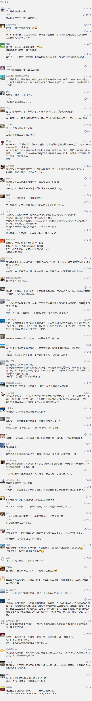

##正文

1973年，第四次中东战争爆发。

在这场阿拉伯国家与以色列的国运之战中，背信弃义的美国突然出手，总统尼克松下令，美国空军“把所有能飞的玩意都飞往以色列”。

在军方鹰派的主持下，美国一方面对阿拉伯国家武器禁运，一方面源源不断的美械装备运抵以色列，使得原本占尽优势的阿拉伯联军顿时转为守势，多处防线摇摇欲坠。

不过，面对严峻危机的阿拉伯国家并没有任人鱼肉，因为他们有着老祖宗给他们留下的巨大财富——石油。

而阿拉伯国家的石油禁运，也让一直到处制裁别人的美国，享受了一把被制裁的滋味。

说起来，在上世纪80年代之前，全球石油一直被埃克森、壳牌、美孚、德士古、BP、雪佛龙、海湾“七姐妹”的西方公司所控制。就像如今中国的稀土供应那样，当时阿拉伯国家供给了全球石油市场90%以上的交易，但并没有议价权，只能靠污染环境换取微薄的收入。

而掌握着科技和贸易优势的西方公司，通过垄断了石油贸易中的巨额利润，不断的跑马圈地兼并扩张。

就像如今的互联网革命时代，垄断了流量的苹果、亚马逊、谷歌、微软、脸书、阿里、腾讯这些“互联网七姐妹”包揽了全球市值排行中前十，在第二次工业革命过程中，垄断了石油的“七姐妹”也在当时分列全球巨头的一、二、三、五、六、七、十位。

不过，这一切随着1973年的这场战争发生了变化，面对美国的背信弃义，阿拉伯国家迅速联合了起来，欧佩克决定立即大幅压缩石油产量，并将石油价格提升了数倍。

虽然全球其他地方也有大量未勘探的原油，但是重新开采需要时间，因此在欧佩克的禁运引发原油产量的迅速减少与价格的急速飙涨，沉重的打击了依赖于石油的美国经济，引发资本市场大规模暴跌，令众多工厂关门破产，更沉重的打击了构架在石油体系上的美国经济。

而此时，在之前在越战中深陷泥潭的美国，在贸易保护主义抬头、财政赤字不断恶化的情况下，美国维持了二十多年的美元布雷顿森林体系恰巧在1973年终结。

因此，阿拉伯国家的石油禁运，正好完成了对美国经济的最后一击，引发了二战后资本主义世界最严重的一次经济危机。

最终，阿拉伯人民挥舞的石油这个工业血液的大棒，逼着美国不得不在中东停战协定上妥协，在大军压境之中，赢得了相对的公平。

而阿拉伯国家也趁着这场战争中引发的民族主义思潮，趁机启动了石油公司的国有化，将油价的谈判权收回至欧佩克。

而且，市场化的竞争使得交叉持股的“七姐妹”的垄断地位被打破，不再能肆无忌惮地掠夺产油国的石油、天然气，迫使西方石油七姐妹不得不转移技术，共同开发合作。

最终，凭借着石油的大棒，虽然阿拉伯国家在战争中遭受到了巨大的损失，但是却为埋在阿拉伯世界土地下的石油，争取到了足够高的溢价和未来

而更重要的是，随着石油价格上涨给阿拉伯国家带来的大量外汇，必须要有一个输出地来储藏财富，而美国为了维护霸权，在布雷顿黄金体系崩溃后，又必须给美元找一个锚。

因此，原本在第四次中东战争中，原本撕破脸的阿拉伯国家和美国，在巨大的共同利益面前，很快就“没羞没臊”的复合了。“石油美元”也取代了“黄金美元”，重新构建了全球经济结构的格局。

 

那么，今天讲这个故事的目的是什么呢？

遥想到石油是第二次工业革命中不可或缺的原材料，那么未来物联网智能化的下一代工业革命中，随着页岩油页岩气开发后的能源自给，美国势必为新经济寻求一个新的锚，来维护美元的体系并驱动整个新经济的发展。

因此，从这个角度来看今天下午的这则引发市场震动的新闻，也许更能理解政府背后的良苦用心。

 

##留言区
 

