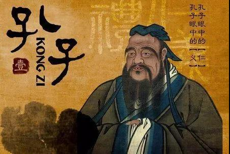
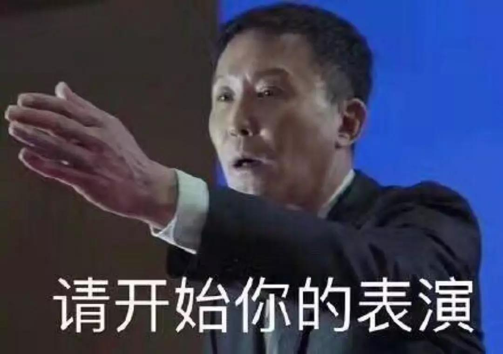

##正文

最近，关于“华为断供”的各种流言漫天飞舞，从美国甚至蔓延到德日等美国的盟友。

今早据《日经亚洲评论》报道，日本松下决定暂停向华为提供某些电子零部件，以配合美国针对华为发布的出口限制。

 

不过，就在舆论即将引爆前，松下中国紧急发布了“辟谣”声明：

>目前松下集团向华为公司供货正常，对于网络媒体上所提及的“断供”等表述均为不实之辞，华为是松下一直以来的重要合作伙伴，我们将严格遵守松下所在国家和地区的相关法律及合规条例的基础上，持续向华为等中国客户销售商品和提供服务，**在中国贡献松下集团的微薄之力，为中国事业发展添砖加瓦。**

 

看这文字，比“美帝良心”的联想中国前几天的辟谣声明要真诚很多。

而华为官方也投桃报李，迅速回应：

>松下是华为重要的合作伙伴，双方在多领域展开密切合作。松下集团与华为公司的所有业务合作持续正常开展。感谢松下集团对华为的一贯支持。同时，**我们也感谢所有长期以来支持华为业务发展的全球供应商伙伴！**

嗯，顺便向其他在特朗普制裁大棒之下坚定支持华为的企业们表示感谢。

不过，松下的澄清并没有终结大家的疑虑，一方面，大量的境外媒体仍然在大肆炒作松下给华为“断供”，另一方面，国内很多媒体也在联系日本松下总部后，表示松下已经真的“断供”了。

那么松下真的会断供么？

政事堂认为是不会的，或者准确说，除了全美国技术外的产品，如果只有部分美国技术的话，松下将在“或可”之间继续对华为供货。

俗话说小孩子才看对错，成年人决策背后都是利益，毕竟中国占了松下海外市场四分之一的收入。

虽然我们在日常中已经见不到松下的消费品，但是松下制造依然围绕在我们身边。譬如2008百灵来朝的鸟巢体育场的钢结构，就是松下做的焊接施工，观众在央视上看到的直播画面，几乎都是松下影像设备制作的，从北京地铁的屏蔽门到遍地的红黄蓝小单车的焊接，都是在松下机器人完成的。

而且，更重要的是，随着松下从ToC的消费领域向ToB的工业制造转型，负责制造集成的中国的制造，更与负责研发的松下制造绑在了一起。譬如All in 新能源电池的松下，其命脉就掌握在了目前正在鬼斧神工般建设的上海特斯拉工厂手里。

所以呢政事堂认为，面对美国的压力，松下会采取“一断各表”的战略。

**一方面按照西方惯例，对西方媒体表示坚决执行美国的要求进行“断供”，而另一方面则按照东方的智慧，认为目前给华为供货的产品都不符合美国的断供标准，因此继续保持对华为供货。**

而这“当面一套背后一套”的手腕，都是只有东亚人才能理解的智慧。

甚至可以说，在此次对华为的制裁过程中，所有东亚儒家文化圈的国家和地区，但凡在华拥有大量业务的公司，都不会参与到供应链的封杀，甚至部分公司还会想办法在此过程中尽可能的帮忙。

这背后的原因不难理解。

因为东亚的企业家们，普遍都是世家传承，我们对于传统历史和文化都有着共同的认知，这是西方人很难理解的。

这两讲两则孔子的故事。

第一则故事是：孔子的学生子贡，把一名被绑架的鲁国人从外国救回来，但拒绝了国家的补偿。孔子批评他说，你不领取补偿，鲁国就没有人再去救自己遇难的同胞了，于是听老师话的子贡选择大张旗鼓的领取赏金。

结果，此事被广为宣扬，鲁国人便愿意积极在他国救助自己的同胞。

第二则故事是：鲁国有一次非常危急的大火，鲁哀公请孔子询问，孔子建议，事情紧急，来不及行赏，而且即使行赏，那么国库的钱也不够。因此只能用刑罚，对于那些不救火和趁火打劫的，按照当逃兵和擅入禁地同罪。

结果，孔子的命令还没传遍国都下去，这场大火就被扑灭了。

 

这两个故事背后的思路，在外儒内法的儒家文化圈内，都是通行的。政治家们在平时都是“千金买马骨”和“徙木立信”，而到了危机的时刻，平时的谦谦君子，也会果断地“杀鸡儆猴”。

而说到“杀鸡儆猴”，就不得不说到韩国六大财团之一的乐天集团。该集团在2016年的萨德事件中，作为狗腿子，积极为美军提供萨德安置场所。

后来，大家都懂了，在中国民众和有关部门的强烈反对之下，乐天在中国的产业面临全线溃败，乐天集团虽然先后向中国市场先后注资上万亿韩元，但依然无法阻挡其中国市场的颓势。

 

最后，乐天不得不将近百家超市白菜价甩卖，无人接手的十余家只得自行关闭；乐天百货一年就亏了700亿韩元，乐天饮料工厂一年亏损上百亿韩元，甚至与乐天合资的影院，也纷纷改名抛弃乐天的名字。

占乐天全部投资版图近三分之一的中国市场，几乎一夜之间丧失殆尽。

甚至据朝鲜日报统计，韩国乐天在中国的销售额从2016年的11.39万韩元，缩水到2.63万亿韩元，累计损失1万亿韩元。

可以说，在中国发展二十余载，累积投资超过10万亿韩元的乐天集团，就因为这一次“趁火打劫”，就令其几十年的在华成功投资和树立起来的品牌，荡然无存，甚至连日本乐天都紧急改名以避免伤及无辜。

而更搞笑的是，后来乐天在韩国也碰了一鼻子灰，老板一家5人全部被韩国检方起诉，一家人整整齐齐的上法庭接受审判，最终多人获刑........

不得不慨叹，这“伪军”当的里外不是人。

 

 所以呢，有着乐天这个从日本起家，做成亚洲一流的韩国财阀作为前车之鉴和“给猴看的鸡”，其他的东亚财阀们必然要站在自己的屁股上去考虑问题。

毕竟，流水的美国总统，铁打的东亚政局，大家没必要为了某人的一时兴起而去充当炮灰。

而且，考虑到东亚传统文化中的“奖励机制”，当欧美的"耿直企业都一头雾水研究具体条款的时候，东亚的企业家们很快都会开始了自己的表演，争取让自己成为那个价值千金的“马骨”。

因此，政事堂认为，**接下来几天，类似于外媒宣扬松下总部“断供”，之后中国分公司真诚的“辟谣”和坚定支持中国，最后华为站出来表示真诚“感谢”的戏码，还会在东亚的财阀之间不断的上演。**

所以呢，大家对于舆论中的“断供潮”不必惊慌，这本身善用媒体的西方惯用手段之一。吃瓜群众们只要放平心态，接下来的几天就可以拿着瓜子坐着凳子，看一群“东亚戏精学院”毕业的大佬们，免费上演一出东亚传统文化为内核的现代大戏。

近期关联文章：

中国式外交的温情

谷歌制裁华为，搬起石头砸自己的脚

##留言区
 

