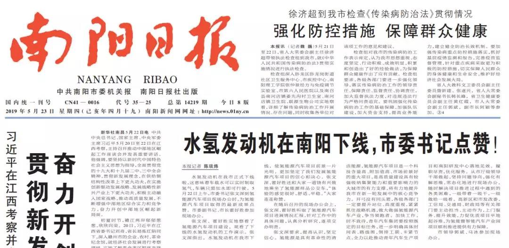
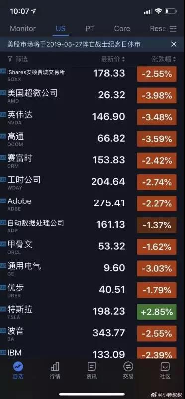
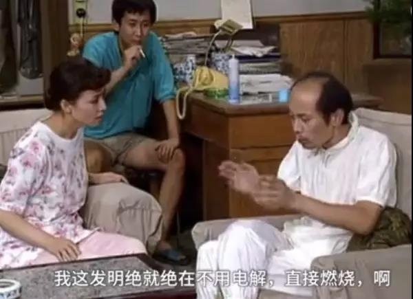
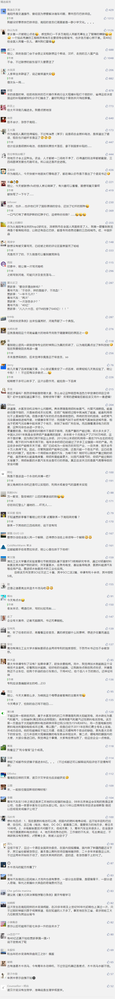

##正文

大概，这是中国人距离诺贝尔奖大满贯最接近的一次。

5月23日，南阳市委机关报《南阳日报》搞了一个大新闻，在头版醒目位置刊文称，“水氢发动机在南阳下线，市委书记点赞.......这意味着**车载水可以实时制取氢气，车辆只需加水即可行驶。**”

 

 

 

 

如此狂拽酷炫吊炸天的新能源黑科技之下......大概牛顿和爱因斯坦的棺材板都快按不住了.......

当然，这种新闻的背后必然不会平静，就在南阳日报官宣当天，大洋彼岸的美国西德克萨斯轻质原油受某股神秘力量影响，突然暴跌6个百分点，引发全球能源市场极度恐慌，全球能源巨头们都在一脸懵逼的询问到底发生了什么。

甚至同为新能源车特斯拉，在已经连跌六天，盘前暴跌4%，所有投资机构都不看好的情况下，当天似乎也受某股神秘力量的影响，在美国科技股集体重挫之中，逆势大涨。

 

看到冥冥之中比“战忽局”还有威慑力的南阳日报，突然觉得，接下来的舆论战交给南阳市委宣传部负责就好了。我方到时候可以承诺不首先使用南阳日报。

毕竟，连咱们演员都是准备好的，在当天的《南阳新闻联播》中，南阳市委书记也操持着特总最喜欢说的“It's very good！”、“Very good！”（非常棒！）来盛赞这个“不用加油，也不用充电，只加水，在特殊催化剂的作用下将水转换成氢气”的就能跑1000公里的新能源汽车。

不过，这一场能源革命似乎来得晚了一些，因为这个专利的所有权，似乎属于25年前上映的《我爱我家》中的二混子葛优。

 

 

 

 

 

 

真有了这技术，咱还买啥美国和沙特的能源啊，还搞什么西气东送，全国老百姓都可以过上沙特油霸们纸醉金迷的生活，闭着眼就进入发达国家行列了。

 

 

只不过，二十多年前大家都能看出的鬼把戏，为啥二十多年后还能继续上演呢？是因为傻子太多了？还是因为南阳迷信诸葛亮的木牛流马？

 

其实还真都不是，毕竟那位给“永动机”手动点赞的市委书记，人家是正经物理专业毕业的，甚至跟着一起到现场办公的市长，也当过省科学院的党委书记。

如果说他们都信了这套牛鬼蛇神的理论，估计纪委都得找他们谈话了。

说起来，市领导和当地的党媒如此积极给该项目造势也是没办法，毕竟这个项目南阳市政府计划配套出资40个亿，而市政府一年的税收收入才刚刚过百亿，可以说大家已经是绑在了一根绳上面的蚂蚱了，真出事儿就是一起完蛋........

所以，也只能死鸭子嘴硬犟到底了。

南阳市如此重磅投入也并非没有原因，这个项目招商时，该公司(青年汽车)表示，预计2020年启动后，销售额三百亿，利税超百亿，可增加1000多个就业岗位。

负责招商的官员们一算，40亿投资不仅可以解决就业，还可以换每年100亿的收入，那简直比高利贷还暴利的投资，当然是要尽快上马。

只不过，估计南阳招商部门的物理不仅不好，恐怕数学也是体育老师教的，一千个就业分摊百亿利税，相当于平均每个青年汽车的员工能够创造千万的税金，拍拍脑袋都知道这里面有多少水分。

这不由得让我想起来我十年前拿着PPT忽悠地方政府的套路，两者何曾相似，只不过我当年是用太阳能忽悠，而如今用青年汽车是用氢能源忽悠，本质是都是在利用政府的贪念。

而贪念一起，自然接下来就容易了，就像老百姓总被P2P的利息诱惑而折了本金，地方政府也总被未来税收的诱惑而进行大规模投入。

其实对青年汽车的历史做一下尽职调查就知道，除了他与南阳政府进行的投入之外，过去十年，还与济南、连云港、六盘水、鄂尔多斯、萧山、石嘴山、海宁、泰安等地方政府搞过合作，将地方政府资金卷走后，最终项目都是烂尾留下来一地鸡毛。

投青年汽车这个屡败屡战的“超生游击队”，凭什么轮到南阳就一定能够搞成功呢？在缺乏工业基础配套的南阳搞汽车，人家图的什么？

恐怕，和之前的那七八个项目一样，都是图政府的补贴吧。

说真的，南阳市真有40个亿，还真不如投给贾跃亭有机会，哪怕最后失败了也能搞出点名气。

最后，原本这个项目包装成氢能源汽车，搞不好还有机会科创板IPO给南阳政府解套的机会，不过这次这么一搞，全国人民都知道了，IPO之路怕是也机会渺茫。

所以呢，南阳市政府接下来得好好开个会了，除了补一补物理和数学基础知识，还得想一想如何向全国人民和南阳人民解释，如此违反常识的项目，是如何立项的？一旦投资失败，又有谁来负责和承担损失呢？

##留言区
 

